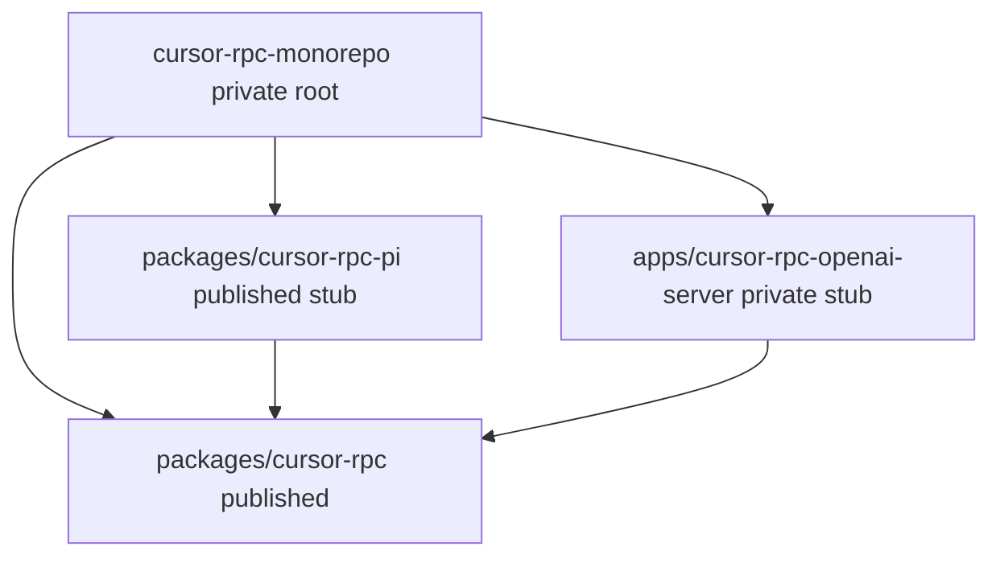

# npm Workspaces Scaffold - Plan

## Goal Capsule

- **Objective:** Turn this repo into an npm workspaces monorepo with a private root, a published protocol-library package, a Pi provider stub, and a private OpenAI-compatible server app, so later product work can depend on the library locally without `npm link` or a registry publish.
- **Authority:** This plan owns workspace layout, package identity, linking, and shared root tooling. `docs/plans/2026-08-19-001-feat-nodejs-protocol-sdk-plan.md` owns the protocol SDK once this plan retargets that document onto the library package. `rpc_spec.md` still owns wire protocol. Where they disagree, this plan wins on repo layout; the SDK plan wins on library behavior.
- **In scope:** Private root workspaces, three workspace packages, ordinary-semver local deps, shared TypeScript base config, import smoke, retarget of the SDK plan's packaging paths.
- **Out of scope:** Protocol client implementation, a working Pi extension, an OpenAI-compatible HTTP server, Changesets, Turbo, Nx, CI, npm publish, git init.
- **Stop if:** `npm install` at the root cannot link a workspace named `cursor-rpc` because that name is already taken on the public registry *and* the local semver range does not satisfy the workspace version. Do not invent a second library name to work around it without updating the SDK plan's published-name requirement.
- **Execution profile:** Greenfield packaging. Smoke-first: install, symlink, and import must pass. Do not execute the protocol-SDK plan until U4 has retargeted it.
- **Tail ownership:** Implementer owns lockfile, ignore files, and the SDK-plan path rewrite. Later SDK work owns real exports, tests, and README disambiguation.

---

## Product Contract

### Summary

This plan sets up npm workspaces: a private root, a published protocol library package, a sibling Pi provider stub, and a private OpenAI-compatible server stub. It covers layout, linking, and shared root config. Stubs exist so dependents can import `cursor-rpc` locally. This work does not implement the protocol client, a working Pi extension, or an HTTP server.

### Problem Frame

The repo is a single CommonJS stub named `cursor-rpc` plus an SDK plan that scaffolds that library at the repo root. The next products are a Pi provider and an OpenAI-compatible server that both consume the library. A root-as-library layout makes the root the publish target, blocks a private wrapper, and forces `npm link` or a publish-bump cycle for the other two packages.

### Requirements

- R1. The repo root is a private workspace wrapper. It is not a publishable package and does not keep the published library name.
- R2. The published protocol library is an ESM workspace named `cursor-rpc` under `packages/`. Node 22+ can import it by that name after a root install.
- R3. A Pi provider workspace exists under `packages/` as a publishable ESM stub that depends on `cursor-rpc` through an ordinary semver range that satisfies the local library version.
- R4. An OpenAI-compatible server workspace exists under `apps/` as a private ESM stub that depends on `cursor-rpc` the same way as R3.
- R5. Root install links all three workspaces into root `node_modules` by package name. Dependents resolve `cursor-rpc` to the local package, not the registry.
- R6. Shared TypeScript compiler options live at the repo root. Each workspace has its own `tsconfig.json`. The root does not compile the whole tree as one project.
- R7. Accidental publish of the root or the server is refused. The library and Pi stubs remain publishable.
- R8. The protocol-SDK plan's scaffold, file lists, and verification targets live in the library workspace. That plan no longer replaces the root `package.json` in place.

Product Contract preservation: new bootstrap. Session-settled packaging choices are recorded on KTD1, KTD2, and KTD8.

### Actors

- A1. Developer setting up this repo.
- A2. Later implementer of the protocol SDK plan.

### Key Flows

- F1. Root install links workspaces
  - **Trigger:** A1 runs install at the repo root.
  - **Actors:** A1
  - **Steps:** Root manifest lists both workspace globs. Install writes one lockfile. Each workspace name appears as a symlink under root `node_modules`.
  - **Covered by:** R1, R5
- F2. Consumer imports the library
  - **Trigger:** A1 loads the Pi stub or the server stub after install.
  - **Actors:** A1
  - **Steps:** The process imports `cursor-rpc` by package name. Resolution follows the workspace symlink. The stub export loads without a bundler.
  - **Covered by:** R2, R3, R4, R5
- F3. Accidental publish is blocked
  - **Trigger:** A1 dry-runs publish from the root, or for all workspaces.
  - **Actors:** A1
  - **Steps:** Root publish is refused. Workspace publish skips the private server. Library and Pi stubs remain eligible.
  - **Covered by:** R7
- F4. SDK plan follows the library package
  - **Trigger:** A2 opens the protocol-SDK plan after this work.
  - **Actors:** A2
  - **Steps:** Output tree and unit file lists are under the library workspace. Verification runs against that workspace, not the private root.
  - **Covered by:** R8

### Acceptance Examples

- AE1. Covers R1, R5. Given a fresh root install, when workspaces are listed, then all three packages appear and `cursor-rpc` in `node_modules` is a symlink to the library workspace.
- AE2. Covers R2, R3, R4, R5. Given that install, when the server stub imports `cursor-rpc`, then Node loads the local stub export and does not fetch a registry tarball.
- AE3. Covers R7. Given the private flags, when publish is dry-run at the root, then it is refused. When it is dry-run across workspaces, then the server is omitted.
- AE4. Covers R8. Given the retargeted SDK plan, when A2 reads U1 Files and Output Structure, then those paths are under the library workspace and U1 does not replace the root manifest in place.

### Success Criteria

- Root install succeeds with one lockfile.
- Pi and server stubs import `cursor-rpc` from the workspace link.
- Root and server cannot publish.
- The SDK plan's packaging unit targets the library workspace.

### Scope Boundaries

**In this work**

- npm workspaces scaffold and local linking.
- Placeholder ESM exports so import smoke does not need the protocol SDK.
- Shared TypeScript base plus per-workspace configs.
- Path rewrite of the existing SDK plan.

**Deferred for later**

- Protocol SDK implementation (existing SDK plan after retarget).
- Real Pi provider (Pi manifest, `@mariozechner/pi-ai`, login UX).
- Real OpenAI-compatible HTTP server.
- Changesets, Turbo, Nx, CI workflows, trusted publishing.
- Dual CJS publish (already deferred in the SDK plan).

**Outside this product's identity**

- Official `@cursor/sdk` and existing third-party Pi Cursor providers.
- Publishing any package to the npm registry in this work.

### Sources

- `package.json` — current CommonJS stub named `cursor-rpc`.
- `docs/plans/2026-08-19-001-feat-nodejs-protocol-sdk-plan.md` — R1, KTD8, U1, Output Structure, verification gates.
- npm CLI v12 workspaces and `package.json` docs (see Planning Contract Sources).

---

## Planning Contract

### Key Technical Decisions

- KTD1. Use npm workspaces with `packages/*` and `apps/*`. Do not add pnpm, Yarn, Turbo, Nx, or Lerna. `(session-settled: user-approved — chosen over polyrepo and a single mixed package: packages that change together stay in one repo; three packages do not need a task runner.)` Cite R1, R5.
- KTD2. Dependents declare `cursor-rpc` with an ordinary caret range that satisfies the local version. Add that dep with the workspace install flag, not by typing `workspace:*`. `(session-settled: user-approved — chosen over pnpm's workspace protocol: npm does not rewrite `workspace:*` and errors with EUNSUPPORTEDPROTOCOL.)` Cite R3, R4, R5.
- KTD3. Rename the root package to `cursor-rpc-monorepo` and set it private. Keep published name `cursor-rpc` only on `packages/cursor-rpc`. Root and library cannot share a name: workspace flags, pack, and publint would be ambiguous, and an unscoped root publish would ship the wrapper as `cursor-rpc`. Cite R1, R2. Honors SDK-plan R1.
- KTD4. Workspace names: `cursor-rpc` (library), `cursor-rpc-pi` (Pi stub), `cursor-rpc-openai-server` (server). Directory names may match. Rename `cursor-rpc-pi` later if Pi's loader requires a different published name. Cite R2, R3, R4.
- KTD5. Set `"type": "module"` on the root and every workspace at scaffold. Root `type` does not inherit into nested packages. A later CJS-to-ESM flip is a breaking change for `.js` files. Cite R2, R3, R4. Honors SDK-plan KTD8.
- KTD6. Root `tsconfig.base.json` holds shared compiler options (NodeNext, strict, Node 22). Each workspace `tsconfig.json` extends it with its own `include` / `outDir`. Do not add TypeScript project references. Do not give the root a compiling `include` that walks the tree. Cite R6.
- KTD7. Put `typescript` on the root as a shared devDependency. The library stub emits a tiny public ESM entry to `dist` so Node can import the package without a TypeScript loader. Dependents import `cursor-rpc`, not a relative path and not a `paths` alias to `src`. Cite R2, R5, R6.
- KTD8. Skip Changesets, Turbo, and Nx in this work. `(session-settled: user-approved — chosen over a full monorepo toolchain on day one: three packages and no release automation yet.)` Cite R1.
- KTD9. Retarget `docs/plans/2026-08-19-001-feat-nodejs-protocol-sdk-plan.md` so Output Structure, U1–U7 Files, SDK KTD8, U1 Goal, DoD `src/` language, and verification gates use `packages/cursor-rpc/` and `npm … -w cursor-rpc`. Split that plan's U1 in prose: this plan owns the private root; the SDK plan's U1 creates the library ESM surface under `packages/cursor-rpc` and must not rewrite the root manifest in place. The library `tsconfig.json` keeps extending repo-root `tsconfig.base.json`. Connect runtime deps stay on the library package. Cite R8.
- KTD10. Set `engines.node` to `>=22` on `cursor-rpc` and `cursor-rpc-pi`. Do not set `engine-strict` until CI exists. Do not copy `@cursor/sdk`'s `>=22.13` floor. Cite R2, R3.

### High-Level Technical Design



Install at the root. npm writes one lockfile and symlinks each workspace name into root `node_modules`. Pi and server depend on `cursor-rpc` with a caret range that matches the library's `1.0.0`. npm links that range to the local workspace when it satisfies the version. A range that no longer matches goes to the registry.

### Output Structure

```text
package.json                 # private root, workspaces globs
package-lock.json
.gitignore
tsconfig.base.json
packages/
  cursor-rpc/
    package.json             # name: cursor-rpc
    tsconfig.json
    src/index.ts             # stub export
    dist/                    # emitted stub
  cursor-rpc-pi/
    package.json             # name: cursor-rpc-pi, depends on cursor-rpc
    tsconfig.json
    src/index.ts
apps/
  cursor-rpc-openai-server/
    package.json             # private, depends on cursor-rpc
    tsconfig.json
    src/index.ts
docs/plans/...-001-...md     # retargeted paths only
```

The tree is a scope declaration. Per-unit file lists stay authoritative. Spec files at repo root stay put.

### Implementation Constraints

- Bind npm workspaces docs for glob matching, `-w` / `--workspaces`, and `--if-present`. Do not re-specify them in units.
- One lockfile at the root. No nested lockfiles. No `workspace:` protocol in any `package.json`.
- Root scripts that fan out across workspaces use `--workspaces --if-present`.
- Do not add `files: ["dist"]` on stubs until the SDK plan owns packing. Import smoke uses the library `exports` map, not `npm pack`.
- Do not move `rpc_spec.md`, `web_search.md`, `web_fetch.md`, or `docs/` into the library package.
- Do not install Pi or HTTP-server runtime frameworks in this work.

### Sequencing

U1 root scaffold → U2 workspace packages and linking → U3 TypeScript emit and import smoke → U4 SDK plan retarget.

U3's first proof is a Node import of `cursor-rpc` from the server workspace after a library build. U4 needs the library package name from U2. Do not start the protocol-SDK plan until U4 lands.

### Assumptions

- `cursor-rpc` remains unpublished on the npm registry through this work, so a mismatched caret range fails closed rather than installing a stranger's package.
- A one-line stub export on the library is enough for smoke. The SDK plan replaces that export.
- `cursor-rpc-pi` is an identity placeholder, not a Pi-installable extension yet.

### Sources and Research

External research was load-bearing for KTD1–KTD7 and KTD10.

- npm workspaces: globs, `npm install <name> -w <consumer>`, symlink layout — https://docs.npmjs.com/cli/v12/using-npm/workspaces/
- `private` and `workspaces` on `package.json`; `npm publish --workspaces` skips private packages — https://docs.npmjs.com/cli/v12/configuring-npm/package-json/ and https://docs.npmjs.com/cli/v12/commands/npm-publish/
- `workspace:*` is unsupported on npm (`EUNSUPPORTEDPROTOCOL`); docs PR dropped it — https://github.com/npm/cli/issues/8845
- npm does not rewrite dependent ranges on `npm version --workspaces` — https://github.com/npm/cli/issues/3403
- Node `type` is per nearest `package.json` — https://nodejs.org/api/packages.html#type
- TypeScript `extends` / do not compile from a parent by accident — https://www.typescriptlang.org/docs/handbook/tsconfig-json.html
- GitHub Node gitignore uses `node_modules/` at any depth — https://github.com/github/gitignore/blob/main/Node.gitignore
- Repo: `package.json` stub; SDK plan R1 / KTD8 / U1 / Output Structure / verification gates.

No `docs/solutions/` learnings exist.

---

## Implementation Units

### U1. Private root workspaces scaffold

- **Goal:** Convert the stub root into a private npm workspaces wrapper that cannot be confused with the published library.
- **Requirements:** R1, KTD1, KTD3, KTD5, KTD8
- **Dependencies:** None
- **Files:** `package.json`, `.gitignore`
- **Approach:**
  1. Set root `name` to `cursor-rpc-monorepo`, `private` true, `type` module, and `workspaces` to `packages/*` and `apps/*`.
  2. Drop root `main` and `directories.doc`. Keep MIT license.
  3. Add root `build` and `typecheck` scripts that fan out with `--workspaces --if-present`. Do not fan out `test`. U3 owns the root `test` script.
  4. Ignore `node_modules/`, `dist/`, and `*.tgz` at any depth. Import smoke always runs after a local library build, not from a committed `dist`.
- **Execution note:** This is packaging config. Prefer install/list smoke over unit tests.
- **Test scenarios:**
  - Happy path: After U2 exists and root install runs, `npm ls --workspaces --depth=0` lists three packages.
  - Edge: Root `name` is not `cursor-rpc`.
  - Error: Covers AE3. Root publish dry-run is refused because the root is private.
- **Verification:** Root manifest is private, lists both globs, and does not claim to be the library.

### U2. Library, Pi, and server workspace packages

- **Goal:** Create the three workspaces with unique names and wire Pi and server to the library through an ordinary caret range.
- **Requirements:** R2, R3, R4, R5, R7, KTD2, KTD4, KTD5, KTD10
- **Dependencies:** U1
- **Files:** `packages/cursor-rpc/package.json`, `packages/cursor-rpc-pi/package.json`, `apps/cursor-rpc-openai-server/package.json`, `packages/cursor-rpc/src/index.ts`, `packages/cursor-rpc-pi/src/index.ts`, `apps/cursor-rpc-openai-server/src/index.ts`, `package-lock.json`
- **Approach:**
  1. Library: name `cursor-rpc`, version `1.0.0`, ESM, `engines.node` `>=22`, not private. Pi: name `cursor-rpc-pi`, same version and engines, not private. Server: name `cursor-rpc-openai-server`, private true, no engines pin required.
  2. Add `cursor-rpc` to Pi and server with the workspace install flag so npm writes a caret range that matches `1.0.0`.
  3. Each package gets a tiny `src/index.ts`. Pi and server import `cursor-rpc` by package name. Do not add Pi or HTTP frameworks.
  4. Add `"typecheck": "tsc --noEmit"` on all three workspace manifests. Add `"build": "tsc"` on the library only.
  5. Root install once. Confirm each workspace name is a symlink under root `node_modules`. Do not require a specific lockfile `link` field name.
- **Execution note:** Prove linking with `npm ls` and symlink shape before TypeScript emit.
- **Test scenarios:**
  - Happy path: Covers AE1. Root `node_modules/cursor-rpc` is a symlink into `packages/cursor-rpc`.
  - Happy path: `npm ls cursor-rpc` from the server workspace shows local `1.0.0`, not a registry tarball.
  - Edge: Pi and server `package.json` contain `cursor-rpc` as `^1.0.0` (or the caret npm wrote for `1.0.0`), never `workspace:*`.
  - Error: Covers AE3. Workspaces publish dry-run omits the private server and includes the non-private stubs as eligible.
- **Verification:** Three workspace names resolve. Dependents' ranges satisfy the local library version. No `workspace:` protocol appears in the tree.

### U3. Shared TypeScript config and import smoke

- **Goal:** Share compiler defaults and emit a Node-importable library stub so consumers load `cursor-rpc` without a bundler.
- **Requirements:** R2, R5, R6, KTD6, KTD7
- **Dependencies:** U2
- **Files:** `tsconfig.base.json`, `packages/cursor-rpc/tsconfig.json`, `packages/cursor-rpc-pi/tsconfig.json`, `apps/cursor-rpc-openai-server/tsconfig.json`, `packages/cursor-rpc/package.json`, `package.json`, `test/workspaces-link.test.mjs`
- **Approach:**
  1. Root base config: strict, NodeNext, Node 22. Workspace configs extend it. Library emits declarations to `dist`.
  2. Library `exports` point at the emitted JS and types, not at `src`.
  3. Root `devDependency` on `typescript`. Library `build` emits the stub. Root `build` fans out with `--if-present`.
  4. Root `typecheck` builds the library first, then fans out `typecheck` with `--workspaces --if-present`. Pi and server typecheck resolve `cursor-rpc` through `exports` to `dist`, not through `paths`.
  5. Add `test/workspaces-link.test.mjs` using Node's test runner. Set root `"test"` to build the library then run that file. Do not use a `.ts` smoke file or tsx.
- **Execution note:** Smoke-first. The test is a link/import proof, not protocol coverage.
- **Test scenarios:**
  - Happy path: Covers AE2. After library build, importing `cursor-rpc` from the server workspace succeeds and returns the stub export.
  - Happy path: `tsc --noEmit` in each workspace is clean for the stub files.
  - Edge: No `paths` mapping from `cursor-rpc` to `packages/cursor-rpc/src`.
  - Error: Importing `cursor-rpc` before library build fails in a documented way (missing `dist`), then succeeds after build.
- **Verification:** Typecheck workspaces pass. The link test passes. Node can import `cursor-rpc` without tsx.

### U4. Retarget the protocol-SDK plan

- **Goal:** Point the existing SDK plan at the library workspace so its U1 cannot rebuild the root as the published package.
- **Requirements:** R8, KTD9
- **Dependencies:** U2
- **Files:** `docs/plans/2026-08-19-001-feat-nodejs-protocol-sdk-plan.md`
- **Approach:**
  1. Prefix Output Structure and every U1–U7 Files path that currently sits at repo root (`package.json` for the library, `tsconfig.json`, `src/`, `test/`, `proto/`, `buf.gen.yaml`, `README.md`) with `packages/cursor-rpc/`.
  2. Rewrite SDK U1 Approach, U1 Goal, and SDK KTD8: they create/update `packages/cursor-rpc/package.json` (ESM exports, errors, vitest, publint/attw). They must not set root `name` to `cursor-rpc` or remove `private` / `workspaces` from the root.
  3. Point Verification Contract and DoD `src/` language at `packages/cursor-rpc` and workspace-flagged commands (`-w cursor-rpc`).
  4. Keep SDK R1 (published name `cursor-rpc`) unchanged. Add a one-line authority note that repo layout is owned by this workspaces plan.
  5. Require `packages/cursor-rpc/tsconfig.json` to extend `../../tsconfig.base.json`. Do not let SDK U1 replace it with a standalone config that duplicates those options.
  6. Leave protocol requirements, Connect KTDs, and unit test scenarios in place except where a path or cwd is wrong.
- **Test scenarios:**
  - Test expectation: none -- documentation retarget. Completeness is a review of the rewritten paths, not a runtime test.
- **Verification:** Covers AE4. A heading scan of the SDK plan shows library paths under `packages/cursor-rpc/`. U1 no longer says to replace the root stub in place. Root `package.json` in *this* repo remains the private wrapper after a reader follows SDK U1.

---

## Verification Contract

| Gate | Command | Applies to | Done signal |
| --- | --- | --- | --- |
| Install + link | `npm install` then `npm ls --workspaces --depth=0` | U1, U2 | Three workspaces listed; `cursor-rpc` is linked |
| Import smoke | `npm test` | U3 | Library build then Node import of `cursor-rpc` via the workspace symlink |
| Types | `npm run typecheck` | U3 | Library `dist` exists, then clean `tsc --noEmit` on all three stubs |
| Publish guard | `npm publish --dry-run` at root; `npm publish --dry-run --workspaces` | U1, U2 | Root refused; server omitted |
| SDK plan retarget | heading/path scan of the SDK plan | U4 | Library files and gates use `packages/cursor-rpc` |

Do not require a live npm login or a Cursor account.

---

## Definition of Done

**Global**

- R1–R8 are met.
- No abandoned spike code outside the stub exports.
- `workspace:*` does not appear in any manifest.
- The SDK plan can be executed without rewriting the private root.

**Per unit**

- U1: private root with both workspace globs.
- U2: three named workspaces; Pi and server depend on linked `cursor-rpc`.
- U3: shared TS base, library emit, import test green.
- U4: SDK plan paths and U1 ownership match the library workspace.

---

## Risks and Dependencies

| Risk | Mitigation |
| --- | --- |
| Root and library share name `cursor-rpc` | KTD3 rename root |
| `workspace:*` typed by habit | KTD2; U2 edge test |
| Caret range stops matching after a later bump | Re-install the workspace dep in the same change; Changesets deferred (KTD8) |
| Public `cursor-rpc` appears on the registry before first publish | Stop condition in Goal Capsule; keep versions in range |
| SDK U1 rewritten in place against this plan | U4 ownership split; verify root stays private |
| `engine-strict` breaks local Node 24 / npm 12 engine warnings | KTD10 leaves it off |
| Pi published name needs a different string | KTD4 allows rename before first publish |

**Dependencies:** npm 10+ (workspaces exist since npm 7; Node 22 bundles npm 10.x). TypeScript on PATH via root install.

---

## Documentation and Operational Notes

- After U4, execute the protocol SDK against `packages/cursor-rpc`, not the repo root.
- First real publish still needs `--access public` for unscoped packages and a later Changesets pass if more than one package ships together.
