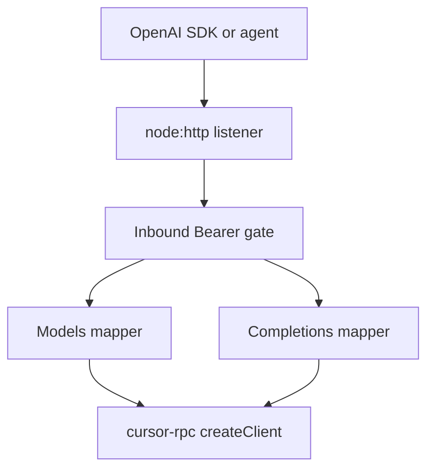
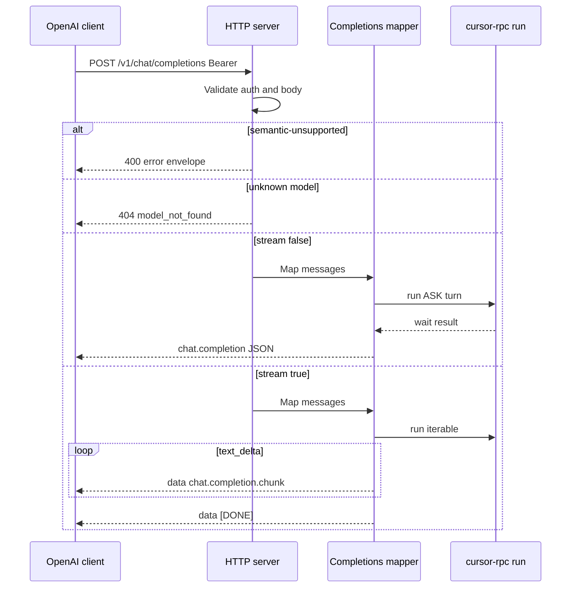
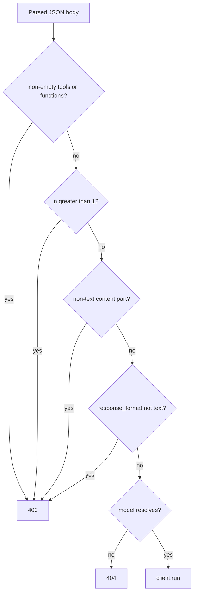

# OpenAI-Compatible API Server - Plan

## Goal Capsule

- **Objective:** Ship a TypeScript OpenAI-compatible HTTP server as a new `packages/` workspace that lists Cursor models and creates text chat completions through `cursor-rpc`, so OpenAI SDK clients and coding agents can point `baseURL` at this process.
- **Authority:** OpenAI Chat Completions create owns request/response and SSE wire shape. OpenAI models list/retrieve own those two routes. `docs/plans/2026-08-19-001-feat-nodejs-protocol-sdk-plan.md` owns `cursor-rpc` `createClient` / `models()` / `run()`. `docs/plans/2026-08-19-002-feat-npm-workspaces-scaffold-plan.md` owns workspace globs. This plan owns the HTTP server package, inbound auth, and the OpenAI-to-Cursor mapping. Where they disagree, OpenAI docs win on HTTP JSON/SSE; the SDK plan wins on protocol client behavior; this plan wins on server packaging.
- **In scope:** New publishable package under `packages/`, inbound server API key (required by default, disableable), `GET /v1/models`, `GET /v1/models/{id}`, `POST /v1/chat/completions` (text + stream), mapping onto library ASK turns, official `openai` SDK contract tests with a mocked library client.
- **Out of scope:** Implementing `cursor-rpc`, Responses/Assistants/embeddings/vision/audio/tools, a hosted multi-tenant gateway, filling in the private apps stub in place.
- **Stop if:** The only way to complete a turn is to reimplement Connect `Run` inside this package. Stop if Chat Completions is removed from the OpenAI platform API (it is not deprecated as of 2026-08-19).
- **Execution profile:** New workspace package. Prove the OpenAI HTTP contract against a mocked `cursor-rpc` client before a live Cursor account is required.
- **Tail ownership:** Implementer owns package scripts, README `baseURL` snippet, and workspace-link retarget. Caller of the server owns Cursor credentials and the inbound server key.

---

## Product Contract

### Summary

This plan adds an OpenAI-compatible HTTP server as a new package under `packages/`, using the in-progress Cursor protocol library as the only backend. Clients list models and create text chat completions, including the documented stream mode. The rest of the OpenAI API stays out.

Product Contract preservation: new bootstrap.

### Problem Frame

OpenAI Chat Completions is the industry client contract. Coding agents and the official SDK already speak `GET /v1/models` and `POST /v1/chat/completions`.

`cursor-rpc` will authenticate to Cursor, list models, and run ASK turns. It does not speak OpenAI HTTP. The repo already has a private stub under `apps/` that only imports the library name. A real server in `packages/` lets the same workspace pattern as the Pi package host a publishable process without implementing the protocol client twice.

### Requirements

**Packaging**

- R1. The server is a new ESM workspace under `packages/` named `cursor-rpc-openai-server`, Node 22+, depending on `cursor-rpc` through an ordinary semver range that satisfies the local library version.
- R2. The unused private apps stub is removed so the workspace name does not collide. Root workspace-link smoke uses the new package as its import cwd.
- R3. The package is publishable and starts a process from a bin. It does not implement ConnectRPC or proto types.

**Inbound auth**

- R4. Inbound HTTP requires `Authorization: Bearer` matching the server's own API key. `(session-settled: user-directed — chosen over unauthenticated inbound: required by default, with a way to disable it.)`
- R5. When inbound auth is disabled, the process still serves the same routes. Dummy Bearer values from the OpenAI SDK are tolerated.
- R6. One Cursor account per process comes from library constructor options or `CURSOR_*` env. Inbound keys are never exchanged for Cursor tokens and never appear in responses.

**Models**

- R7. `GET /v1/models` returns an OpenAI list object whose `id` values are the catalogue canonical `modelId`s from `client.models()`.
- R8. `GET /v1/models/{id}` returns one model object or 404 `model_not_found`. Lookup is case-insensitive through the library alias map.
- R9. `POST /v1/chat/completions` `model` resolves the same way as R8. Omitted or empty `model` uses the catalogue default, else the first canonical id, else 404.

**Chat completions**

- R10. `POST /v1/chat/completions` accepts text conversations (`role` `system` / `developer` / `user` / `assistant`, string content or arrays of `type: "text"` parts) and runs one `client.run()` turn per request.
- R11. `stream: true` returns OpenAI Chat Completions SSE as documented on the create method. `stream` omitted or false returns one `chat.completion` JSON object.
- R12. Assistant text is only visible Chat Completions `content` / `delta.content`. Library thinking, server notices, and tool-display events are dropped from those fields.
- R13. Client disconnect during SSE aborts the in-flight `run`. Concatenating streamed `delta.content` equals the non-stream `message.content` for the same mocked turn.
- R14. Semantic-unsupported fields are rejected with 400 before `run`: non-empty `tools` or `functions`, `n` greater than 1, non-text content parts, `response_format` other than omitted or `{ type: "text" }`. Sampling knobs and unknown extra keys are ignored.

**Errors and bind**

- R15. Error bodies use `{ error: { message, type, param, code } }`. Inbound auth failure is 401. Unknown model is 404. Semantic-unsupported is 400. Cursor-upstream failures are not reported as inbound 401.
- R16. Default bind is `127.0.0.1:8787`. The process does not listen on all interfaces by default.

### Actors

- A1. OpenAI SDK or coding-agent client pointing `baseURL` at this server with the inbound key.
- A2. Operator who starts the process with Cursor credentials and the inbound key.

### Key Flows

- F1. List then complete
  - **Trigger:** A1 constructs the official SDK with `baseURL` ending in `/v1` and calls models list then chat completions create.
  - **Actors:** A1, A2
  - **Steps:** Bearer check; list canonical ids; create maps messages to one ASK `run`; JSON completion returns.
  - **Covered by:** R4, R7, R10, R11
- F2. Stream then abort
  - **Trigger:** A1 calls create with `stream: true` and cancels the SDK request mid-stream.
  - **Actors:** A1
  - **Steps:** SSE chunks; socket close aborts `run`; no orphaned turn.
  - **Covered by:** R11, R13
- F3. Tool-calling agent hits the wall
  - **Trigger:** A1 sends non-empty `tools`.
  - **Actors:** A1
  - **Steps:** 400 OpenAI envelope; `run` is not called.
  - **Covered by:** R14, R15
- F4. Auth off for local loopback
  - **Trigger:** A2 starts with inbound auth disabled. A1 sends any Bearer or none.
  - **Actors:** A1, A2
  - **Steps:** Routes succeed without matching a server key. Cursor credentials still come from the library env.
  - **Covered by:** R5, R6

### Acceptance Examples

- AE1. Covers R4, R15. Given inbound auth required and a missing or wrong Bearer, when any documented route is called, then the response is 401 with the OpenAI error envelope and the body contains neither a Cursor token nor the inbound server key.
- AE2. Covers R7, R8, R9. Given `GET /v1/models` returns id `X`, when create uses `X` or a catalogue alias of `X`, then the request is not 404.
- AE3. Covers R10, R12. Given a mocked `run` that yields thinking then `text_delta` `"hi"`, when create is non-stream, then `choices[0].message.content` is `"hi"` and does not contain thinking text.
- AE4. Covers R11, R13. Given `stream: true`, when the client reads chunks until done, then events are `data:` JSON with `object: "chat.completion.chunk"` and the stream ends with `data: [DONE]`. Client abort cancels `run`.
- AE5. Covers R14. Given `tools: [{ ... }]` or an `image_url` part, when create is called, then 400 and `run` is not invoked. Given `tools: []` or `content: [{ type: "text", text: "hi" }]`, when create is called, then the request is not 400 for those reasons.
- AE6. Covers R1, R2. Given a root install, when workspace-link smoke imports `cursor-rpc` from the new server package cwd, then it resolves the local library dist.

### Success Criteria

- Official `openai` npm client against `http://127.0.0.1:<port>/v1` can list models, retrieve a listed id, create a non-stream completion, and iterate a stream.
- Unsupported tool/vision/`n>1` requests fail closed with 400.
- CI does not need a live Cursor account.

### Scope Boundaries

**In this work**

- OpenAI-shaped HTTP for models list/retrieve and chat completions create.
- Inbound server key plus Cursor credentials via `cursor-rpc`.
- Mocked library client in tests; optional live test skipped without `CURSOR_API_KEY`.
- Honor `stream_options.include_usage` (KTD12).

**Deferred for later**

- Function calling / tools, vision, audio, JSON schema, Responses API, `/v1/completions`, embeddings.
- Per-key quotas, bind on `0.0.0.0` as a default, HTTP/2 front door.
- `stream_options.include_obfuscation`.

**Outside this product's identity**

- A Cursor account marketplace or per-request mapping of OpenAI keys to Cursor users.
- Local shell/file/MCP execution triggered by Chat Completions.
- Replacing `@cursor/sdk` or cloning official Cursor CLI UX.

**Deferred to Follow-Up Work**

- Filling the Pi provider stub.
- Completing `cursor-rpc` U6/U7 (owned by the SDK plan). This server consumes that surface; it does not implement it.

### Key Decisions

- KD1. Compatibility surface is Chat Completions plus models, not Responses. Governs R7, R10, R11.
- KD2. Inbound auth is the server's own key, required by default, disableable. Cursor auth stays on the library. Governs R4, R5, R6.
- KD3. Semantic-unsupported fields 400; cosmetic sampling fields ignored. Governs R14.
- KD4. New `packages/` workspace; retire the apps stub rather than implement HTTP there. Governs R1, R2.

---

## Planning Contract

### Key Technical Decisions

- KTD1. Place the server at `packages/cursor-rpc-openai-server` and delete `apps/cursor-rpc-openai-server`. Retarget `test/workspaces-link.test.mjs`. Copy the Pi package pattern (ESM, `engines.node` `>=22`, `"cursor-rpc": "^1.0.0"`, tsconfig extends `tsconfig.base.json`, no `paths`). The package is publishable with a bin, not `private`. Cite R1, R2, R3.
- KTD2. Listen with Node 22 `node:http` (HTTP/1.1). Rejected: `node:http2` (SDK tests are HTTP/1.1) and Hono as a requirement (POST-SSE abort is a `ServerResponse` `close` event, which Hono does not give for free on Node 22). Cite R11, R13, R16.
- KTD3. Inbound key from `CURSOR_RPC_OPENAI_API_KEY`. An empty string is missing. Disable only with exact `CURSOR_RPC_OPENAI_AUTH=off` or `--no-auth` (`false` / `0` / empty do not disable). If auth is required and the key is missing, refuse to listen. Compare only the Bearer token (optional `api-key` header is an alias, never required) with a constant-time equality check. Query or JSON `api_key` does not authenticate. Auth runs before routing, so unknown paths still 401 when the Bearer is wrong. Refuse to listen when auth is off and the bind host is not loopback (`127.0.0.1` or `::1`). Auth-on plus `0.0.0.0` stays operator-owned. `(session-settled: user-directed — chosen over unauthenticated inbound: required by default, with a way to disable it.)` Cite R4, R5, R16.
- KTD4. Default bind `127.0.0.1:8787`. Override with `CURSOR_RPC_OPENAI_HOST` / `CURSOR_RPC_OPENAI_PORT` or bin flags. README tells clients to use `http://127.0.0.1:8787/v1`, not `localhost` (IPv6 `::1` miss). Cite R16.
- KTD5. Consume only the SDK-plan public facade: `createClient`, `client.models()`, `client.run()` as async iterable plus `wait()` and `abort()`, plus public error classes. Do not import `packages/cursor-rpc/src/**` or generated proto. Do not call `login`. One process-lifetime Client (not per Bearer, not per POST). Until SDK-plan U7 is exported, tests inject a fake client with that shape. The `models()` result this package needs is canonical ids, a default id, and resolve-id-to-canonical. Alias merge and credential-shaped catalogue fields are SDK-owned. Cite R3, R6.
- KTD6. Map OpenAI `messages` onto one ASK `run`: concatenate `system`/`developer` text and prepend to the last `user` text as the current user message; earlier `user`/`assistant` text-only turns become `conversation_history`; no user message → 400 `invalid_request_error`. Flatten `content` text parts. Cite R10.
- KTD7. Process `createClient` uses library defaults only: omit `tools`, do not set allowed-tools headers, no workspace RequestContext. Every create keeps ASK pin: `excludeWorkspaceContext: true`, no advertised tools, fail-closed exec. Extra JSON keys cannot widen that. Cite R10, R14.
- KTD8. Unknown model → 404 with `type: invalid_request_error`, `code: model_not_found`, `param: "model"`. Resolve only through the public `models()` result in KTD5. List canonical ids only. Omit credential-shaped properties from HTTP JSON as defense in depth without importing proto types. Cite R7, R8, R9, R15.
- KTD9. Error mapping: inbound auth → 401 `invalid_api_key`; semantic-unsupported → 400 `invalid_request_error` with `param` set; per-request Cursor `AuthenticationError` / `PolicyError` → 502 `api_error` saying the failure is Cursor upstream, not inbound Bearer (no GetMe identity, no tokens); after library pin, later calls on that Client stay 502 until process restart — do not `createClient` again in v1; `TransportUnsupportedError` and retryable `StreamError` → 503 for that request only; `CancelledError` after client abort → no error body; other → 500 `api_error`. Map from public error fields only. Never put `cause`, `stack`, inbound key, or Cursor secrets into HTTP, SSE error lines, or logs. Bin start is process-fatal when Cursor env credentials are missing (symmetric with inbound key), unless tests inject a client. Cite R15.
- KTD10. SSE abort: after the POST body is read, abort `run` on `res` `close` when `!res.writableFinished`. Do not use `req` `close` or `req.signal` (absent on Node 22; POST body close is not client-gone). Raise server `requestTimeout` / `headersTimeout` for long streams. Cite R13.
- KTD11. One process-lifetime Client. Concurrent POSTs each call `run()` as a separate turn on that Client. No global serialize or inbound 429 in v1. After library pin (KTD9), recovery is operator restart. Rejected: per-request Client; silent recreate-on-502; server mutex as a substitute for library turn isolation. Cite R6.
- KTD12. Non-stream completion emits `id` (`chatcmpl-…`), `object: "chat.completion"`, `created`, `model`, one choice with `message.role: "assistant"`, `finish_reason: "stop"`, and `usage` from turn-ended tokens (zeros if missing). Stream: `Content-Type: text/event-stream`; data-only `chat.completion.chunk`; first chunk includes `delta.role`; content deltas; last choice chunk empty `delta` plus `finish_reason`; then `data: [DONE]`. If `stream_options.include_usage` is true, emit one extra chunk with `usage` and empty `choices` before `[DONE]`. Pre-stream failures stay HTTP JSON errors. Mid-stream upstream failure writes one `data: {"error":{…}}` line then closes. Cite R11, R12, R15.
- KTD13. 400 tools only when `tools` or `functions` is a non-empty array. Ignore omitted `tool_choice` and `tool_choice: "none"`. `n` omitted or `1` is ok. Cite R14.
- KTD14. Add `openai` (npm, Node 22-compatible) as a server-package devDependency. Contract tests use `baseURL: http://127.0.0.1:<port>/v1` and `maxRetries: 0` on negative cases. Add one raw `fetch` test that asserts `text/event-stream` and a terminal `data: [DONE]` line. Cite AE1–AE5.

### High-Level Technical Design

Component topology:



Create request sequence:



Validation gate (directional, not implementation specification):



### Output Structure

```text
packages/cursor-rpc-openai-server/
  package.json
  tsconfig.json
  vitest.config.ts
  README.md
  src/
    index.ts
    cli.ts
    server.ts
    auth.ts
    errors.ts
    config.ts
    openai/
      models.ts
      completions.ts
      messages.ts
      sse.ts
    provider.ts
  test/
    auth.test.ts
    models.test.ts
    completions.test.ts
    sse.test.ts
    sdk.contract.test.ts
```

The tree is the expected shape. Per-unit `Files` lists are authoritative.

### Implementation Constraints

- Do not add `workspace:` protocol ranges. Match Pi: `"cursor-rpc": "^1.0.0"`.
- Do not set tsconfig `paths` into library `src`. Dependents load `dist`.
- Do not export generated protobuf from this package.
- Root `npm test` stays the workspace-link smoke plus whatever the new package `test` script runs when invoked with `-w`. Add `"test": "vitest run"` on the new package.

### Sequencing

U1 can land before `cursor-rpc` exports `createClient`. U2 does not need a live Run. U3–U4 need the intended facade, injected in tests. A live optional test waits on SDK U7 and `CURSOR_API_KEY`.

---

## Implementation Units

### U1. Workspace package and stub retirement

- **Goal:** Add the publishable server workspace under `packages/` and remove the colliding apps stub.
- **Requirements:** R1, R2, R3, AE6
- **Dependencies:** none
- **Files:** `packages/cursor-rpc-openai-server/package.json`, `packages/cursor-rpc-openai-server/tsconfig.json`, `packages/cursor-rpc-openai-server/src/index.ts`, `packages/cursor-rpc-openai-server/vitest.config.ts`, `test/workspaces-link.test.mjs`, `apps/cursor-rpc-openai-server/` (delete)
- **Approach:**
  1. Mirror `packages/cursor-rpc-pi` for name, ESM, engines, caret dependency, and tsconfig.
  2. Add vitest like `packages/cursor-rpc/vitest.config.ts` and a `test` script.
  3. Delete the apps stub. Point workspace-link cwd and tsconfig-path assertions at the new package.
- **Patterns to follow:** `packages/cursor-rpc-pi/package.json`, `test/workspaces-link.test.mjs`
- **Test scenarios:**
  - Happy path: Covers AE6. After root install and library build, importing `cursor-rpc` from the new package cwd prints `cursor-rpc`.
  - Edge: Two workspaces named `cursor-rpc-openai-server` do not exist.
  - Error: With library `dist` parked, the same import fails, then succeeds after restore (existing smoke behavior).
- **Verification:** `npm test` (root link smoke) passes. `npm run typecheck -w cursor-rpc-openai-server` is clean.

### U2. Listener, inbound auth, and error envelope

- **Goal:** Serve HTTP on the default loopback bind with Bearer gating and OpenAI-shaped errors.
- **Requirements:** R4, R5, R6, R15, R16, AE1, KTD2, KTD3, KTD4, KTD9
- **Dependencies:** U1
- **Files:** `packages/cursor-rpc-openai-server/src/server.ts`, `packages/cursor-rpc-openai-server/src/auth.ts`, `packages/cursor-rpc-openai-server/src/errors.ts`, `packages/cursor-rpc-openai-server/src/config.ts`, `packages/cursor-rpc-openai-server/src/cli.ts`, `packages/cursor-rpc-openai-server/test/auth.test.ts`
- **Approach:**
  1. Create `node:http` server. Parse JSON bodies for POST. Auth runs before routing (KTD3).
  2. Apply KTD3/KTD4 for key, exact disable switch, loopback fail-closed with auth-off, and bind. Startup fails closed when auth is required and the key is unset or empty.
  3. Apply KTD9 for status, envelope, and redaction. Include `x-request-id` on responses. Log bind URL only.
- **Execution note:** Prove 401 vs 200 auth with a stub handler before models or completions exist.
- **Patterns to follow:** Library `CursorRpcError.toJSON` redaction in `packages/cursor-rpc/src/errors.ts` (do not leak secrets).
- **Test scenarios:**
  - Happy path: Covers AE1 inverse. Matching Bearer reaches a stub 200.
  - Happy path: Covers F4. With auth off, missing Authorization still reaches the stub.
  - Error: Covers AE1. Missing or wrong Bearer → 401 `invalid_api_key`; body has no Cursor token.
  - Error: Auth required and key unset or empty → `listen` is not called / process start throws.
  - Error: Auth off and bind host `0.0.0.0` → refuse to listen.
  - Error: `CURSOR_RPC_OPENAI_AUTH=false` still requires a matching Bearer.
  - Error: Query or JSON `api_key` does not authenticate.
  - Error: 401 JSON and process logs contain neither the inbound key nor a planted Cursor token.
  - Edge: Auth off still ignores a dummy `Bearer sk-local`.
  - Edge: Wrong Bearer on an unknown path is 401, not 404.
- **Verification:** `npm test -w cursor-rpc-openai-server` covers auth. Process binds `127.0.0.1` in tests via an ephemeral port.

### U3. Models list and retrieve

- **Goal:** Expose catalogue ids in OpenAI model objects and resolve aliases on retrieve.
- **Requirements:** R7, R8, R9, AE2, KTD5, KTD8
- **Dependencies:** U2
- **Files:** `packages/cursor-rpc-openai-server/src/server.ts`, `packages/cursor-rpc-openai-server/src/openai/models.ts`, `packages/cursor-rpc-openai-server/src/provider.ts`, `packages/cursor-rpc-openai-server/test/models.test.ts`
- **Approach:**
  1. Inject `client.models()` (fake in tests) matching the KTD5 DTO. Map each canonical id to `{ id, object: "model", created, owned_by: "cursor" }`.
  2. Retrieve and create-time resolution share `models()` resolve. Omit credential-shaped properties from JSON (KTD8).
  3. Empty catalogue lists `data: []`. Create with no resolvable model is 404 per KTD8.
- **Patterns to follow:** KTD5 `models()` DTO. Do not deep-import `packages/cursor-rpc/src/session/models.ts`.
- **Test scenarios:**
  - Happy path: Covers AE2. List ids are accepted by retrieve and by create-time resolution helper.
  - Happy path: Alias and different casing resolve to the canonical id.
  - Edge: Omitted model uses `defaultModel` then first id.
  - Error: Unknown id → 404 `model_not_found` with `param: "model"`.
  - Edge: Empty catalogue → list is empty; create 404s.
  - Edge: Fake catalogue objects that include credential-shaped fields still serialize without those keys.
- **Verification:** Models tests pass without a live Cursor account.

### U4. Chat completions mapping, JSON, and SSE

- **Goal:** Validate create, map messages to one ASK turn, and emit JSON or OpenAI SSE.
- **Requirements:** R10, R11, R12, R13, R14, AE3, AE4, AE5, KTD6, KTD7, KTD9, KTD10, KTD11, KTD12, KTD13
- **Dependencies:** U3
- **Files:** `packages/cursor-rpc-openai-server/src/server.ts`, `packages/cursor-rpc-openai-server/src/openai/completions.ts`, `packages/cursor-rpc-openai-server/src/openai/messages.ts`, `packages/cursor-rpc-openai-server/src/openai/sse.ts`, `packages/cursor-rpc-openai-server/test/completions.test.ts`, `packages/cursor-rpc-openai-server/test/sse.test.ts`
- **Approach:**
  1. Run KTD13/R14 gates before `run`. Ignore temperature and extra keys.
  2. Apply KTD6 message mapping and KTD7 ASK pin.
  3. Non-stream: `wait()`, map assistant text only (KTD12). Stream: iterate events, write SSE, `[DONE]`, abort per KTD10.
  4. Map library errors per KTD9. Multiplex concurrent POSTs (KTD11).
- **Execution note:** Start with failing contract tests for JSON, SSE, tools 400, and abort-cancels-run before widening the mapper.
- **Patterns to follow:** SDK plan U6/U7 event union (`text_delta` vs notice/thinking). OpenAI create method SSE examples.
- **Test scenarios:**
  - Happy path: Covers AE3. Thinking then `"hi"` → content `"hi"` only.
  - Happy path: Covers AE4. Stream chunks are `chat.completion.chunk`; terminal `[DONE]`; streamed concat equals non-stream content.
  - Happy path: `content: [{ type: "text", text: "hi" }]` is accepted. `tools: []` is accepted.
  - Happy path: System plus two user/assistant turns maps to prepended system on last user plus history of the earlier pair (no duplicated last user).
  - Error: Covers AE5. Non-empty `tools`, `n: 2`, `image_url` part, `response_format.json_schema` → 400 and `run` not called.
  - Error: No user message → 400.
  - Error: Mock `AuthenticationError` from `run` → 502, not 401. A second create on the same injected client also 502s (pin; no silent recreate).
  - Error: Mock `AuthenticationError` whose message contains Bearer or key material → 502 envelope and SSE error line omit that material, the inbound test key, and `stack`.
  - Edge: Extra body keys do not change the `run()` ASK pin arguments.
  - Error: Client abort mid-SSE → fake `run` abort/signal fires; no throw as unhandled `error`.
  - Edge: `stream_options.include_usage: true` yields an empty-`choices` usage chunk before `[DONE]`.
  - Edge: Two overlapping POSTs both complete against independent fake runs.
  - Integration: Covers AE4 abort path with a real `http` client cancel, not only a mocked `AbortSignal`.
- **Verification:** Completions and SSE tests pass with the injected fake client.

### U5. Bin, README, and official SDK contract tests

- **Goal:** Document the `baseURL` snippet and prove the official Node SDK against the live listener with mocks.
- **Requirements:** R3, R16, AE1–AE5, KTD4, KTD14
- **Dependencies:** U4
- **Files:** `packages/cursor-rpc-openai-server/src/cli.ts`, `packages/cursor-rpc-openai-server/src/index.ts`, `packages/cursor-rpc-openai-server/README.md`, `packages/cursor-rpc-openai-server/package.json`, `packages/cursor-rpc-openai-server/test/sdk.contract.test.ts`
- **Approach:**
  1. Bin starts the listener, constructs one `createClient` from env when not injected (KTD5, KTD7), fails if Cursor env credentials are missing, and logs the bind URL only.
  2. README: Chat Completions only; disable client tool-calling; use `http://127.0.0.1:8787/v1`; inbound key vs `CURSOR_API_KEY`; inbound key spends this process's Cursor quota; auth-off is refused with a non-loopback bind.
  3. SDK tests per KTD14: `models.list`, `models.retrieve`, `chat.completions.create` stream and non-stream, tools 400, 401, abort.
- **Test scenarios:**
  - Happy path: Official SDK list, retrieve, create, stream against ephemeral port.
  - Error: SDK create with tools → `BadRequestError`. Wrong key → `AuthenticationError`. Unknown model → `NotFoundError`.
  - Integration: Raw fetch stream includes `data: [DONE]`.
  - Test expectation: README example `baseURL` matches the default bind (string fixture or doc test).
- **Verification:** `npm test -w cursor-rpc-openai-server` and `npm run typecheck -w cursor-rpc-openai-server` pass. README states this is not `@cursor/sdk`.

---

## Verification Contract

| Gate | Command | Applies to | Done signal |
| --- | --- | --- | --- |
| Workspace link | `npm test` at repo root | U1, AE6 | Link smoke uses `packages/cursor-rpc-openai-server` |
| Server tests | `npm test -w cursor-rpc-openai-server` | U2–U5 | Auth, models, completions, SSE, SDK contract pass |
| Types | `npm run typecheck -w cursor-rpc-openai-server` after `npm run build -w cursor-rpc` | U1–U5 | `tsc --noEmit` clean |
| Optional live | skip unless `CURSOR_API_KEY` is set | U4–U5 | One ASK create returns assistant text |

Do not require a live Cursor account for CI.

---

## Definition of Done

**Global**

- R1–R16 met or listed under Scope Boundaries.
- Apps stub gone; one workspace named `cursor-rpc-openai-server`.
- No Connect/proto reimplementation in the server package.
- Abandoned spike servers or extra HTTP frameworks are not left in the diff.

**Per unit**

- U1: Pi-like package exists; root smoke retargeted.
- U2: Bearer required-by-default with disable path; 401 envelope.
- U3: List/retrieve/alias resolution with 404 unknown.
- U4: JSON + SSE create, abort, semantic 400s, thinking stripped.
- U5: Bin and README; official SDK contract tests green.

---

## System-Wide Impact

This HTTP API is the agent surface. Tool-calling agents must disable tools or they 400 by design (R14). Workspace-link smoke currently hard-codes `apps/cursor-rpc-openai-server`; U1 changes that shared test.

| Failure | Who sees it |
| --- | --- |
| Wrong inbound Bearer | That client, 401; Cursor unused |
| Auth-off + loopback | Every local client uses the process Cursor account |
| Auth-off + non-loopback | Listen refused (KTD3) |
| Cursor quota / rate limit | All agents on this process (KTD11) |
| Cursor `AuthenticationError` + pin | This request 502, then all later models/completions 502 until restart (KTD9) |
| Retryable `StreamError` / 503 | That request only |
| Client abort / `CancelledError` | That SSE only; other Runs untouched |
| `GET /v1/models` | Live `client.models()` on the shared Client; polling agents amplify one account |
| Mid-stream Cursor error | That SSE error line; Client is not recreated |

---

## Risks & Dependencies

- **Dependency:** SDK plan U6/U7 must export `createClient` / `models` / `run` before a live server can complete a Cursor turn. Contract tests must not wait on that. Concurrent `run()` on one Client is assumed as independent turns (KTD11); if implementation finds the library is not isolation-safe, serialize at the HTTP layer rather than deep-importing session code.
- **Risk:** Empty usable-model catalogue currently becomes `models: []` in the library merge. Create then 404s. Do not treat empty as success with a fake `gpt-*` id.
- **Risk:** `localhost` vs `127.0.0.1` connection refused on Linux. Mitigate in README (KTD4).
- **Risk:** Silently ignoring `tools` would hang agent tool loops. Mitigate with R14 / KTD13.
- **Risk:** Reasoning leaked into `content` poisons client history. Mitigate with R12.
- **Risk:** Auth-off plus a reachable non-loopback bind would expose the process Cursor account. Mitigate by refusing listen (KTD3).
- **Risk:** Cursor unauth pins the process Client. Mitigate with 502 until restart, no silent `createClient` (KTD9).
- **Risk:** Secrets in logs or SSE error lines. Mitigate with KTD9 redaction tests (inbound key and Cursor tokens).

---

## Sources & Research

- OpenAI create (not deprecated; Assistants sunsets 2026-08-26): https://developers.openai.com/api/reference/resources/chat/subresources/completions/methods/create
- Models list / retrieve: https://developers.openai.com/api/reference/resources/models/methods/list/ and `.../retrieve`
- Errors: https://developers.openai.com/api/docs/guides/error-codes
- Auth overview: https://developers.openai.com/api/reference/overview/
- SSE cookbook: https://developers.openai.com/cookbook/examples/how_to_stream_completions
- Node 22 HTTP abort: use response `close` + `writableFinished` (no `req.signal` until 24.16+)
- Intended library facade: `docs/plans/2026-08-19-001-feat-nodejs-protocol-sdk-plan.md` U6–U7
- Workspace pattern: `packages/cursor-rpc-pi/`, `docs/plans/2026-08-19-002-feat-npm-workspaces-scaffold-plan.md`
- Alias merge: `packages/cursor-rpc/src/session/models.ts` (consume via public `models()`, do not deep-import)
