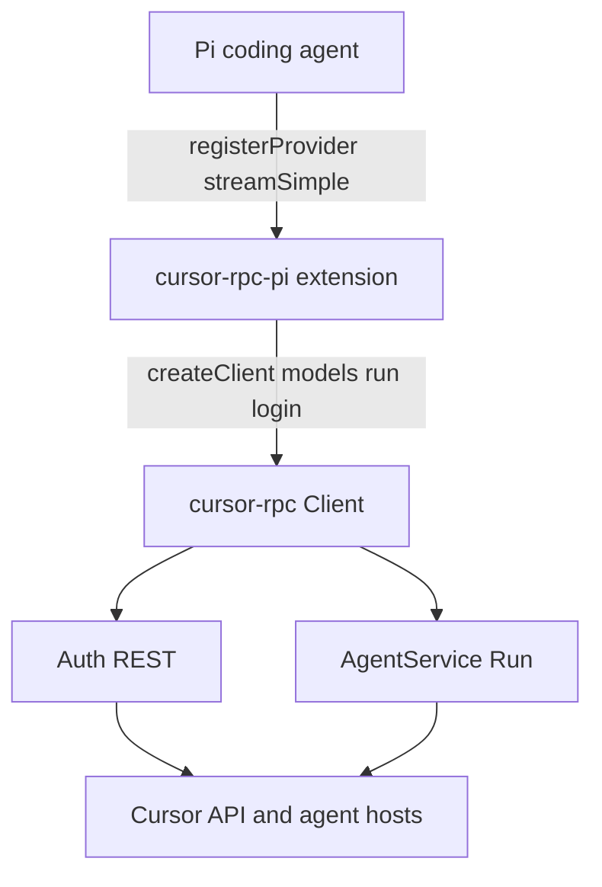
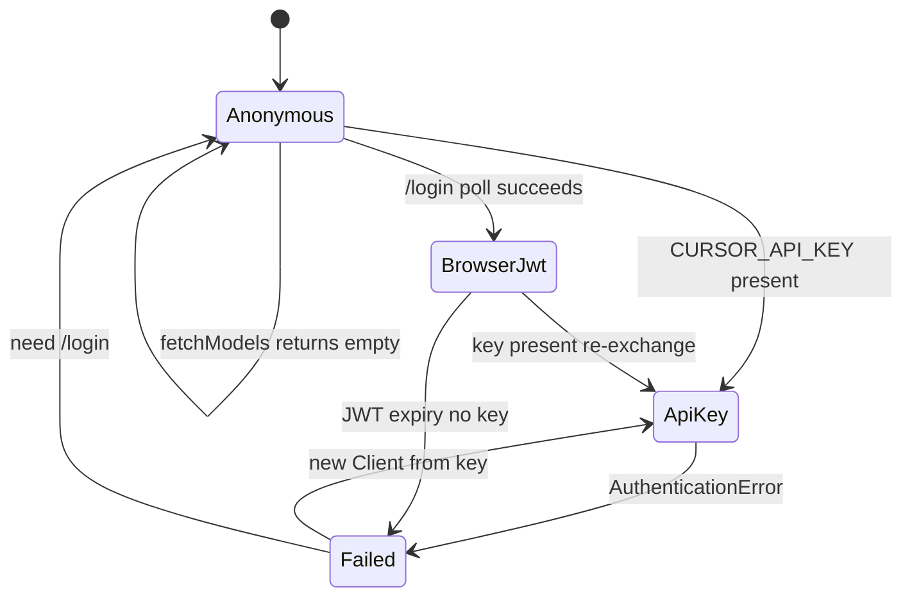
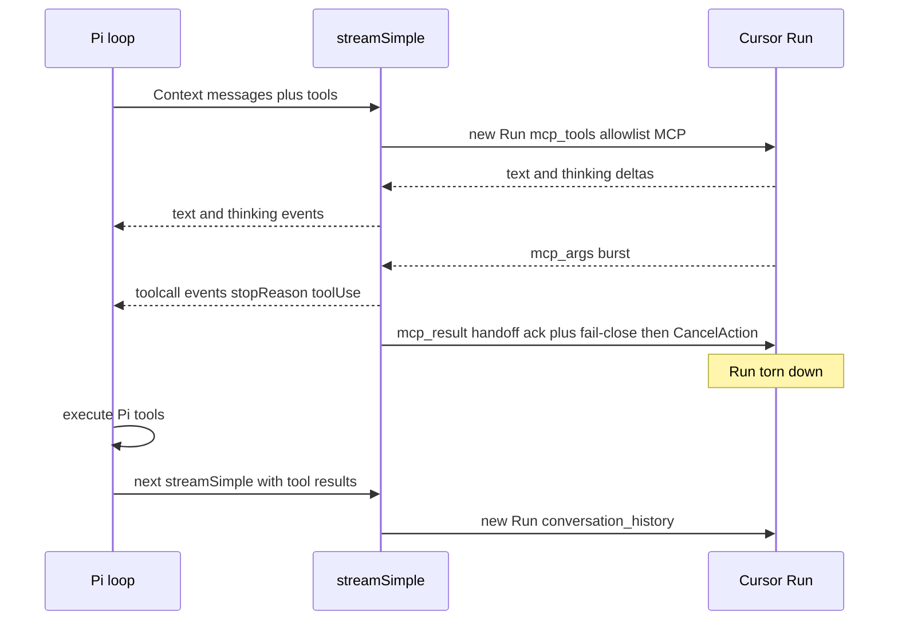

# Pi Agent Provider Plugin - Plan

## Goal Capsule

- **Objective:** Ship a Pi Coding Agent custom-provider package so Pi can use Cursor models through `cursor-rpc`, with Pi remaining the agent and Cursor remaining the model backend.
- **Authority:** `rpc_spec.md` owns the Cursor wire protocol. `docs/plans/2026-08-19-001-feat-nodejs-protocol-sdk-plan.md` owns the protocol SDK surface. Pi 0.84.x custom-provider and packages docs own extension registration. This plan owns the plugin and the narrow SDK increment that plugin needs (`mcp_args` channel, per-turn `mcp_tools`, per-run tool-gating headers). Where they disagree, the named spec owns protocol behavior; the SDK plan owns library defaults; this plan owns Pi mapping and the SDK additions it requires.
- **In scope:** Pi package identity, `createProvider` registration, API-key auth plus optional human `/login`, live model catalogue, custom `streamSimple` over one Cursor `Run` per Pi generation, MCP advertisement of Pi tools, fail-close then history continuation, overflow rewrite, SDK proto/handler additions needed for MCP capture.
- **Out of scope:** Wrapping Cursor as a nested agent, `@cursor/sdk`, the OpenAI-compatible server, usage/doctor commands, executing Cursor shell/file/MCP-server tools, parking a live `Run` across Pi tool execution, reading Cursor CLI/keychain credentials, HTTP/1.1 shim, checkpoint/blob resume.
- **Stop if:** Live `Run` cannot be torn down after an MCP handoff and continued on a new `Run` with portable `conversation_history` (no silent park, no checkpoint mix). Stop if the only way to get Cursor to call advertised MCP tools also forces Cursor built-in local exec that cannot be gated. Do not invent a third loop.
- **Execution profile:** Adapter over an in-progress SDK. Extend `cursor-rpc` for MCP exec capture first, then implement the Pi package against public SDK exports with a fake `Run`.
- **Tail ownership:** Implementer owns package manifest, tests, and README install path. Pi host owns credential persistence in `~/.pi/agent/auth.json`. Caller of `cursor-rpc` (this plugin) owns approval policy and local Pi tool execution.

---

## Product Contract

### Summary

This plan delivers a Pi custom provider that registers Cursor models through `cursor-rpc`. Pi stays the agent: it owns tools and the tool loop. Each Pi generation is one Cursor `Run`. When Cursor asks to invoke a Pi tool, the provider emits Pi tool-call events, fail-closes that `Run`, and continues on the next generation with portable conversation history.

Product Contract preservation: new bootstrap.

### Problem Frame

Pi can register non-standard model APIs via `pi.registerProvider()`. Cursor's backend is ConnectRPC `agent.v1.AgentService/Run`, not OpenAI or Anthropic, so a built-in `api` string cannot carry it. Community Cursor-in-Pi plugins exist; they either wrap `@cursor/sdk` (Cursor owns the loop) or reverse-engineer Connect without this repo's SDK. This package is the first-party consumer of `cursor-rpc`: headless API-key auth, no credential harvest, Pi-owned tools.

`packages/cursor-rpc-pi` is a typecheck stub today. `cursor-rpc` does not yet export `createClient` / `run` / `models` / `login`, and reconstructed exec messages omit `mcp_args` / `mcp_result`. The plugin cannot paper over those gaps.

### Requirements

**Identity and packaging**

- R1. The published package is the existing ESM workspace `cursor-rpc-pi`. It is a Pi package (`keywords` includes `pi-package`, `"pi".extensions` points at the built entry) that Node 22.19+ can load after `pi install npm:cursor-rpc-pi` or `pi -e`.
- R2. Runtime dependency is `cursor-rpc` via the ordinary workspace semver range. Pi host packages (`@earendil-works/pi-ai`, `@earendil-works/pi-coding-agent`, `@earendil-works/pi-agent-core`, `@earendil-works/pi-tui`, `typebox`) are peerDependencies at `"*"`. Do not bundle them. Do not depend on `@mariozechner/*`.
- R3. The default export is an extension factory that registers a complete `createProvider` provider. Provider id is `cursor-rpc`. The custom stream uses a unique `api` id that is not a Pi KnownApi (`openai-completions`, `anthropic-messages`, and siblings).
- R4. README states this is a protocol-SDK provider for Pi, not `@cursor/sdk`, not community `cursor` providers, and not a local Cursor agent.

**Authentication**

- R5. A caller with `CURSOR_API_KEY` can list models and complete a stream with no TTY, browser, or `/login`.
- R6. `/login cursor-rpc` wraps the SDK browser-login helper: surface the authorization URL, poll until tokens or abort. It never opens a browser from `streamSimple`. Missing credentials fail closed.
- R7. The plugin does not read Cursor CLI, app, or OS keychain stores. Credentials live in Pi's auth store, adapted into the SDK `CredentialStore`.
- R8. After SDK auth-failure clear, the plugin discards that `Client` and does not silent-re-exchange on the pinned instance. Headless recovery constructs a new client from `CURSOR_API_KEY`. Browser JWT has no redeemable refresh; expiry requires `/login` unless an API key can re-exchange.

**Models**

- R9. Extension load does not block Pi startup on Cursor network. Catalogue fill uses `createProvider` `fetchModels` against `client.models()`. Unauthenticated `fetchModels` returns `[]` without throwing.
- R10. Registered models come from the SDK merge of usable models. Do not ship a hardcoded Cursor model id as a fake catalogue. Each model carries provider `cursor-rpc` and the unique custom `api` id.

**Stream and tools**

- R11. One `streamSimple` call opens one `Run`. Map Pi `Context` (system prompt, messages, tools) into that `Run`. Yield Pi `start` / text / thinking / `toolcall_*` / `done` or `error`. Failures stay inside the stream; `streamSimple` does not throw.
- R12. Pi `Context.tools` are advertised as `AgentRunRequest.mcp_tools` for that turn. Cursor built-in tools are gated by per-run allowlist headers so only advertised MCP is in-policy. The plugin does not execute Cursor shell, file, or other local tools.
- R13. When Cursor sends `mcp_args` for an advertised Pi tool, emit Pi `toolcall_*` events and end the Pi stream with `stopReason` `toolUse`. Fail-close that `Run` (exactly one terminal reply per pending exec, interaction query, and KV message, then cancel). The next `streamSimple` opens a new `Run` with portable `conversation_history`. Do not park the live `Run` across Pi tool execution in this work.
- R14. `options.signal` abort tears down the `Run` after outstanding fail-closed replies and finishes the Pi stream as `aborted`.
- R15. Context-limit failures are rewritten so Pi compaction can fire. Auth, stall, HTTP/1.1-unsupported, policy, and rate-limit failures are not rewritten as overflow.

### Key Decisions

- KD1. Pi owns the agent loop. Cursor is the model. Governs R11, R12, R13. `(session-settled: user-approved — chosen over wrapping Cursor as a nested agent: the product is a Pi provider, not @cursor/sdk.)`
- KD2. Auth is API key plus optional human `/login`. Governs R5, R6, R7, R8. `(session-settled: user-approved — chosen over login-only and over reading Cursor CLI credentials: headless must work; harvest is out of identity.)`
- KD3. v1 is provider, models, and stream. No usage dashboard, doctor command, or extra slash commands. Governs R4. `(session-settled: user-approved — chosen over community-plugin extras: those are a different product.)`
- KD4. Tool handoff is fail-close then history, not a parked `Run`. Governs R13.

### Actors

- A1. Interactive Pi user: `/login cursor-rpc`, `/model`, chat.
- A2. Headless automation: `CURSOR_API_KEY`, no TTY.
- A3. Pi agent loop: calls `streamSimple`, executes Pi tools, sends tool results on the next generation.

### Key Flows

- F1. Headless API-key turn
  - **Trigger:** A2 starts Pi with `CURSOR_API_KEY` and a selected `cursor-rpc` model.
  - **Actors:** A2, A3
  - **Steps:** Factory registers provider with empty models; later `fetchModels` fills the catalogue; `streamSimple` opens `Run`; text/thinking events; `turn_ended` maps to `stop`.
  - **Covered by:** R5, R9, R10, R11
- F2. Interactive `/login`
  - **Trigger:** A1 runs `/login cursor-rpc`.
  - **Actors:** A1
  - **Steps:** SDK login helper returns a URL; Pi shows it; poll until JWT; store in Pi auth; refresh models. No browser from `streamSimple`.
  - **Covered by:** R6, R8, R9
- F3. Pi tool hop
  - **Trigger:** A3 passes tools; Cursor sends `mcp_args`.
  - **Actors:** A3
  - **Steps:** Emit `toolcall_*`; fail-close `Run`; Pi executes locally; next `streamSimple` sends history including tool results on a new `Run`.
  - **Covered by:** R12, R13
- F4. Abort
  - **Trigger:** A1/A2 abort the generation.
  - **Actors:** A1, A2, A3
  - **Steps:** Outstanding replies, cancel `Run`, Pi `stopReason` `aborted`.
  - **Covered by:** R14
- F5. JWT expiry
  - **Trigger:** Browser session expires mid or before a turn.
  - **Actors:** A1, A2
  - **Steps:** Auth error inside the stream; discard Client; A2 re-exchanges from API key on a new client; A1 without a key must `/login` again.
  - **Covered by:** R8

### Acceptance Examples

- AE1. Covers R5, R6. Given only `CURSOR_API_KEY` and no `/login`, when a text turn completes, then no browser or poll ran.
- AE2. Covers R9. Given the extension factory returns, when Pi startup continues, then no Cursor RPC was awaited in the factory.
- AE3. Covers R12, R13. Given Pi advertised a tool `read_file`, when Cursor sends matching `mcp_args`, then the Pi stream emits that tool call with `toolUse` and the `Run` is not left open.
- AE4. Covers R13. Given turn 1 ended in `toolUse` and Pi executed the tool, when turn 2 starts, then the new `Run` carries portable history, a new `conversation_id`, and no checkpoint blob ids.
- AE5. Covers R15. Given a Cursor context-limit error, when `message_end` runs, then `errorMessage` starts with `context_length_exceeded`. Given a rate-limit error, it does not.
- AE6. Covers R3. Given this provider and a built-in OpenAI model in the same Pi process, when both stream, then the OpenAI KnownApi handler is unchanged.

### Success Criteria

- A2 can list models and complete an ASK-or-tool turn using only an API key.
- Advertising Pi tools does not hang a `Run` in tests.
- Missing credentials never open a browser.
- `pi --list-models` can see the provider after load without a live Cursor account (empty list is allowed).

### Scope Boundaries

**In this work**

- Pi package identity, `createProvider`, auth adapter, `fetchModels`, `streamSimple`, overflow `message_end`.
- SDK increment: reconstruct `mcp_args` / `mcp_result`, per-turn `mcp_tools` and mode on `run`, per-run tool-gating headers, a caller-supplied MCP handler (library default remains SDK R17 throw).

**Deferred for later**

- Parking a live `Run` across Pi tool execution (heartbeat-while-Pi-runs).
- Image content in history.
- Parameterised model slugs as first-class Pi picker rows (`claude-…[context=1m,effort=high]`).
- Extra Pi commands (status, usage, doctor).
- HTTP/1.1 shim and checkpoint resume (already deferred in the SDK plan).

**Outside this product's identity**

- Official `@cursor/sdk` local/cloud agent runtime.
- Community providers that harvest Cursor CLI/keychain credentials.
- The OpenAI-compatible server in `apps/`.

### Sources

- `docs/plans/2026-08-19-001-feat-nodejs-protocol-sdk-plan.md` — SDK surface this plugin consumes.
- `docs/plans/2026-08-19-002-feat-npm-workspaces-scaffold-plan.md` — existing `packages/cursor-rpc-pi` stub.
- `docs/specs/rpc_spec.md` — Run, MCP declaration, exec channel, auth.
- https://pi.dev/docs/latest/custom-provider — `createProvider`, `streamSimple`, overflow.
- https://pi.dev/docs/latest/packages — Pi package shape and peerDeps.
- https://github.com/earendil-works/pi/tree/main/packages/coding-agent/examples/extensions/custom-provider-anthropic — stream + `/login` shape (not Cursor).

---

## Planning Contract

### Key Technical Decisions

- KTD1. Register `createProvider({ id: "cursor-rpc", auth, models: [], fetchModels, api: cursorStreams })` then `pi.registerProvider(provider)`. Rejected: legacy `registerProvider(name, config)` as the primary path, and `registerApiProvider`. Import `createProvider` only from the host-provided `@earendil-works/pi-ai` peer. Do not list `@earendil-works/*` under `dependencies` or as a workspace `devDependency` that can hoist a second copy beside the Pi CLI (duplicate `pi-ai` splits the provider registry). Typecheck Pi-facing modules with ambient/minimal local types, or only in a Pi-installed environment. Cite R2, R3, R9.
- KTD2. Custom `api` id is `cursor-connectrpc` (string, not a KnownApi). Set it on every registered model and on `output.api`. Rejected: `openai-completions` or `anthropic-messages`. Pi #2696: a custom `streamSimple` keyed by a KnownApi overwrites that API for every model in the process. Cite R3, AE6.
- KTD3. SDK prerequisite lands in `packages/cursor-rpc` before plugin stream work. SDK-owned: proto field 11; `run` options as **plain DTOs** (`name`, `description`, `inputSchemaJson`, ids — not generated protobuf-es messages); a discriminated MCP **event** on the public union; default MCP handler remains SDK R17 `throw`. Plugin-owned: map Pi `Context.tools` → those DTOs; on the MCP event, emit `toolcall_*`, send the terminal `mcp_result` handoff ack, fail-close, `stopReason: toolUse`. Do not bake Pi handoff semantics into the library. Cite R12, R13.
- KTD4. Tool hop is abort-and-history, not park-and-resume. `(session-settled: user-approved — chosen over parking a live Run: Pi owns the loop; the SDK's portable transcript is conversation_history.)` Parking is also incompatible with SDK stall-abort (30s inbound silence). On advertised `mcp_args` burst: emit Pi tool calls, send a terminal MCP handoff reply that is not Pi tool output, reject outstanding interaction queries, answer KV per SDK R17, `CancelAction`, ignore that Run's transcript. Next generation is a new `Run` with a **new `conversation_id` and `run_id`**. Portability is the history blob, not UUID reuse (reusing `conversation_id` can reattach Cursor checkpoint/pending-tool state). Leave `conversation_group_id` / `agent_session_id` unset. Unadvertised `mcp_args` is not a Pi tool: fail-close that exec and cancel. Cite R13, KD4.
- KTD5. Run posture for tool-capable turns is `AGENT_MODE_AGENT` with `x-cursor-agent-allowed-tools` allowlisting `mcp_tool_call` (and `get_mcp_tools_tool_call` if the server requires it to list advertised MCP). Rejected: relying on SDK default ASK + exclude-only web search/fetch. ASK may never emit `mcp_args`; exclude lists of 70+ built-in names drift. Text-only turns (no `Context.tools`) may keep SDK ASK defaults. Cite R12.
- KTD6. One SDK `Client` per auth epoch, shared by `fetchModels` and `streamSimple`. Headless uses `apiKey` from `CURSOR_API_KEY` (resolve-only; do not write the env key into Pi `auth.json`). `/login` wraps SDK `login` as Pi `auth.oauth` or `auth.apiKey.login` using URL+poll (not the Anthropic paste-code example). Persist access JWT through Pi's bag; do not persist poll `verifier`; Cursor `refreshToken` stays inert. SDK store for this plugin is in-memory only (no SDK file/keychain, no `AGENT_CLI_CREDENTIAL_STORE` persistence). After SDK `AuthenticationError` (Connect `Unauthenticated` after a Bearer was sent), drop the Client **after** the stream ends. Do not substring-clear the Pi bag on `401` in unrelated errors. Do not construct a replacement Client inside the same `streamSimple`. `oauth.refresh` does not redeem Cursor `refreshToken`; if an API key is stored, re-exchange on a **next** call's new client, else fail. Stall, HTTP/1.1-unsupported, policy, and abort keep the Client. Cite R5, R6, R7, R8.
- KTD7. `fetchModels` calls `client.models()` with the fetch `signal`. Seed `models: []`. Persist last successful catalogue through `createProvider` (0.84.0 owns restore). Do not `await` catalogue RPCs in the extension factory. Cite R9, R10.
- KTD8. Map `thinking_delta` to Pi thinking events. Drop `is_server_notice` from assistant text. Send Pi `systemPrompt` as `custom_system_prompt`. Images are out of scope. Honor `options.signal` and `options.maxTokens`. Cite R11, R14.
- KTD9. Overflow rewrite is a provider-scoped `message_end` handler: only this provider; only context-limit phrasing; prefix `context_length_exceeded` if absent; never rewrite rate-limit, stall, auth, or HTTP/1.1-unsupported. Cite R15, AE5.
- KTD10. Pi tests use vitest on `packages/cursor-rpc-pi` (`npm test -w cursor-rpc-pi`) with a fake SDK `Run`. Root `npm test` stays workspace-link only. Tighten `engines.node` to `>=22.19.0` to match Pi 0.84.2. Cite R1.

### High-Level Technical Design

Component topology:



Auth epochs:



Pi tool hop (one generation, then a new Run):



### Output Structure

```text
packages/cursor-rpc-pi/
  package.json          # Pi package manifest, peers, exports, test/build
  src/
    index.ts            # extension factory
    provider.ts         # createProvider wiring
    auth.ts             # apiKey resolve and /login wrap
    models.ts           # fetchModels mapping
    stream.ts           # streamSimple adapter
    overflow.ts         # message_end rewrite
  test/
packages/cursor-rpc/    # U1 only: proto exec MCP cases, run options, tests
```

The tree is a scope declaration. Per-unit file lists stay authoritative.

### Implementation Constraints

- Import only the public `cursor-rpc` export (`createClient`, `login`, errors, plain DTO `run` options, discriminated events). Do not import `src/generated` or `src/transport`.
- Do not log tokens, poll verifiers, `Authorization`, tool-arg payloads, or `Context` / history. Follow SDK KTD13. `/login` `onAuth` receives the authorization URL only, never the poll URL.
- Do not send `x-cursor-checksum`. Do not default `x-cursor-client-type` to `cli`.
- Do not bundle `@earendil-works/pi-*`.
- Reconstruct `McpArgs` / `McpResult` from `rpc_spec.md` §12.2 field numbers and community native providers; exact nested field names are an implementation-time discovery bound to the spec's field numbers.
- Keep workspaces-plan caret range on `cursor-rpc`. If the library version bumps, re-install so the lockfile still links the workspace.
- Tool-capable Runs still use SDK-minimal RequestContext: empty `workspace_paths`, omit `file_contents` / auto-run, `excludeWorkspaceContext: true`. Do not scrape git remotes or project layouts.

### Sequencing

Hard gate: SDK plan U6 and U7 public exports (`createClient`, `run`, `login`, `models`, error classes) exist before this U1. This U1 is an increment on that frozen list (proto field 11, DTO `run` options, MCP event), not a substitute for SDK U7.

Then U2 package/provider (may register with stub `fetchModels`/`streamSimple` without importing `run`) → U3 auth (needs SDK `login`) → U4 catalogue (`fetchModels` success does not imply Run is available) → U5 stream (fake `Run` is U1's public event union) → U6 overflow and README.

U5 must not start until U1 is publicly importable. U3 `/login` must wrap SDK URL+poll, not a paste-code flow.

### Assumptions

- `AGENT_MODE_AGENT` plus MCP allowlist is sufficient to get `mcp_args` without Cursor local shell/file exec. If a live probe shows otherwise, stop per Goal Capsule rather than implementing those tools.
- A terminal `mcp_result` that acknowledges handoff (not tool output) plus `CancelAction` does not poison the next `conversation_history` turn. If it does, that is the Goal Capsule stop, not a silent park.
- Pi 0.84.x `createProvider` `fetchModels` persistence is enough; no handwritten `ModelsStore`.

### Open Questions

- Q1. Deferred: exact `McpArgs` / `McpResult` nested fields after reading live or recorded frames. Not blocking: field numbers are specified (11).
- Q2. Deferred: whether `get_mcp_tools_tool_call` must join the allowlist. Default to include it if listing advertised tools fails in a probe.
- Q3. Deferred: Auto/`default` model row in the Pi picker. Default omit until the catalogue exposes a stable usable id.
- Q4. Deferred: live probe whether Cursor ignores checkpoint state when only `conversation_history` is sent with a reused `conversation_id`. v1 default is new ids per generation (KTD4).

### Risks and Dependencies

- **Dependency:** SDK plan U6–U7 public exports before this U1. This plugin cannot import `createClient` today.
- **Threat model:** (a) API keys, JWTs, poll verifiers; (b) Pi `auth.json` vs SDK `CredentialStore`; (c) prompt, tool schemas, and tool results on `Run`; (d) unadvertised `mcp_args`; (e) plugin logs, Pi `errorMessage`, overflow rewrite, README.
- **Risk:** Dual-loop hang if fail-close is skipped, or stall if a `Run` is left open while Pi executes tools. Mitigation: KTD4; U1 dispatcher tests plus U5 fake-Run suite.
- **Risk:** ASK never offers MCP, or AGENT re-enables Cursor local exec. Mitigation: KTD5 allowlist; Goal Capsule stop; do not implement those tools.
- **Risk:** Peer-dep duplicate `pi-ai` splits the provider registry. Mitigation: KTD1.
- **Risk:** Secret leak (tokens, verifier, proxy userinfo, tool args) via Pi UI, stream error, or overflow. Mitigation: KTD6, Implementation Constraints, U3/U6 tests.
- **Risk:** Spec §14.2 substring `401`/`unauthorized` wipes the Pi API key so F5 cannot recover. Mitigation: drop Client only on SDK `AuthenticationError`; do not substring-clear the Pi bag.
- **Risk:** Provider id `cursor-rpc` vs community `/login cursor`. Mitigation: README identity (R4).
- **Disclosure:** System prompt, messages, advertised tool schemas, and later tool results leave the machine on `Run`. Users who need that not to happen must not use this provider.

### System-Wide Impact

Affected parties: interactive Pi user, headless API-key automation, Pi agent loop, `cursor-rpc` maintainers (U1 is a public-surface change), Pi host process (peer registry, `message_end`, KnownApi table), Cursor account APIs. Not in identity: `@cursor/sdk`, community credential-harvest providers, the OpenAI-compatible server.

Interfaces: public `cursor-rpc` only (KTD3). Pi `createProvider` id `cursor-rpc`, api `cursor-connectrpc` (KTD2 is process-global; AE6). Overflow `message_end` is process-global (KTD9 scoping is a host invariant). Credentials: Pi bag → in-memory SDK store (KTD6). Cursor `interaction_query` is rejected, not forwarded to the Pi user. Cursor shell/file exec stays SDK `throw`.

Failure propagation:

| Failure | Plugin | Client epoch |
| --- | --- | --- |
| `AuthenticationError` mid-stream | Pi `error`; drop Client after the stream ends | next call: new Client from key, or `/login` |
| Stall (`StreamError`, retryable) | Pi `error`; no in-stream retry; not overflow | keep Client |
| `TransportUnsupportedError` (HTTP/1.1) | catch → Pi `error`; not shim; not overflow | keep Client; `models()` may still succeed |
| `PolicyError` / rate-limit | Pi `error`; not overflow; no poll | keep Client |
| `CancelledError` / `options.signal` | `aborted` | keep Client |
| Unanswered `mcp_args` | forbidden; U1/U5 hang tests | — |

Catalogue persistence can show models after JWT expiry while streams fail — picker is not session health. Do not park Run state or persist SDK checkpoint/blob ids in Pi messages.

### Sources and Research

External research was load-bearing for KTD1, KTD2, KTD4, KTD6, KTD7, KTD9, KTD10.

- Pi custom providers 0.84.x — https://pi.dev/docs/latest/custom-provider
- Pi packages / peerDeps — https://pi.dev/docs/latest/packages
- `createProvider` and `fetchModels` — `@earendil-works/pi-ai` 0.84.2 README
- Unique custom `api` overwrites KnownApi streams — https://github.com/earendil-works/pi/issues/2696
- `@mariozechner/*` deprecated 2026-05-07; current scope `@earendil-works`
- Official stream example — `packages/coding-agent/examples/extensions/custom-provider-anthropic`
- Closest prior art (do not clone extras or credential harvest) — `@rahularya01/pi-cursor`
- Nested-agent competitor, out of identity — https://pi.dev/packages/pi-cursor-sdk
- Cursor browser sessions have no working refresh without an API key — `rpc_spec.md` §5.4; Cursor SDK auth docs

---

## Implementation Units

### U1. SDK MCP run surface

- **Goal:** Public `run` can advertise MCP tools, surface `mcp_args`, accept a caller MCP handler, and stamp per-run tool-gating headers. The library still does not execute tools. Default MCP handler remains SDK R17 `throw`.
- **Requirements:** R12, R13, KTD3, KTD5
- **Dependencies:** SDK plan U6 and U7 (`createClient`, `run`, dispatcher)
- **Files:** `packages/cursor-rpc/proto/agent/v1/agent.proto`, `packages/cursor-rpc/src/run/dispatch.ts`, `packages/cursor-rpc/src/run/run.ts`, `packages/cursor-rpc/src/client.ts`, `packages/cursor-rpc/src/index.ts`, `packages/cursor-rpc/test/mcp-exec.test.ts`, `packages/cursor-rpc/test/run.test.ts`
- **Approach:**
  1. Add `mcp_args` / `mcp_result` as exec oneof field 11. Keep other unknown execs on SDK R17 `throw`.
  2. Extend `run` options with per-turn `mode`, `mcpTools` as **plain DTOs** (`name`, `description`, `inputSchemaJson`), `conversationHistory`, `conversationId`, and allow/exclude tool header names. Do not require reconstructing the Client to change tools. Do not put generated protobuf-es types on the public export.
  3. Yield a discriminated MCP exec event on the public union. Default MCP handler stays SDK R17 `throw`. The plugin, not the library, sends the handoff ack (KTD3).
  4. Default header policy for callers that pass `mcpTools` is allowlist `mcp_tool_call` (KTD5). Callers that pass no tools keep SDK R15/R21 defaults.
- **Execution note:** Dispatcher tests first with a fake bidi iterable; prove MCP reply + cancel does not hang before any Pi work.
- **Patterns to follow:** SDK U6 dispatcher correlation (`id` / `exec_id`), SDK R16 exactly-one reply, SDK KTD5 dispatcher table.
- **Test scenarios:**
  - Happy path: `run({ mcpTools: [read_file] })` accepts a plain DTO (not a generated message type), serializes `mcp_tools`, and sets allowlist header `mcp_tool_call`.
  - Happy path: inbound `mcp_args` with a handler sends `mcp_result` field 11 with echoed `id`/`exec_id` and yields a typed MCP event.
  - Edge: no `mcpTools` keeps ASK defaults and web-tool exclude headers from SDK R21.
  - Error: inbound `mcp_args` with no handler still sends exactly one `throw` and the test does not hang.
  - Error: shell `exec` remains unimplemented `throw`.
  - Integration: second `run` with `conversationHistory` omits checkpoint blobs (SDK AE4 still holds).
- **Verification:** `npm test -w cursor-rpc` covers the new dispatcher cases. Public exports still omit generated proto.

### U2. Pi package and provider registration

- **Goal:** Replace the stub with a loadable Pi package that registers `cursor-rpc` without network in the factory.
- **Requirements:** R1, R2, R3, R4, AE6, KTD1, KTD2, KTD10
- **Dependencies:** U1 for types only; factory can register with empty `fetchModels`/`streamSimple` stubs until U4/U5
- **Files:** `packages/cursor-rpc-pi/package.json`, `packages/cursor-rpc-pi/tsconfig.json`, `packages/cursor-rpc-pi/src/index.ts`, `packages/cursor-rpc-pi/src/provider.ts`, `packages/cursor-rpc-pi/test/extension.test.ts`
- **Approach:**
  1. Add `exports`, `files`, `build` (`tsc` emit), `test` (vitest), `keywords: ["pi-package"]`, `"pi": { "extensions": ["./dist/index.js"] }`, `engines.node: ">=22.19.0"`, peerDependencies `"*"` for the five Pi packages, keep `cursor-rpc` in `dependencies`.
  2. Default export: `async function (pi) { pi.registerProvider(createProvider(...)); pi.on("message_end", overflowHandler); }`. Factory must not await Cursor RPCs (AE2).
  3. Delete the stub `export const provider = \`pi:${name}\``. Update `test/workspaces-link.test.mjs` if it imported `name` through this package.
- **Patterns to follow:** Official Anthropic example's default export; Pi packages.md peerDep list; workspace tsconfig extends `../../tsconfig.base.json`.
- **Test scenarios:**
  - Happy path: loading the factory registers provider id `cursor-rpc` and models start as `[]`.
  - Covers AE2. Factory promise resolves without calling `createClient.models`.
  - Covers AE6. Provider `api` on registered models is `cursor-connectrpc`, not a KnownApi.
  - Error: package.json peers are `"*"`, `cursor-rpc` is not a peer, and `@earendil-works/*` is not under `dependencies`.
- **Verification:** `npm run typecheck -w cursor-rpc-pi` after a library build. `npm test -w cursor-rpc-pi` for the registration test.

### U3. Auth adapter

- **Goal:** Headless API key and optional `/login` share one Client-per-epoch rule with no credential harvest and no stream-time browser.
- **Requirements:** R5, R6, R7, R8, AE1, KTD6
- **Dependencies:** U2, SDK `login` / `createClient`
- **Files:** `packages/cursor-rpc-pi/src/auth.ts`, `packages/cursor-rpc-pi/src/provider.ts`, `packages/cursor-rpc-pi/test/auth.test.ts`
- **Approach:**
  1. `auth.apiKey.resolve` reads Pi-stored access JWT or `CURSOR_API_KEY` and constructs `createClient({ apiKey })`. Env key is resolve-only.
  2. `/login` wraps SDK `login`: pass the authorization URL through Pi auth interaction (`onAuth` / notify). Never the poll URL or `verifier`. Do not call `openBrowser`. Honor abort on the poll. Persist access JWT; do not persist `verifier`; Cursor `refreshToken` stays inert.
  3. SDK store is in-memory only. On SDK `AuthenticationError`, drop the Client after the stream ends. Keep a stored API key for F5. Do not substring-clear the Pi bag.
- **Patterns to follow:** SDK F3 / R4 / AE5 (no default browser). Pi `auth.apiKey` / `auth.oauth` on `createProvider`, not Anthropic paste-code.
- **Test scenarios:**
  - Covers AE1. `streamSimple` with env key never calls `login`.
  - Happy path: `/login` helper returns an authorization URL (`challenge` present, `verifier` absent) and stores access JWT in the Pi credential shape. Poll `verifier` is not in the bag.
  - Error: missing credentials from `streamSimple` emit `stopReason: "error"` and zero poll requests.
  - Error: after `AuthenticationError`, a second call does not reuse the pinned Client; constructing from stored/env API key does not call `/login`.
  - Error: rate-limit or stall whose text contains `401` does not clear a stored Pi API key and does not start poll.
  - Edge: no reads of `~/.cursor/` or OS keychain APIs; with SDK file-store env set, adapter still uses memory and does not write a Cursor-domain `auth.json`.
  - Error: fake `login` failure whose URL or `cause` contains `verifier=` and `Bearer`: Pi-facing `onAuth`/error omit those substrings; proxy userinfo is stripped.
- **Verification:** Auth tests pass with a fake SDK `login` and in-memory Pi credential bag.

### U4. Model catalogue

- **Goal:** `fetchModels` fills Pi's model list from `client.models()` without blocking startup.
- **Requirements:** R9, R10, KTD7
- **Dependencies:** U3
- **Files:** `packages/cursor-rpc-pi/src/models.ts`, `packages/cursor-rpc-pi/src/provider.ts`, `packages/cursor-rpc-pi/test/models.test.ts`
- **Approach:**
  1. Map SDK usable models to Pi `Model` rows: `id`, `name`, `provider: "cursor-rpc"`, `api: "cursor-connectrpc"`, `contextWindow`, `maxTokens`, `reasoning`, `input: ["text"]`, `cost` zeros if the SDK has no prices.
  2. Honor `signal`. Unauthenticated → `[]`. Empty usable list → `[]`, not a placeholder id.
  3. Omit Auto/`default` until Q3 is resolved.
- **Patterns to follow:** SDK R13 merge is already done inside `client.models()`; do not re-merge `GetUsableModels` in the plugin.
- **Test scenarios:**
  - Happy path: two usable models become two Pi models with the custom `api` id.
  - Edge: no credentials returns `[]` without throwing.
  - Edge: empty usable list returns `[]`.
  - Error: aborted `signal` rejects or returns `[]` without hanging.
- **Verification:** Catalogue tests do not use the network.

### U5. streamSimple mapping and fail-close hop

- **Goal:** Translate one Pi generation onto one Cursor `Run`, including MCP tool hops.
- **Requirements:** R11, R12, R13, R14, AE3, AE4, KTD4, KTD5, KTD8
- **Dependencies:** U1, U3, U4
- **Files:** `packages/cursor-rpc-pi/src/stream.ts`, `packages/cursor-rpc-pi/src/provider.ts`, `packages/cursor-rpc-pi/test/stream.test.ts`, `packages/cursor-rpc-pi/test/abort.test.ts`
- **Approach:**
  1. Build `conversation_history` from Pi `Context.messages` (user, assistant text/thinking/toolCall, toolResult). Opening user text is the latest user message. Set `custom_system_prompt` from `context.systemPrompt`. Mint a new `conversation_id` and `run_id` per generation (KTD4).
  2. If `context.tools` is non-empty, `mode: AGENT`, `mcpTools` from Pi tool name/description/parameters JSON Schema, allowlist MCP. Keep SDK-minimal RequestContext (empty `workspace_paths`, no `file_contents`, `excludeWorkspaceContext: true`). Otherwise SDK ASK defaults.
  3. Map SDK text/thinking events to Pi content events. On advertised MCP exec: accumulate the burst, emit `toolcall_*`, fail-close, `done` with `toolUse`. Unadvertised `mcp_args` is not a Pi tool.
  4. Abort: fail-close then cancel; `stopReason: "aborted"`. Forward `options.maxTokens` onto the Cursor `Run` (KTD8). Stall/auth/HTTP/1.1 map per System-Wide Impact, not overflow. Catch SDK `TransportUnsupportedError` inside the stream.
- **Execution note:** Drive the adapter with a fake SDK `Run` (scripted text, `mcp_args`, interaction_query, abort). Do not require a live Cursor account.
- **Patterns to follow:** Pi `createAssistantMessageEventStream` start → content → done/error. SDK U6 hang-prevention. Community native providers for MCP advertisement; do not copy park-and-resume.
- **Test scenarios:**
  - Happy path: text deltas then `turn_ended` produce Pi `stop`.
  - Covers AE3. Scripted `mcp_args` for `read_file` yields matching `toolCall` and `toolUse`; fake Run receives a terminal MCP reply and cancel.
  - Covers AE4. Second `streamSimple` after a tool result serializes history tool messages, uses a **new** `conversationId`/`runId`, and does not send checkpoint blobs or extra workspace contents.
  - Edge: two advertised `mcp_args` in one burst both become Pi tool calls before cancel.
  - Edge: inbound `mcp_args` for a name not in this turn's `Context.tools` (or any MCP on a text-only turn) is not a Pi `toolCall`; fake Run still gets a terminal reply + cancel.
  - Edge: tool-capable `run` options keep empty `workspace_paths`, omit `file_contents`, and set `excludeWorkspaceContext`.
  - Edge: `is_server_notice` is not concatenated into assistant text.
  - Error: inbound `interaction_query` is rejected and the stream still ends.
  - Error: unimplemented shell/write/read exec is thrown at the SDK layer and does not become a Pi tool.
  - Error: `options.signal` abort yields `aborted` and tears down the fake Run.
  - Error: `streamSimple` does not throw when the fake Run fails or when `run` raises `TransportUnsupportedError`; it pushes `error`.
  - Edge: adapter logs do not contain scripted tool-arg payloads.
- **Verification:** `npm test -w cursor-rpc-pi` stream and abort files pass with no hanging tests.

### U6. Overflow rewrite, docs, and install identity

- **Goal:** Pi compaction recognizes Cursor context-limit errors, and humans can install the right provider id.
- **Requirements:** R4, R15, AE5, KTD9
- **Dependencies:** U2, U5
- **Files:** `packages/cursor-rpc-pi/src/overflow.ts`, `packages/cursor-rpc-pi/src/index.ts`, `packages/cursor-rpc-pi/README.md`, `packages/cursor-rpc-pi/test/overflow.test.ts`
- **Approach:**
  1. `message_end` handler scoped to `message.provider` and `ctx.model?.provider` === `cursor-rpc`. Prefix `context_length_exceeded` only on context-limit phrasing.
  2. README first paragraph is R4. Document `pi install npm:cursor-rpc-pi`, `CURSOR_API_KEY`, `/login cursor-rpc`, `/model cursor-rpc/…`. State no usage/doctor commands in v1. State that prompts, tool schemas, and tool results are sent to Cursor. Use placeholders only.
- **Patterns to follow:** Pi custom-provider overflow sample; SDK README disambiguation vs `@cursor/sdk`.
- **Test scenarios:**
  - Covers AE5. Context-limit `errorMessage` is rewritten; `rate limit` is not; already-prefixed messages stay idempotent.
  - Edge: other providers' messages are untouched.
  - Error: context-limit `cause` containing `Bearer` / `verifier=` still rewrites without those substrings.
  - Edge: README uses placeholders and states turn data is sent to Cursor.
- **Verification:** Overflow tests pass. README names provider id `cursor-rpc` and unique `api` id.

---

## Verification Contract

| Gate | Command | Applies to | Done signal |
| --- | --- | --- | --- |
| SDK MCP surface | `npm test -w cursor-rpc` | U1 | Dispatcher hang-prevention includes MCP cases |
| Plugin unit tests | `npm test -w cursor-rpc-pi` | U2–U6 | Registration, auth, models, stream, abort, overflow pass |
| Types | `npm run typecheck` | U1–U6 | Root typecheck (library build then all workspaces) |
| Link smoke | `npm test` | U2 | Workspace link test still imports `cursor-rpc` locally |

Do not require a live Cursor account for CI. Optional developer probe: `CURSOR_API_KEY` plus `pi -e ./packages/cursor-rpc-pi`.

---

## Definition of Done

- R1–R15 are met or explicitly deferred in Scope Boundaries.
- U1 is on the public `cursor-rpc` export; the plugin does not import generated proto.
- AE1–AE6 have matching tests or README statements (AE6 via registration test).
- README distinguishes this package from `@cursor/sdk` and from community `cursor` providers.
- No usage/doctor commands shipped.
- Goal Capsule stop conditions remain: no silent park, no Cursor local tool execution.
