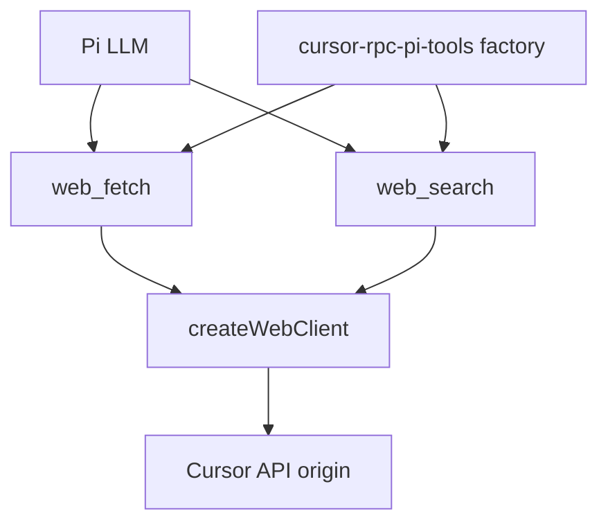
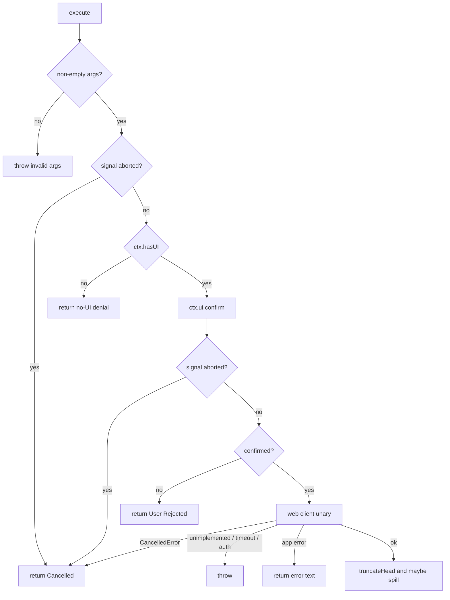

# Pi Web Fetch and Search Tools - Plan

## Goal Capsule

- **Objective:** Ship a Pi-installable workspace package that registers `web_fetch` and `web_search` so a Pi model can retrieve Markdown and search references through Cursor's authenticated unary RPCs.
- **Authority:** `docs/specs/web_fetch.md` and `docs/specs/web_search.md` own unary request/response shapes and the year-guidance rule. `docs/specs/rpc_spec.md` owns auth, headers, and Connect transport. `docs/plans/2026-08-19-002-feat-npm-workspaces-scaffold-plan.md` owns workspace linking. `docs/plans/2026-08-19-001-feat-nodejs-protocol-sdk-plan.md` owns the rest of the protocol SDK. This plan owns the Pi tools package and the unary web client those tools need. Where they disagree, the named spec owns wire behavior; this plan owns Pi UX and the web-client surface; the workspaces plan owns package linking.
- **In scope:** Reconstruct `RunWebFetch` / `RunWebSearch` on `cursor-rpc`, a public web client, a fourth workspace `cursor-rpc-pi-tools`, Pi `registerTool` factories, Pi-native confirm, fail-closed print/json, truncation, year-guidance, and a deferred-list retarget on the SDK plan.
- **Out of scope:** Completing `cursor-rpc-pi` as a provider, agent-stream interaction/precheck handlers, Cursor CLI allowlists and `autoAcceptWebSearch`, browser login from tool execute, local HTTP fetch, npm registry publish.
- **Stop if:** After JSON-first plus binary retry on HTTP 415, a unary that is Connect `unimplemented`, HTTP 404, or not the spec oneof/document shape is disabled. Do not fall back to `AgentService/Run`, client-side HTTP, or a third search provider. The sibling tool still ships when its unary works.
- **Execution profile:** Library contract tests first, then Pi execute tests with a fake web client. No live Cursor account in CI. Optional developer probe of the unverified unaries.
- **Tail ownership:** Implementer owns proto generate, public exports, the Pi package manifest, and the SDK-plan deferred-list edit. The caller of Pi owns credentials and whether to `pi install` the local path.

---

## Product Contract

### Summary

A new Pi-installable tools package registers two Pi-callable tools: WebFetch (URL to Markdown) and WebSearch (query to references). Pi's model calls them. They authenticate through `cursor-rpc` and hit Cursor's fetch/search backend. This is not the Cursor-provider stub, not a full agent turn, and not a clone of the official CLI. Because those backend calls are still deferred in the protocol library, this plan also adds them there.

Product Contract preservation: new bootstrap.

### Problem Frame

Pi has no built-in fetch or search. Cursor's backend already converts pages to Markdown and returns search documents, but those unaries are deferred in the SDK plan and absent from proto. The existing `cursor-rpc-pi` stub is a provider identity placeholder, not a Pi package. Without a tools package, a Pi agent cannot use the Cursor web backend, and folding the tools into the provider stub would mix model-provider work with tool registration.

### Requirements

**Package identity**

- R1. A publishable ESM workspace named `cursor-rpc-pi-tools` exists under `packages/` and depends on `cursor-rpc` with an ordinary caret range that satisfies the local library version.
- R2. The package is Pi-installable: `keywords` includes `pi-package`, and `pi.extensions` points at the factory file Pi should load.
- R3. `cursor-rpc-pi` stays a provider stub. It does not gain `pi-package` or these tools.

**Tools**

- R4. The extension registers `web_fetch` (label `WebFetch`) with a required `url` string. On success the LLM receives the unary `content` as text.
- R5. The extension registers `web_search` (label `WebSearch`) with a required `search_term` string. On success the LLM receives a JSON array of `{title,url,chunk}` mapped from unary documents `{url,title,text}`. The optional unary `answer` is omitted from LLM content.
- R6. Both tools set `promptSnippet` and `promptGuidelines` that name the tool. Search guidelines include the year-guidance paragraph from `docs/specs/web_search.md` §15, built from today's UTC `YYYY-MM-DD`.
- R7. Neither tool performs HTTP on the caller's machine. Execution is the corresponding `aiserver.v1.AiService` unary on the API origin.

**Auth and client**

- R8. Tools share one authenticated web client per extension factory, using `CURSOR_API_KEY` or `CURSOR_AUTH_TOKEN` through `cursor-rpc`. Missing credentials throw from `execute`, not from factory load.
- R9. `execute` never opens a browser or starts login polling.
- R10. `cursor-rpc` exposes a public web client that performs `RunWebFetch` and `RunWebSearch` without exporting generated protobuf types.

**Approval**

- R11. When `ctx.hasUI` is true (TUI and RPC), each call prompts with `ctx.ui.confirm` before the unary. Fetch prompt: `Allow this web fetch?` plus the URL. Search prompt: `Allow this web search?` plus the term.
- R12. When `ctx.hasUI` is false (print and JSON), the tool returns a denial string and does not call the RPC. No standing auto-approve environment variable.

**Errors, cancel, truncation**

- R13. Empty or whitespace `url` / `search_term` throws before confirm. Auth, transport, timeout (`is_timeout` or `deadline_exceeded`), and Connect `unimplemented` throw from `execute` (Pi `isError`).
- R14. User deny, no-UI deny, and abort/cancel return text and do not set `isError`. Application-level fetch/search error strings without timeout return text and do not set `isError`. Empty search documents are success.
- R15. LLM payloads pass Pi `truncateHead` at 50KB and 2000 lines. Truncated remainder is spilled to a temp file and the path is appended to the result. Limits are documented in each tool description.

**Install**

- R16. Local development uses root workspace install, a built `cursor-rpc` `dist`, and `pi install` of the tools package path. The package does not claim `npm:` install until `cursor-rpc` is published.

### Actors

- A1. Pi user in TUI or RPC who can answer a confirm dialog.
- A2. Headless Pi user (`-p` / JSON) with no UI.
- A3. Pi's LLM, which calls the registered tools.
- A4. Developer installing the workspace package locally.

### Key Flows

- F1. TUI fetch
  - **Trigger:** A3 calls `web_fetch` with a URL.
  - **Actors:** A1, A3
  - **Steps:** Validate URL. Confirm. Authenticate. Unary `RunWebFetch`. Return truncated `content`.
  - **Covered by:** R4, R7, R8, R11, R15
- F2. TUI search
  - **Trigger:** A3 calls `web_search` with a term.
  - **Actors:** A1, A3
  - **Steps:** Validate term. Confirm. Resolve Cursor `model_id`. Unary `RunWebSearch`. Map documents. Omit `answer`. Truncate.
  - **Covered by:** R5, R6, R7, R11, R15
- F3. Headless deny
  - **Trigger:** A3 calls either tool under print or JSON.
  - **Actors:** A2, A3
  - **Steps:** Validate. Return no-UI denial text. No RPC.
  - **Covered by:** R12, R14
- F4. Local Pi load
  - **Trigger:** A4 builds the library and installs the tools package path.
  - **Actors:** A4
  - **Steps:** Root install links workspaces. Library emit exists. Pi loads the factory from `pi.extensions` and both tools appear in `getAllTools`.
  - **Covered by:** R1, R2, R16

### Acceptance Examples

- AE1. Covers R4, R11, R14. Given TUI and a valid URL, when the user denies confirm, then no unary runs and the tool returns `User Rejected` without `isError`.
- AE2. Covers R12, R14. Given print mode, when the model calls `web_search`, then the result is a no-UI denial string and the web client is not invoked.
- AE3. Covers R5. Given a unary success with two documents and an `answer`, when `web_search` formats output, then the LLM text is a JSON array of two `{title,url,chunk}` objects and does not contain `answer`.
- AE4. Covers R8, R9. Given no credentials, when `execute` runs, then it throws an authentication error and does not open a browser.
- AE5. Covers R13. Given Connect `unimplemented` after the library codec path, when either unary is attempted, then `execute` throws and does not open `AgentService/Run` or `fetch`.
- AE6. Covers R3. Given the provider stub, when the tools package is added, then `cursor-rpc-pi` still has no `pi` key and no `pi-package` keyword.

### Success Criteria

- `npm test -w cursor-rpc` covers the new web client.
- `npm test -w cursor-rpc-pi-tools` covers confirm, mapping, truncation, and no-UI deny with a fake client.
- `pi install` of the local tools path registers both tool names.
- SDK plan no longer lists these unaries as deferred.

### Scope Boundaries

**In this work**

- Unary proto, generate, and public web client on `cursor-rpc`.
- Pi tools package with two tools.
- Pi-native confirm and fail-closed print/json.
- SDK-plan deferred-list retarget.

**Deferred for later**

- Durable standing-accept (session entry, config flag, or host allowlist).
- Publishing `cursor-rpc` and `cursor-rpc-pi-tools` to npm.
- Completing `cursor-rpc-pi` as a Pi provider.
- Exposing unary `answer` to the LLM.
- Live probe automation in CI.

**Outside this product's identity**

- Cursor CLI `permissions.allow` / `approvalMode` / `autoAcceptWebSearch` / `CURSOR_FORCED_SHELL_EGRESS`.
- Agent-stream `web_fetch_request_query`, allowlist precheck exec, and `web_search_request_query` handlers.
- Official `@cursor/sdk` agent runtime.
- Client-side page fetch or a non-Cursor search API.

### Key Decisions

- KD1. Pi-callable tools, not provider-side handlers. Governs R4, R5, R7. `(session-settled: user-approved — chosen over Cursor-model fetch/search handlers in the provider: Pi's model is the caller; Cursor is the retrieval backend.)`
- KD2. Pi-native confirm / fail-closed print, not Cursor CLI policy. Governs R11, R12. `(session-settled: user-approved — chosen over cloning allowlists, approvalMode, and autoAcceptWebSearch: Pi already owns confirmation; print cannot prompt.)`

---

## Planning Contract

### Key Technical Decisions

- KTD1. Reconstruct `RunWebFetch` and `RunWebSearch` on `aiserver.v1.AiService` in `packages/cursor-rpc/proto/aiserver/v1/ai.proto`. Do not add them to `agent/v1/agent.proto`. Do not name aiserver messages `WebFetchResult` or `WebSearchResult`. Cite R7, R10.
- KTD2. Public unary surface is a permanent `createWebClient(options?)` facade returning `{ fetch, search, close }` with plain JSON-shaped results. Internals stay module-private: `AuthSession`, stores, `createOriginConnection`, `unaryCall`, generated `AiService` and messages. `package.json` `exports` stays `"."` only. Rejected: exporting internals or proto (breaks R10 and the later U7 freeze). Rejected: waiting for SDK U7 `createClient` (blocks this plan on `run()` and pulls agent-host transport). Rejected: shipping a partial `Client` with U7 option names. After U7, `createClient` may reuse internal helpers but must not swallow or rename this export or share an agent-host HTTP/2 manager with it. Do not name public result types `WebFetchResult` or `WebSearchResult`. Cite R8, R10. Honors SDK-plan R22, KTD4, KTD12.
- KTD3. Call the API origin with existing `unaryCall` and JSON-first 415 fallback. Do not use `bootstrap().agentBaseUrl` or `assertRunTransport`. Ghost mode stays fail-closed (`"true"`). The tool URL is never a client HTTP target, including preflight HEAD/GET and unimplemented recovery. Cite R7. Honors SDK-plan KTD3 and KTD12.
- KTD4. Search `model_id` is `GetDefaultModelForCli.model.modelId` if non-empty, else first `GetUsableModels` id, else throw `No model found.` Resolve lazily on first search, single-flight, and cache. Fetch never joins that flight. Omit `explanation`. Cite R5.
- KTD5. Pi package declares `"pi": { "extensions": ["./src/index.ts"] }`, `keywords: ["pi-package"]`, and peerDependencies `"*"` for `@earendil-works/pi-coding-agent`, `@earendil-works/pi-ai`, `@earendil-works/pi-tui`, and `typebox`. `cursor-rpc` is a runtime `dependencies` caret range. Do not import `@mariozechner/*`. Cite R1, R2.
- KTD6. Gate dialogs on `ctx.hasUI`, not `ctx.mode === "tui"`. Print/JSON `confirm()` returns `false` without prompting. RPC still calls confirm. Cite R11, R12, KD2.
- KTD7. Throw vs return follows R13–R14. Catch `CancelledError` and aborted `signal` and return `Cancelled`. After confirm, if `signal.aborted` then `Cancelled`, else if `!ok` then `User Rejected`. If `confirm()` throws or rejects, return deny/Cancelled, do not call the unary, and do not treat it as `isError` retry. Cite R13, R14.
- KTD8. Dependents keep `cursor-rpc: ^1.0.0` via workspace install, not `file:` or `workspace:*`. `npm:` Pi install waits on a published library. Cite R1, R16. Honors workspaces-plan KTD2.
- KTD9. Edit `docs/plans/2026-08-19-001-feat-nodejs-protocol-sdk-plan.md` so Direct `RunWebSearch` / `RunWebFetch` move out of Deferred and point at this plan as owner of those unaries and of a permanent `createWebClient` sibling, not a wrap preview of U7. Do not implement SDK U6/U7 as a prerequisite. Cite R10.
- KTD10. One `WebClient` per Pi factory invocation is shared by both tools. Concurrent fetch and search are allowed. Single-flight `accessToken` and KTD4 `model_id` at the WebClient boundary. A per-call `AbortSignal` cancels only that unary. `close()` is the only `sessionManager.abort()`, is idempotent, and runs on `session_shutdown`, not on a tool throw. Pin is instance-scoped: one Unauthenticated clears the store and both tools throw `AuthenticationError` with no re-exchange until a new factory client. Rejected: one client per tool (split pin, silent re-exchange). Rejected: globally serializing all RPCs. Cite R8. Honors SDK-plan KTD12.
- KTD11. Public errors, R14 tool text, logs, `inspect`, and the optional probe honor the same redaction as `packages/cursor-rpc/src/errors.ts` (`Bearer`, authorization, token/key fields, URL userinfo). Do not log raw URL query strings. Truncation spill is owner-only and is not an env/credential dump. Cite R14.
- KTD12. Treat `url` and `search_term` as untrusted in confirm UI. Confirm display is a single line: strip C0/C1/ANSI, collapse newlines, bound length. The unary still sends the original argument the model passed. Do not retrieve the URL to canonicalize it. Cite R11.

### High-Level Technical Design





### Output Structure

```text
packages/cursor-rpc/
  proto/aiserver/v1/ai.proto          # add RunWeb* rpcs and messages
  src/web/client.ts                   # createWebClient
  src/index.ts                        # export createWebClient + errors
  test/web-client.test.ts
packages/cursor-rpc-pi-tools/
  package.json                        # pi.extensions, peers, cursor-rpc dep
  tsconfig.json
  vitest.config.ts
  src/index.ts                        # default factory
  src/approval.ts
  src/format.ts
  src/tools/web-fetch.ts
  src/tools/web-search.ts
  test/approval.test.ts
  test/web-fetch.test.ts
  test/web-search.test.ts
docs/plans/2026-08-19-001-feat-nodejs-protocol-sdk-plan.md  # deferred-list retarget
```

The tree is a scope declaration. Per-unit file lists stay authoritative.

### Implementation Constraints

- Follow `unaryCall` + `createOriginConnection` in `packages/cursor-rpc/src/transport/connect.ts`. Await `AuthSession.accessToken(signal)` before each unary and pass a sync `getAccessToken` snapshot into the interceptor.
- Reconstruct unary messages from `docs/specs/web_fetch.md` §15 and `docs/specs/web_search.md` §14. Fetch success field is `content`. Search documents are `{url,title,text}`.
- Pi factory may be sync. Do not open sockets in the factory beyond constructing the web client. Close the origin connection on `session_shutdown`.
- Tool `execute` signature is `(toolCallId, params, signal, onUpdate, ctx)`.
- Truncate with `truncateHead`, `DEFAULT_MAX_BYTES`, `DEFAULT_MAX_LINES`, and `formatSize` from `@earendil-works/pi-coding-agent`.
- Year guidance is a pure function over a 10-character ISO date. Malformed input throws. Call it at execute time with UTC today, not factory load time.
- Do not read `cli-config.json`.

### Sequencing

U1 proto generate → U2 public web client → U5 workspace identity → U3 Pi tools → U4 SDK-plan retarget.

Do not start U5 until U2 exports compile without proto/internal names. Do not start U3 until U5's root link smoke imports `createWebClient` from the tools cwd. U4 depends only on U1 and may overlap U3/U5. U4 must name `createWebClient` as a permanent sibling of future `createClient`.

### Sources and Research

External research was load-bearing for KTD5, KTD6, KTD7, and the stop-if.

- Pi extensions: `registerTool`, `promptSnippet`, `promptGuidelines` must name the tool, throw sets `isError`, truncation 50KB/2000, `ctx.hasUI` vs print no-op `confirm() → false` — https://raw.githubusercontent.com/earendil-works/pi/refs/heads/main/packages/coding-agent/docs/extensions.md
- Pi packages: `pi.extensions`, `pi-package` keyword, peerDependencies `"*"`, runtime deps in `dependencies`, local path install without copy — https://raw.githubusercontent.com/earendil-works/pi/refs/heads/main/packages/coding-agent/docs/packages.md
- `@mariozechner/*` deprecated; current scope `@earendil-works/*` 0.84.2 — https://pi.dev/news/2026/5/7/pi-has-a-new-home
- `examples/extensions/tools.ts` is a `/tools` enable-disable UI, not a tool definition. Follow `hello.ts` / `registerTool` instead.
- Unaries are declared and unverified: `docs/specs/web_fetch.md` §15, `docs/specs/web_search.md` §14.
- Repo: `packages/cursor-rpc/src/index.ts` currently exports only `name` and errors. `AiService` lacks RunWeb*. Workspaces plan KTD2/KTD4.

No `docs/solutions/` learnings exist.

---

## Implementation Units

### U1. Reconstruct RunWeb* proto and generate

- **Goal:** `AiService` descriptors include `runWebFetch` and `runWebSearch` with spec field numbers and shapes.
- **Requirements:** R7, R10, KTD1
- **Dependencies:** None
- **Files:** `packages/cursor-rpc/proto/aiserver/v1/ai.proto`, `packages/cursor-rpc/src/generated/aiserver/v1/ai_pb.ts`, `packages/cursor-rpc/test/proto-json.test.ts`
- **Approach:**
  1. Add `RunWebFetchRequest` `{ url }`, `RunWebFetchResponse` oneof `success.content` | `error { error, is_timeout }`, `RunWebSearchRequest` `{ search_term, optional explanation, model_id }`, `RunWebSearchResponse` `{ optional answer, repeated documents { url, title, text } }`.
  2. Add both rpcs to `service AiService`. Keep existing model rpcs.
  3. Run `npm run generate -w cursor-rpc`. Extend proto-json round-trip tests for the new messages and unknown-field ignore.
- **Patterns to follow:** `packages/cursor-rpc/proto/aiserver/v1/dashboard.proto` colocates messages with the service. `packages/cursor-rpc/test/proto-json.test.ts` uses `fromJson` / `toJson`.
- **Test scenarios:**
  - Happy path: JSON round-trip of fetch success `{ content }` and search `{ documents: [{ url, title, text }], answer }`.
  - Edge: unknown JSON fields on the response are ignored.
  - Error: fetch error `{ error, is_timeout: true }` round-trips both fields.
- **Verification:** Generated `AiService.method.runWebFetch` and `runWebSearch` exist with `methodKind: "unary"`. `npm test -w cursor-rpc` proto-json tests pass.

### U2. Public `createWebClient` on cursor-rpc

- **Goal:** Dependents can fetch and search through a typed client without importing generated proto or waiting for SDK `createClient`.
- **Requirements:** R8, R10, R13, KTD2, KTD3, KTD4, KTD10, KTD11
- **Dependencies:** U1
- **Files:** `packages/cursor-rpc/src/web/client.ts`, `packages/cursor-rpc/src/index.ts`, `packages/cursor-rpc/test/web-client.test.ts`
- **Approach:**
  1. `createWebClient(options?)` reads env via `resolveEnvironment` and constructs a private `AuthSession` + `MemoryCredentialStore` + `createOriginConnection`.
  2. Before each unary, single-flight `await session.accessToken(signal)` then pass a sync token snapshot to the interceptor. Map Unauthenticated through `handleAuthFailure` and throw `AuthenticationError`.
  3. `fetch(url, { signal })` calls `RunWebFetch`. Return `{ ok: true, content }` or `{ ok: false, error, isTimeout }`. Throw `CancelledError`, `AuthenticationError`, and `unimplemented`.
  4. `search(term, { signal })` resolves `model_id` once (KTD4, KTD10), calls `RunWebSearch`, returns `{ ok: true, documents, answer? }` or `{ ok: false, error }`. Same throw set.
  5. `close()` aborts the HTTP/2 session manager and is idempotent. Export only the client, plain result types, `name`, and existing error classes from `src/index.ts`. Do not export `AiService`, `AuthSession`, or `createOriginConnection`.
- **Execution note:** Contract-test against a fake Connect `Transport.unary` like `packages/cursor-rpc/test/transport.test.ts`. No live account.
- **Patterns to follow:** Token-at-call-start in SDK-plan KTD12. Codec fallback already inside `connection.transport`.
- **Test scenarios:**
  - Happy path: mocked fetch success returns `content`. Search maps `documents` and preserves optional `answer`.
  - Happy path: JSON 415 then binary success on fetch uses the existing codec path.
  - Happy path: overlapping fetch and search with an empty store perform one API-key exchange and both unaries.
  - Edge: first search loads default model id; two overlapping first searches hit catalogue RPCs once.
  - Edge: empty usable models and empty default throws `No model found.` before `RunWebSearch`.
  - Edge: fetch does not call model rpcs.
  - Edge: aborting one call's signal does not fail the sibling unary or abort the session manager.
  - Error: missing credentials throw `AuthenticationError` before network.
  - Error: abort during unary throws `CancelledError`.
  - Error: Unauthenticated clears the store, pins the session, and a following search does not re-exchange.
  - Error: Connect unimplemented throws, is not retried as another protocol or as HTTP GET of `url`, and does not close the client.
  - Error: a Connect/app error containing `Bearer` and URL userinfo redacts both in `message`, `toJSON()`, and inspect.
  - Error: `close()` then a next call fail-closes; a second `close()` is safe.
- **Verification:** `import { createWebClient } from "cursor-rpc"` typechecks from another workspace after library build. `AiService`, `AuthSession`, and `createOriginConnection` are not exported. `npm test -w cursor-rpc` includes the new file.

### U5. Fourth workspace identity and workspace-link smoke

- **Goal:** `packages/cursor-rpc-pi-tools` is a linked ESM workspace with Pi package identity and a caret `cursor-rpc` dep. After library build, Node can import `createWebClient` from that workspace. `cursor-rpc-pi` stays a provider stub.
- **Requirements:** R1, R2, R3, R16, KTD5, KTD8. AE6.
- **Dependencies:** U2
- **Files:** `packages/cursor-rpc-pi-tools/package.json`, `packages/cursor-rpc-pi-tools/tsconfig.json`, `packages/cursor-rpc-pi-tools/vitest.config.ts`, `packages/cursor-rpc-pi-tools/src/index.ts`, `package-lock.json`, `test/workspaces-link.test.mjs`
- **Approach:**
  1. Mirror `packages/cursor-rpc-pi` for engines, `type`, and typecheck. Add `cursor-rpc: ^1.0.0` via workspace install. Set KTD5 `pi.extensions`, `pi-package`, and Pi peerDependencies `"*"`.
  2. Tsconfig extends `tsconfig.base.json` with `noEmit`. Copy `packages/cursor-rpc/vitest.config.ts`. Add vitest as a package devDependency. Do not add a `test` script yet.
  3. Stub `src/index.ts` imports `createWebClient` from `cursor-rpc`. No `registerTool`.
  4. Extend `test/workspaces-link.test.mjs`: tools-cwd import of `createWebClient`, tools tsconfig in the no-`paths` list, tools `package.json` has `pi` / `pi-package` and a caret `cursor-rpc`, provider stub still has neither.
- **Execution note:** Smoke-first. Prefer install/import proof over unit tests.
- **Patterns to follow:** `packages/cursor-rpc-pi/package.json` and `tsconfig.json`. `test/workspaces-link.test.mjs` for `dist`-missing then restore.
- **Test scenarios:**
  - Happy path: after library build, importing `createWebClient` from `packages/cursor-rpc-pi-tools` as cwd succeeds and the binding is a function.
  - Happy path: tools `package.json` has `pi-package`, `pi.extensions` is `["./src/index.ts"]`, and `cursor-rpc` is a caret range that satisfies `1.0.0`.
  - Edge: Covers AE6. `packages/cursor-rpc-pi/package.json` has no `pi` key and no `pi-package` keyword.
  - Edge: tools tsconfig has no `compilerOptions.paths`.
  - Error: tools-cwd import fails while `packages/cursor-rpc/dist` is parked, then succeeds after restore.
- **Verification:** Fourth workspace is symlinked. Root link smoke covers the tools cwd. Tools typecheck is clean on the stub.

### U3. Pi tools package

- **Goal:** The U5 workspace registers `web_fetch` and `web_search` with Pi-native approval, document mapping, truncation, and year-guidance.
- **Requirements:** R4–R6, R8, R9, R11–R15, R16, KTD6, KTD7, KTD10–KTD12. KD1, KD2. AE1–AE5.
- **Dependencies:** U2, U5
- **Files:** `packages/cursor-rpc-pi-tools/package.json`, `packages/cursor-rpc-pi-tools/src/index.ts`, `packages/cursor-rpc-pi-tools/src/approval.ts`, `packages/cursor-rpc-pi-tools/src/format.ts`, `packages/cursor-rpc-pi-tools/src/tools/web-fetch.ts`, `packages/cursor-rpc-pi-tools/src/tools/web-search.ts`, `packages/cursor-rpc-pi-tools/test/index.test.ts`, `packages/cursor-rpc-pi-tools/test/approval.test.ts`, `packages/cursor-rpc-pi-tools/test/format.test.ts`, `packages/cursor-rpc-pi-tools/test/web-fetch.test.ts`, `packages/cursor-rpc-pi-tools/test/web-search.test.ts`, `packages/cursor-rpc-pi-tools/README.md`
- **Approach:**
  1. Replace the U5 stub with a default factory: one `createWebClient()`, both tools, `close()` on `session_shutdown`. Register tools even when env has no credentials. Add `"test": "vitest run"`.
  2. `approval.ts` owns confirm/deny/cancel (KTD6, KTD7, KTD12). Inject `{ client, confirm, hasUI, now, truncate }` so package tests do not load Pi.
  3. Fetch: confirm, `client.fetch`, success text is `content`, timeout/unimplemented/auth throw, other `ok: false` returns redacted error text (KTD11).
  4. Search: confirm, `client.search`, format documents as JSON `{title,url,chunk}`, drop `answer`, empty list is `"[]"`. Year-guidance builder is pure and unit-tested with a fixed date including a 2026 vs 2025 example.
  5. Apply `truncateHead` after formatting. On truncate, write the full string to an owner-only temp file and append size/line counts plus the path.
  6. README: local `pi install` path, required `CURSOR_API_KEY`, print-mode fail-closed, not `@cursor/sdk`.
- **Execution note:** Unit-test execute helpers with a fake client. Do not require a live LLM or `createAgentSession` in CI.
- **Patterns to follow:** Pi `registerTool` Quick Start. Fake-transport injection in `packages/cursor-rpc/test/transport.test.ts`.
- **Test scenarios:**
  - Happy path: Covers AE1. Confirm false → client not called, text `User Rejected`.
  - Happy path: Confirm true → one `fetch` with the caller AbortSignal, content returned. Confirm display is a single sanitized line; the client receives the original URL.
  - Happy path: Covers AE3. Search maps two documents and omits `answer`.
  - Happy path: Factory mock registers `web_fetch` and `web_search`; `session_shutdown` closes the client.
  - Happy path: Search guidelines contain `web_search` and a this-year vs prior-year example for a fixed ISO date.
  - Edge: Covers AE2. `hasUI: false` → no client call, denial names print/json.
  - Edge: `hasUI: true` and `confirm` throws → client not called; deny/Cancelled; not `isError`.
  - Edge: Abort before confirm → `Cancelled`, client not called.
  - Edge: `CancelledError` from client → `Cancelled`, not thrown.
  - Edge: URL containing a newline and a spoofed allow sentence → confirm receives one line; unary still gets the original argument.
  - Edge: Payload over 50KB → truncated head plus temp path; spilled file is owner-only and is not `CURSOR_*` env.
  - Edge: Zero documents → success `"[]"`.
  - Error: Covers AE4. Missing credentials throw auth from the client, no browser.
  - Error: Covers AE5. Client unimplemented → throw; tools package does not import `AgentService` and does not HTTP-fetch the argument URL.
  - Error: `ok: false` whose error contains `Bearer` and userinfo → tool text is redacted; no second protocol.
  - Error: Empty URL / empty `search_term` throws before confirm.
  - Error: Year-guidance builder throws on a non-`YYYY-MM-DD` string.
- **Verification:** `npm test -w cursor-rpc-pi-tools` and `npm run typecheck -w cursor-rpc-pi-tools` pass. Factory mock registers both names. README names the local install path.

### U4. Retarget SDK-plan deferred unaries

- **Goal:** The protocol SDK plan no longer lists these unaries as future work owned by that document.
- **Requirements:** KTD9
- **Dependencies:** U1
- **Files:** `docs/plans/2026-08-19-001-feat-nodejs-protocol-sdk-plan.md`
- **Approach:**
  1. Remove Direct `RunWebSearch` / `RunWebFetch` unary RPCs from that plan's Deferred list.
  2. Add one sentence in its Authority or Scope Boundaries that this plan owns those unaries and a permanent `createWebClient` sibling of future `createClient`, not a wrap preview of U7.
  3. Do not rewrite SDK units U1–U7.
- **Test expectation:** none -- documentation retarget only.
- **Verification:** A search of that plan for `RunWebFetch` does not describe the RPCs as deferred.

---

## Verification Contract

| Gate | Command | Applies to | Done signal |
| --- | --- | --- | --- |
| Library tests | `npm test -w cursor-rpc` | U1, U2 | Proto-json and web-client tests pass |
| Workspace link | `npm test` at repo root | U5 | Tools cwd imports `createWebClient`; AE6 holds |
| Tools tests | `npm test -w cursor-rpc-pi-tools` | U3 | Approval, mapping, truncation, deny, factory registration |
| Types | `npm run typecheck` at repo root | U1, U2, U5, U3 | Workspaces typecheck after library build |
| SDK plan | read `docs/plans/2026-08-19-001-feat-nodejs-protocol-sdk-plan.md` | U4 | Unaries are not in Deferred |
| Optional probe | `createWebClient` against prod/staging with `CURSOR_API_KEY` | Stop-if | 2xx shape or documented unimplemented stop. Never print tokens or raw query strings. |

Do not require a live Cursor account or a Pi LLM turn for CI.

---

## Definition of Done

- R1–R16 are met by U1, U2, U5, U3, U4.
- `createWebClient` is a public `cursor-rpc` export. Generated proto, `AuthSession`, and `createOriginConnection` are not.
- `cursor-rpc-pi-tools` registers `web_fetch` and `web_search` with named guidelines, confirm/`hasUI` gating, truncation, redaction, and no browser login.
- `cursor-rpc-pi` is unchanged as a provider stub.
- Abandoned probe/fallback code that talks to `AgentService/Run` or HTTP-fetches the tool URL is not in the diff.
- SDK plan deferred list no longer owns these unaries. `createWebClient` is documented as a sibling of future `createClient`.

---

## System-Wide Impact

**Export freeze.** Public `cursor-rpc` adds `createWebClient`, the client type, plain fetch/search results, existing error classes, and `name`. Not public: `AiService`, generated messages, `AuthSession`, `createOriginConnection`, `unaryCall`, Connect transports. `exports` stays `"."`. `createWebClient` remains after SDK U7 and is not a wrap preview.

**Shared client.** Both Pi tools share one API-origin HTTP/2 manager and one `AuthSession` per factory (KTD10). That instance is not shared with future `run()` on the agent host. Ghost mode stays fail-closed `"true"`.

**Failure propagation.** Unauthenticated pins the instance for both tools. Per-call abort does not abort the sibling or the manager. `unimplemented` on one method leaves the sibling callable and does not `close()`. `session_shutdown` aborts in-flight unaries onto the KTD7 cancelled path. Missing credentials throw from `execute`, not factory load.

**Consumers.** The tools package is the second library consumer beside the OpenAI server stub. It depends on the frozen facade only. Auth remains env/constructor plus in-memory store.

**Residual host trust.** An RPC host that always acks confirm is auto-approve outside this package. This package still must call confirm and must not add a standing auto-approve env var.

---

## Risks and Dependencies

- **Unverified unaries.** Specs mark `RunWebFetch` / `RunWebSearch` as declared and uncalled by the CLI. Mitigation: stop-if after codec path; ship one tool if only one works. Recovery must not become `fetch(url)` or `AgentService/Run`. Auth REST to the Cursor API origin remains allowed.
- **Unpublished library.** `pi install npm:cursor-rpc-pi-tools` cannot resolve `cursor-rpc` until publish. Mitigation: R16 local path only.
- **Print confirm no-op.** Unguarded `confirm()` looks like user deny. Mitigation: KTD6 `hasUI` branch.
- **RPC-host confirm.** Print is fail-closed. RPC still uses Pi confirm (KD2). Confirm throw ⇒ deny, no unary (KTD7). Residual: a host that always returns true is auto-approve.
- **Error/log redaction.** `redactSecrets` applies only to `CursorRpcError` unless this surface honors KTD11. Mitigation: redact R14 text, logs, inspect, and probe; never log raw URL query.
- **Untrusted URL/query in confirm.** SSRF is server-side. The client sink is UI and logs. Mitigation: KTD12 single-line display; do not retrieve the URL to sanitize it.
- **Truncation spill.** Plaintext retrieval residue in tmp. Mitigation: owner-only file; do not write `CURSOR_*` env into it.
- **Search `model_id`.** Unary requires a Cursor catalogue id, not Pi's `ctx.model`. Mitigation: KTD4.
- **Depends on** existing `unaryCall`, `AuthSession`, and workspace linking. Does not depend on SDK `run()` / `createClient`.
