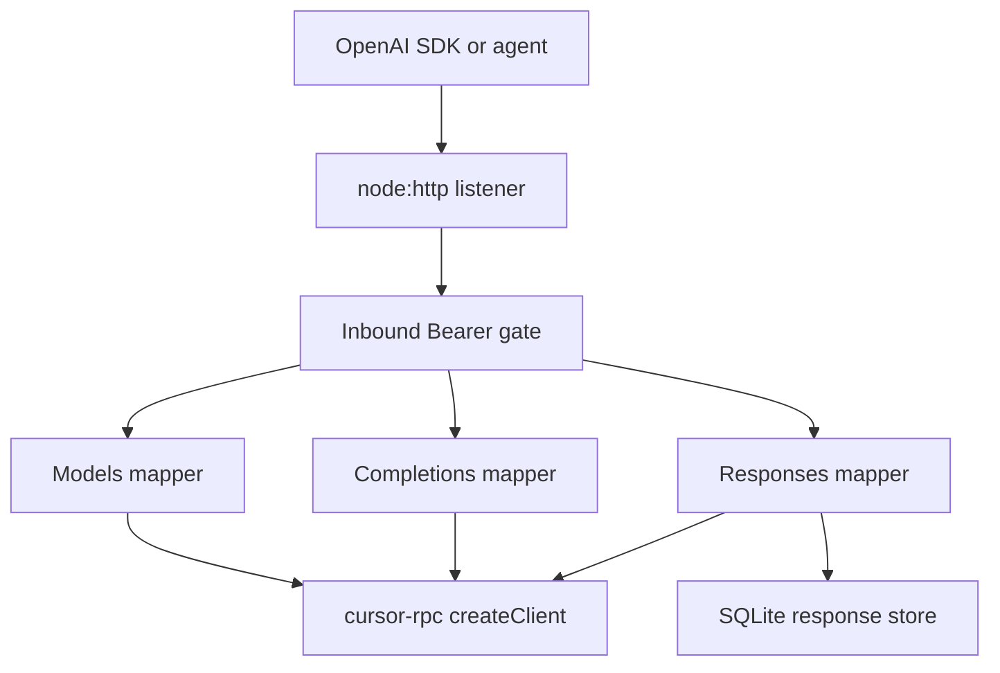
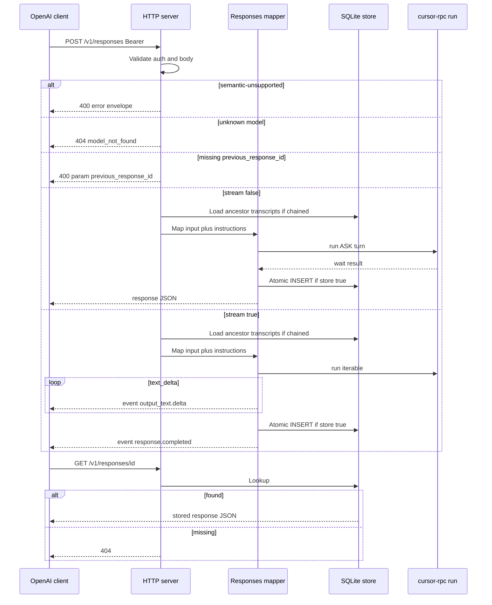
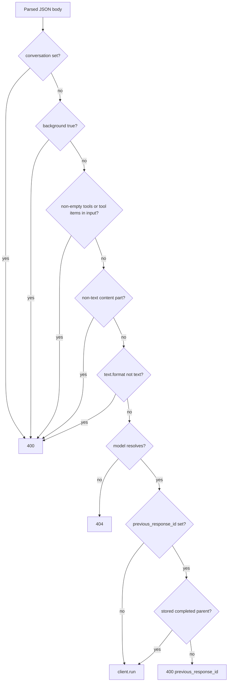
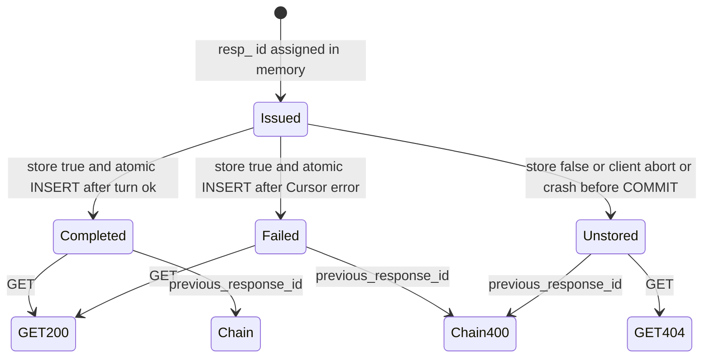

# OpenAI Responses API - Plan

## Goal Capsule

- **Objective:** Extend the OpenAI-compatible server from `docs/plans/2026-08-19-003-feat-openai-compatible-server-plan.md` with text-only Responses create, typed event streaming, retrieve, and SQLite-backed `previous_response_id` chaining that survives process restart, still through one `cursor-rpc` ASK turn per request.
- **Authority:** OpenAI Responses create owns request/response JSON and the typed SSE event stream. OpenAI retrieve owns `GET /v1/responses/{id}`. The Chat Completions plan owns packaging, inbound auth, models, Chat Completions, and the shared listener, except this plan overwrites `cursor-rpc-openai-server` `engines.node` to `>=22.16.0` (KTD3). `docs/plans/2026-08-19-001-feat-nodejs-protocol-sdk-plan.md` owns `cursor-rpc` `createClient` / `models()` / `run()`. Where they disagree, OpenAI docs win on Responses HTTP; the Chat Completions plan wins on server packaging and auth; the SDK plan wins on protocol client behavior; this plan wins on Responses mapping, the SQLite store, and that engines pin.
- **In scope:** `POST /v1/responses` (text `input` / `instructions` / `model`, JSON and typed stream), `GET /v1/responses/{id}`, SQLite persistence for `store` / `previous_response_id` / retrieve after restart, official `openai` SDK contract tests with a mocked library client.
- **Out of scope:** Hosted tools, function calling, vision/files/audio, background runs, Conversations API, delete/cancel/input-items list, analytics or list endpoints, implementing `cursor-rpc`, changing Chat Completions SSE.
- **Stop if:** The only way to complete a turn is to reimplement Connect `Run` inside this package. Stop if Responses create is removed from the OpenAI platform API (it is not deprecated as of 2026-08-19).
- **Execution profile:** Follow-up on the existing server package. Prove the Responses HTTP contract against a mocked `cursor-rpc` client and a temp SQLite file before a live Cursor account is required.
- **Tail ownership:** Implementer owns Responses routes, store, README protocol split, and SDK tests. Caller of the server owns Cursor credentials, the inbound server key, and the SQLite file on disk.

---

## Product Contract

### Summary

This plan adds OpenAI Responses create and retrieve to the same `packages/cursor-rpc-openai-server` process as Chat Completions. Clients send text `input`, get a `response` object or a typed event stream, then chain with `previous_response_id` or inspect via GET. Stored responses live in SQLite so IDs survive restart. Tools, vision, background, and Conversations stay fail-closed.

Product Contract preservation: new bootstrap follow-up. Origin `KD1` (Chat Completions only) is superseded for this work; Chat Completions behavior is unchanged.

### Problem Frame

OpenAI recommends Responses for new native apps. The official SDK speaks `client.responses.create()` and `client.responses.retrieve()`, with a typed event stream that is not Chat Completions chunks.

The Chat Completions server already authenticates inbound clients, lists Cursor models, and runs ASK turns. Responses is a second wire protocol on that listener. Without a durable store, `previous_response_id` and retrieve die on process restart, which breaks inspection and multi-turn agents that keep only the last `resp_` id.

### Requirements

**Packaging and reuse**

- R1. Responses land in `packages/cursor-rpc-openai-server` after the Chat Completions plan’s package, listener, auth, and models exist. No second package, bind, or process.
- R2. Inbound Bearer, auth-off loopback rule, error envelope `{ error: { message, type, param, code } }`, one process-lifetime Client, ASK pin, and model resolution stay as specified in the Chat Completions plan. This plan does not reopen those choices.
- R3. Chat Completions `POST /v1/chat/completions` SSE stays `chat.completion.chunk` plus `data: [DONE]`. Responses must not reuse that mapper.

**Create**

- R4. `POST /v1/responses` accepts text `input` as a string or as message items with string content or `input_text` / `text` parts, plus optional `instructions` and `model`, and runs one `client.run()` ASK turn per request.
- R5. `stream` omitted or false returns one JSON object with `object: "response"` and `status: "completed"`. `stream: true` returns the documented typed SSE event stream, not Chat Completions chunks and not a terminal `[DONE]` line.
- R6. Assistant text is only `output[].content[]` with `type: "output_text"` (JSON) / `response.output_text.delta` (stream). Library thinking, server notices, and tool-display events are dropped from those fields. Do not put top-level `output_text` on the wire.
- R7. Semantic-unsupported fields are rejected with 400 before `run`: non-empty `tools`, function-calling or hosted-tool items in `input`, non-text content parts, `background: true`, `conversation`, and `text.format` other than omitted or `{ type: "text" }`. Empty `tools: []` is accepted. Sampling knobs and unknown extra keys are ignored.
- R8. Unknown `model` is 404 `model_not_found`. Omitted or empty `model` uses the catalogue default, else the first canonical id, else 404, matching models on the Chat Completions plan.
- R9. Client disconnect during SSE aborts the in-flight `run`. Concatenating streamed `delta` text equals the non-stream `output[].content[].text` for the same mocked turn.

**Store, retrieve, chain**

- R10. `store` omitted or true persists enough to retrieve the public response and to rebuild ASK `conversation_history` for later `previous_response_id`. Persistence is SQLite on disk so IDs survive process restart. `(session-settled: user-directed — chosen over in-process memory and over create-only chaining: retrieve plus restart survival for inspection.)`
- R11. `store: false` still returns a `resp_` body for that call and does not write a row. Later `previous_response_id` of that id is 400. Later GET of that id is 404.
- R12. `GET /v1/responses/{id}` returns the stored response object or 404. Delete, cancel, list, and `input_items` are not implemented.
- R13. `previous_response_id` walks the stored ancestor chain into `conversation_history`. Current-request `instructions` apply to this turn only and are not inherited from the stored parent. Missing, unstored, or failed parent ids are 400 with `param: "previous_response_id"`. `previous_response_id` combined with `conversation` is 400.

**Errors**

- R14. Pre-stream failures stay HTTP JSON using the Chat Completions plan’s status mapping (401 inbound, 400 semantic, 404 unknown model, 502 Cursor auth/policy, 503 retryable stream/transport, 500 other). Mid-stream Cursor failure emits typed `response.failed` / `error` events, then closes, never a Chat Completions error line.

### Actors

- A1. OpenAI SDK or Responses-native agent pointing `baseURL` at this server with the inbound key.
- A2. Operator who starts the process with Cursor credentials, the inbound key, and (optionally) a SQLite path.

### Key Flows

- F1. Create then read
  - **Trigger:** A1 calls `responses.create` with a text `input`.
  - **Actors:** A1, A2
  - **Steps:** Bearer check; fail-closed gates; one ASK `run`; JSON `response` with `output[].content[].text`.
  - **Covered by:** R2, R4, R5, R6
- F2. Stream then abort
  - **Trigger:** A1 creates with `stream: true` and cancels mid-stream.
  - **Actors:** A1
  - **Steps:** Typed events; socket close aborts `run`; no orphaned turn.
  - **Covered by:** R5, R9
- F3. Chain after restart
  - **Trigger:** A1 creates with `store` true, the process restarts, A1 retrieves the id then creates with `previous_response_id`.
  - **Actors:** A1, A2
  - **Steps:** GET returns the stored object; second create rebuilds history from SQLite and runs one ASK turn.
  - **Covered by:** R10, R12, R13
- F4. Store false
  - **Trigger:** A1 creates with `store: false`, then chains or retrieves that id.
  - **Actors:** A1
  - **Steps:** Create succeeds; GET 404; chain 400; `run` is not called on the chain attempt.
  - **Covered by:** R11, R13
- F5. Tool-calling agent hits the wall
  - **Trigger:** A1 sends non-empty `tools` or `background: true`.
  - **Actors:** A1
  - **Steps:** 400 OpenAI envelope; `run` is not called.
  - **Covered by:** R7, R14

### Acceptance Examples

- AE1. Covers R4, R6. Given a mocked `run` that yields thinking then `text_delta` `"hi"`, when create is non-stream, then `output` contains one assistant message whose `content[0]` is `{ type: "output_text", text: "hi" }` and that text does not contain thinking.
- AE2. Covers R5, R9. Given `stream: true`, when the client reads until completion, then frames include `event:` plus `data:` JSON with `type: "response.created"` through `type: "response.completed"`, and the body does not contain `data: [DONE]`. Client abort cancels `run`.
- AE3. Covers R7. Given non-empty `tools`, an `input_image` part, `background: true`, `conversation`, or `text.format.json_schema`, when create is called, then 400 and `run` is not invoked. Given `tools: []` or `input` as a string, when create is called, then the request is not 400 for those reasons.
- AE4. Covers R10, R12, R13. Given a completed stored response, when the listener is restarted against the same SQLite file, then GET returns that object and a follow-up create with `previous_response_id` is not 400.
- AE5. Covers R11. Given `store: false`, when GET or a later create uses that `resp_` id, then GET is 404 and create is 400 `param: "previous_response_id"`.
- AE6. Covers R3, R5. Given the official SDK `responses.create({ stream: true })` iterator, when the stream is consumed, then events are typed Responses events, not `chat.completion.chunk`.

### Success Criteria

- Official `openai` npm client against `http://127.0.0.1:<port>/v1` can `responses.create` (JSON and stream), `responses.retrieve` a stored id, and chain with `previous_response_id` after a listener restart on the same DB file.
- Unsupported tool/vision/background/conversation/structured-output requests fail closed with 400.
- Chat Completions contract tests from the origin plan still pass.
- CI does not need a live Cursor account.

### Scope Boundaries

**In this work**

- Responses create (text) + typed stream + GET retrieve.
- SQLite store for chaining and inspect-by-id after restart.
- Fail-closed wall matching origin semantic-unsupported posture, extended for Responses-only fields (`background`, `conversation`, `text.format`).

**Deferred for later**

- Function calling / hosted tools, vision, audio, JSON schema / structured outputs.
- `DELETE /v1/responses/{id}`, cancel, list, `GET /v1/responses/{id}/input_items`.
- Conversations API.
- TTL / compaction / encryption of the SQLite file.
- `stream_options.include_obfuscation`.
- Analytics, trend, or query APIs over stored responses (operators may inspect the SQLite file themselves).

**Outside this product's identity**

- A Cursor account marketplace or per-request mapping of OpenAI keys to Cursor users.
- Local shell/file/MCP execution triggered by Responses.
- Replacing `@cursor/sdk` or cloning official Cursor CLI UX.

**Deferred to Follow-Up Work**

- Completing `cursor-rpc` U6/U7 (owned by the SDK plan). This server consumes that surface; it does not implement it.
- Filling the Pi provider stub.

### Key Decisions

- KD1. Compatibility surface for this follow-up is documented Responses create + retrieve, not a full Responses clone. Governs R4, R5, R12.
- KD2. Store is SQLite on disk so retrieve and `previous_response_id` survive restart. Governs R10, R11, R12, R13. `(session-settled: user-directed — chosen over in-process memory and over create-only chaining: retrieve plus restart survival for inspection.)`
- KD3. Semantic-unsupported fields 400; cosmetic sampling fields ignored. Governs R7.
- KD4. Responses typed events and Chat Completions SSE stay separate protocols on the same listener. Governs R3, R5.

---

## Planning Contract

### Key Technical Decisions

- KTD1. Add Responses beside Chat Completions in `packages/cursor-rpc-openai-server`. Allowed shares: `server.ts` routing, `auth.ts`, `errors.ts` status/envelope helpers, `config.ts`, `provider.ts`, `openai/models.ts`. Do not import `openai/completions.ts`, `openai/messages.ts`, or `openai/sse.ts`. ASK pin is copied as constants into Responses create, not imported from Completions. Input prepend/history lives in `responses-input.ts` against Responses item types. Cite R1, R2, R3.
- KTD2. Consume only the SDK-plan public facade already named by the Chat Completions plan: `createClient`, `client.models()`, `client.run()` as async iterable plus `wait()` and `abort()`, plus public error classes. One process-lifetime Client. Until SDK-plan U7 is exported, tests inject a fake client with that shape. Cite R2.
- KTD3. Persist in `response-store.ts` (not `responses.ts`) with Node `node:sqlite` `DatabaseSync`, one connection per process. Raise this package’s `engines.node` to `>=22.16.0` so constructor `timeout` exists. Conflict call-out: this supersedes origin KTD1 `>=22` for `cursor-rpc-openai-server` only. It excepts workspaces-plan KTD10’s “do not copy `>=22.13`” because `timeout` needs 22.16, not because of the Cursor SDK. Do not bump library/Pi. Do not set `engine-strict`. Unflagged since 22.13; still Stability 1.1 experimental on Node 22 (Node 24/26 sqlite is RC, not Stable). Isolation of the store module is the swap path if the API regresses. Rejected: `better-sqlite3` and in-process `Map`. Set busy `timeout` and `PRAGMA busy_timeout` (pin a duration) before `PRAGMA journal_mode=WAL`. WAL/busy exist for other processes on the same file; in-process overlapping POSTs share one connection and must not hold a transaction across `await`. After open: `PRAGMA user_version` — empty file creates v1 schema and sets version 1; any other version refuses to listen (no ALTER in this work). Every SELECT/INSERT/UPDATE uses bound parameters; never concatenate user ids or text into SQL; never interpolate the file path into SQL. Tests use a temp file or `:memory:`. Cite R10.
- KTD4. SQLite path from `CURSOR_RPC_OPENAI_RESPONSES_DB`. If unset, `$XDG_DATA_HOME/cursor-rpc-openai-server/responses.sqlite`, else `~/.local/share/cursor-rpc-openai-server/responses.sqlite`. Resolve env values to an absolute filesystem path (relative from cwd). Reject empty/whitespace, directories, and SQLite URI forms (`file:` prefix or `?` query). Create the leaf directory mode `0700` and the DB file `0600`. If an existing file is group/other-readable, refuse to listen. `-wal`/`-shm` are the same secret. README warns the file is the process Cursor account’s plaintext prompt log. Cite R10.
- KTD5. v1 is one table, `id TEXT PRIMARY KEY`, `status` `completed` or `failed`, plus `previous_response_id` (nullable, not unique — forks allowed), `model`, echoed `instructions`, `store` flag, timestamps, public response JSON (GET projection), and a chainable transcript of user/assistant text for this turn. Persist with exactly one `INSERT` of every column in a single autocommit statement, or `BEGIN`/`INSERT`/`COMMIT` with no event-loop yield inside the transaction. Never two commits for one id, never `INSERT OR REPLACE`, never an `in_progress` row. GET reads the projection. Chaining walks ancestors with a visited set; self-id, a repeated id, or more than 100 hops → 400 `param: "previous_response_id"` and `run` is not called. Cite R10, R12, R13.
- KTD6. `store` omitted or true: the only durable write is that terminal `INSERT` after `run` returns (`completed`) or after a Cursor failure once a `resp_` id was issued (`failed`). Do not insert before `run` returns. Do not commit on client abort or crash before `COMMIT`. Do not chain from `failed`. `store: false`: never insert. Unique-constraint failure on `id` does not mutate the existing row; map to 500 or mint a new id before any row exists. Cite R11, R14.
- KTD7. Durable states per id: absent (GET 404, chain 400), committed `completed` (GET 200, chain OK), committed `failed` (GET 200, chain 400). GET unknown / unstored / aborted / `store: false` / uncommitted id → 404. Create with missing/unstored/failed/`walk-invalid` `previous_response_id` → 400 `param: "previous_response_id"`. After restart, GET 200 and chainable ancestor are the same committed-row predicate. Cite R11, R12, R13.
- KTD8. Map `input` onto one ASK `run`: prepend `instructions` plus `system`/`developer` item text to the last user text as the current user message; earlier user/assistant text-only items become `conversation_history`; no user text → 400 `param: "input"`. Accept input part types `input_text` and `text`. With `previous_response_id`, stored ancestor transcripts are history; current `input` is the new user turn; current `instructions` only. Cite R4, R13.
- KTD9. Non-stream JSON matches official create examples: `id` (`resp_` plus ≥128 bits of CSPRNG entropy), `object: "response"`, `created_at` unix seconds, `status: "completed"`, `model`, `output: [{ id: "msg_" plus the same entropy bar, type: "message", status: "completed", role: "assistant", content: [{ type: "output_text", text, annotations: [] }] }]`, `usage` with `input_tokens` / `output_tokens` / `total_tokens` (zeros if `wait()` has none), plus echoed `instructions`, `store`, `previous_response_id`, `error: null`, `incomplete_details: null`, `tools: []`, `text.format.type: "text"`. Do not put top-level `output_text` on the wire. GET ids that fail `resp_` plus `[A-Za-z0-9]+` are 404. Cite R5, R6.
- KTD10. Stream frames are `event: <type>` plus `data: {json}` with the same `type` and a monotonic `sequence_number`. Emit the text-message ladder: `response.created` → `response.in_progress` → `response.output_item.added` → `response.content_part.added` → `response.output_text.delta`* → `response.output_text.done` → `response.content_part.done` → `response.output_item.done` → `response.completed`. `created` / `in_progress` carry `output: []`, `usage: null`, `status: "in_progress"`. Usage appears on `response.completed`. Abort on `res` `close` when `!res.writableFinished` (origin KTD10). Mid-stream failure: `response.failed` and/or `error`, then close. Cite R5, R9, R14.
- KTD11. 400 tools only when `tools` is a non-empty array. Function-call / hosted-tool item types in `input` 400. Ignore omitted `tool_choice` and `tool_choice: "none"`. Cite R7.
- KTD12. Error mapping reuses origin KTD9 classes and redaction. Cursor `AuthenticationError` / `PolicyError` stay 502 (not inbound 401). After library pin, later Responses and Completions calls on that Client stay 502 until process restart. Persist only the already-redacted wire GET projection (same envelope as HTTP/SSE). Failed rows persist that redacted `error` object, never library `cause`/`stack`/raw message. Do not scan or strip user `input`/`instructions`/transcripts — those are the plaintext prompt log. Never put `cause`, `stack`, inbound key, or Cursor secrets into HTTP, SSE, SQLite values, or logs. Cite R2, R14.
- KTD13. Official `openai` SDK contract tests use `baseURL: http://127.0.0.1:<port>/v1` and `maxRetries: 0` on negatives. Cover `responses.create` JSON + stream, `responses.retrieve`, tools 400, unknown model 404, missing previous 400, `store: false` then chain 400, restart then retrieve+chain. Add one raw `fetch` test that asserts `event:` lines and absence of `data: [DONE]`. Cite AE1–AE6.

### High-Level Technical Design

Component topology:



Create, retrieve, and chain:



Validation gate:



Store lifecycle:



Issued is not a SQLite row. GET 200 and chainable ancestor are the same committed-row predicate.

### Output Structure

Origin package tree, with Responses files added:

```text
packages/cursor-rpc-openai-server/
  src/
    openai/
      models.ts
      completions.ts
      messages.ts
      sse.ts
      responses.ts
      responses-input.ts
      responses-sse.ts
      response-store.ts
  test/
    responses.test.ts
    responses-sse.test.ts
    response-store.test.ts
    sdk.contract.test.ts
```

The tree is the expected shape. Per-unit `Files` lists are authoritative.

### Implementation Constraints

- Do not deep-import `packages/cursor-rpc/src/**` or generated proto.
- Do not add `workspace:` protocol ranges.
- Do not export generated protobuf from this package.
- Do not implement Conversations, list, delete, cancel, or input-items routes as stubs that claim success.
- Origin Chat Completions tests must stay green.

### Sequencing

This plan starts after origin U1–U3 (package, listener, auth, models). Origin U4 (Chat Completions mapper) may land in parallel as long as Responses does not import it; both only add routes on `server.ts`. Origin U5 (bin, README, SDK contract tests) is required before this plan’s U4. Origin U1 may write `engines.node` `>=22`; this plan’s U1 overwrites that field to `>=22.16.0`.

A live optional test still waits on SDK U7 and `CURSOR_API_KEY`.

---

## Implementation Units

### U1. SQLite store and GET retrieve

- **Goal:** Persist response rows and serve `GET /v1/responses/{id}` from the same file across listener restarts.
- **Requirements:** R1, R10, R11, R12, AE4, AE5, KTD3, KTD4, KTD5, KTD7
- **Dependencies:** Origin U1–U3
- **Files:** `packages/cursor-rpc-openai-server/src/openai/response-store.ts`, `packages/cursor-rpc-openai-server/src/config.ts`, `packages/cursor-rpc-openai-server/src/server.ts`, `packages/cursor-rpc-openai-server/package.json`, `packages/cursor-rpc-openai-server/test/response-store.test.ts`
- **Approach:**
  1. Raise `engines.node` to `>=22.16.0` (KTD3 conflict call-out). Open one `DatabaseSync` per process per KTD3/KTD4.
  2. Apply KTD5 v1 schema. Insert fixture rows in tests; GET uses origin auth + error envelope.
  3. Unknown id 404 per KTD7. GET retrieve and ancestor-transcript load both read the same committed table. Auth-off tests still require loopback.
- **Execution note:** Prove insert → close listener → new listener same path → GET before create mapping exists.
- **Patterns to follow:** Origin U2 auth-before-routing and `x-request-id`. Origin KTD9 redaction (do not persist inbound keys).
- **Test scenarios:**
  - Happy path: Covers AE4 GET half. Insert a completed row, restart the listener on the same file, GET returns that JSON and the chain helper accepts that id.
  - Happy path: Covers F3 retrieve. Matching Bearer GET of a stored id is 200 `object: "response"`.
  - Edge: `:memory:` or temp-file store in tests does not touch the default XDG path.
  - Edge: Two overlapping inserts of distinct ids on one connection both commit; GET of each matches that id’s transcript.
  - Edge: New DB file mode is `0600`; leaf directory is `0700`.
  - Edge: Two stored ids are not consecutive counters; a truncated mutation of a real id is 404.
  - Error: Covers AE5 GET half. Unknown id and a `store: false` id are 404, not 400.
  - Error: Wrong Bearer on GET is 401; body contains neither inbound key nor a planted Cursor token.
  - Error: Missing `CURSOR_RPC_OPENAI_RESPONSES_DB` uses the XDG default path (assert config helper, not a write into the real home dir).
  - Error: URI-shaped DB path and a directory path refuse to open. Opening a planted `0644` fixture refuses.
  - Error: Id / `previous_response_id` / transcript containing `'`, `"`, `;`, `--` still round-trips as data; other rows unchanged.
  - Error: Second insert of the same `id` fails; the first row is unchanged.
  - Error: Fixture cycle (A→B→A) and self-parent: chain helper 400, no hang.
  - Error: Open a file with `user_version = 2` → store open fails.
  - Error: Mock `AuthenticationError` material in a failed-row fixture: SQLite read omits that material, `stack`, and `cause`, and still stores the user transcript.
- **Verification:** Store tests pass without a live Cursor account. GET is 401 without Bearer when auth is on.

### U2. Responses create JSON mapping

- **Goal:** Validate create, map text input to one ASK turn, return JSON, and commit when `store` is true.
- **Requirements:** R4, R6, R7, R8, R11, R13, R14, AE1, AE3, AE5, KTD6, KTD8, KTD9, KTD11, KTD12
- **Dependencies:** U1
- **Files:** `packages/cursor-rpc-openai-server/src/openai/responses.ts`, `packages/cursor-rpc-openai-server/src/openai/responses-input.ts`, `packages/cursor-rpc-openai-server/src/server.ts`, `packages/cursor-rpc-openai-server/test/responses.test.ts`
- **Approach:**
  1. Route `POST /v1/responses`. Run KTD11/R7 gates before `run`. Resolve model per R8.
  2. Shared create-prep (gates, model, `previous_response_id` walk, KTD8 map, ASK pin) is used by JSON and stream. Apply KTD9 JSON shape. Thinking stripped per R6.
  3. Commit per KTD6. Chain lookup per KTD7/R13. Map library errors per KTD12.
- **Execution note:** Start with failing tests for JSON create, tools 400, missing previous 400, and `store: false` before widening the mapper.
- **Patterns to follow:** Origin U4 validation-before-`run`. Reimplement prepend/history in `responses-input.ts`; do not import `messages.ts`. SDK plan U6 event union (`text_delta` vs notice/thinking).
- **Test scenarios:**
  - Happy path: Covers AE1. Thinking then `"hi"` → `content[0].type` `"output_text"` and `text` `"hi"` only.
  - Happy path: String `input` and `content: [{ type: "input_text", text: "hi" }]` are accepted. `type: "text"` parts are accepted. `tools: []` is accepted.
  - Happy path: `instructions` plus two user/assistant items maps to prepended instructions on last user plus history of the earlier pair.
  - Happy path: Stored parent plus new `input` maps ancestor transcripts into `conversation_history` and does not reuse parent `instructions`.
  - Error: Covers AE3. Non-empty `tools`, `input_image`, `background: true`, `conversation`, `text.format.json_schema` → 400 and `run` not called.
  - Error: No user text → 400 `param: "input"`.
  - Error: Unknown model → 404 `model_not_found`.
  - Error: Covers AE5 chain half. `store: false` then `previous_response_id` → 400 and `run` not called. Missing parent id → 400.
  - Error: Mock `AuthenticationError` from `run` → 502, not 401. A second create on the same injected client also 502s.
  - Error: Mock `AuthenticationError` whose message contains Bearer or key material → 502 envelope omits that material, the inbound test key, and `stack`.
  - Edge: Extra body keys do not change the `run()` ASK pin arguments.
  - Edge: Failed stored parent cannot be chained (400).
  - Edge: Two overlapping POSTs both complete against independent fake runs.
- **Verification:** Responses JSON tests pass with the injected fake client and a temp DB.

### U3. Typed Responses SSE

- **Goal:** Stream the documented text-message event ladder and abort the ASK turn on client disconnect.
- **Requirements:** R3, R5, R6, R9, R13, R14, AE2, KTD10, KTD12
- **Dependencies:** U2
- **Files:** `packages/cursor-rpc-openai-server/src/openai/responses-sse.ts`, `packages/cursor-rpc-openai-server/src/openai/responses.ts`, `packages/cursor-rpc-openai-server/src/server.ts`, `packages/cursor-rpc-openai-server/test/responses-sse.test.ts`
- **Approach:**
  1. New SSE writer per KTD10. Do not call origin `openai/sse.ts`.
  2. Reuse U2 create-prep for ancestor load and input map; `responses-sse.ts` is output-only.
  3. Map `text_delta` to `response.output_text.delta`. Drop thinking/notices. Mid-stream Cursor errors per KTD12 into `response.failed` / `error`. Abort per origin KTD10.
- **Execution note:** Prove official-SDK-parseable event order (`output_item.added` before first delta) with a failing stream test first.
- **Patterns to follow:** OpenAI create method streaming example (created → in_progress → item/part added → deltas → done → completed). Origin abort-on-`res.close`.
- **Test scenarios:**
  - Happy path: Covers AE2. Event types and order match KTD10; concatenated deltas equal non-stream text; no `[DONE]`.
  - Happy path: Frames include both `event:` and `data:` with matching `type`.
  - Happy path: Stream create with `previous_response_id` of a stored parent calls `run` with ancestor history (same prep as JSON).
  - Error: Client abort mid-SSE → fake `run` abort/signal fires; no unhandled `error`; no completed row committed.
  - Error: Mid-stream mock `StreamError` → typed failed/error event; no Completions error line; `store: true` commits `failed`.
  - Error: Failed SSE `error.message` omits inbound key, Cursor token material, and `stack`.
  - Integration: Covers AE2 abort path with a real `http` client cancel, not only a mocked `AbortSignal`.
- **Verification:** SSE tests pass with the injected fake client. Origin completions SSE tests still pass.

### U4. README, SDK contract, and restart chain

- **Goal:** Document both protocols and prove official SDK create/retrieve/chain against the live listener with mocks, including restart.
- **Requirements:** R1, R5, R10, R12, R13, AE4, AE6, KTD4, KTD13
- **Dependencies:** U3, origin U5
- **Files:** `packages/cursor-rpc-openai-server/README.md`, `packages/cursor-rpc-openai-server/test/sdk.contract.test.ts`, `packages/cursor-rpc-openai-server/src/cli.ts`
- **Approach:**
  1. README: Chat Completions and Responses; different SDK methods; disable tools on both; `http://127.0.0.1:8787/v1`; inbound key vs `CURSOR_API_KEY`; SQLite path, `0600`, and “plaintext prompt log for this process’s Cursor account”; auth-off means any loopback client can retrieve by id; `store: false` is the way to avoid disk; GET is inspect-by-known-id only; no delete in this work.
  2. SDK tests per KTD13. Restart uses the same temp DB path with two listener lifetimes. This unit extends origin U5 files; it does not recreate Client construction.
  3. Bin still constructs one Client; pass the store path from config.
- **Test scenarios:**
  - Happy path: Official SDK create JSON, create stream, retrieve, and `previous_response_id` chain against an ephemeral port.
  - Happy path: Covers AE4. Create → stop listener → start listener same DB → retrieve + chain.
  - Error: SDK create with tools → `BadRequestError`. Wrong key → `AuthenticationError`. Unknown model → `NotFoundError`. Missing previous → `BadRequestError`. Retrieve unknown → `NotFoundError`. Create with `store: false` then chain that id → `BadRequestError`.
  - Integration: Raw fetch stream includes `event: response.completed` and does not include `data: [DONE]`.
  - Test expectation: README example `baseURL` matches the default bind. README states Responses SSE is not Chat Completions chunks.
- **Verification:** `npm test -w cursor-rpc-openai-server` and `npm run typecheck -w cursor-rpc-openai-server` pass. Origin Chat Completions SDK cases still pass.

---

## Verification Contract

| Gate | Command | Applies to | Done signal |
| --- | --- | --- | --- |
| Server tests | `npm test -w cursor-rpc-openai-server` | U1–U4 plus origin U2–U5 | Auth, models, completions, Responses JSON/SSE/store, SDK contract pass |
| Types | `npm run typecheck -w cursor-rpc-openai-server` after `npm run build -w cursor-rpc` | U1–U4 | `tsc --noEmit` clean |
| Optional live | skip unless `CURSOR_API_KEY` is set | U2–U4 | One ASK Responses create returns assistant text |

Do not require a live Cursor account for CI.

---

## Definition of Done

**Global**

- R1–R14 met or listed under Scope Boundaries.
- Origin Chat Completions and models behavior unchanged.
- No Connect/proto reimplementation in the server package.
- Abandoned spike servers, extra HTTP frameworks, or a second Responses package are not left in the diff.

**Per unit**

- U1: SQLite file + GET retrieve across restart; unknown id 404.
- U2: JSON create, fail-closed 400s, chain 400s, thinking stripped, Cursor 502 pin.
- U3: Typed event ladder, abort, no `[DONE]`.
- U4: README protocol split; official SDK create/retrieve/stream/restart-chain green.

---

## System-Wide Impact

This HTTP API remains the agent surface. Tool-calling agents 400 on Responses as they already do on Chat Completions. Default `store: true` writes prompt and assistant text to disk for the process Cursor account.

| Failure | Who sees it |
| --- | --- |
| Wrong inbound Bearer | That client, 401; Cursor unused; store unread |
| Auth-off + loopback | Every local client uses the process Cursor account; retrieve is by unguessable `resp_` id (KTD9), not sequential guess |
| Local FS read of DB/WAL/SHM | Full plaintext prompt log for this process Cursor account if file mode is too open; KTD4 refuses group/other-readable files |
| Cursor quota / rate limit | All Completions and Responses agents on this process |
| Cursor `AuthenticationError` + pin | This request 502, then all later models/completions/responses 502 until restart |
| SQLite lock / disk full | That create 500; other routes may still work; no partial row |
| Client abort / `CancelledError` | That SSE only; no row committed |
| Unbounded SQLite growth | Operator disk; no TTL in this work |
| Sync `DatabaseSync` on a long ancestor walk | Completions SSE on the same listener can stall; hop cap 100 (KTD5) |

---

## Risks & Dependencies

- **Dependency:** Origin Chat Completions plan U1–U3 must land first. SDK plan U6/U7 must export `createClient` / `models` / `run` before a live server can complete a Cursor turn. Contract tests must not wait on that.
- **Risk:** `node:sqlite` is still experimental on Node 22 (unflagged since 22.13; `timeout` since 22.16; Stability 1.1). Mitigate by pinning `engines.node` `>=22.16.0`, isolating persistence in `response-store.ts`, and keeping HTTP tests independent of the driver. If the experimental API regresses, swap the module without changing HTTP tests.
- **Risk:** Official SDK `responses.stream()` / `finalResponse()` throws if `output_item.added` is omitted before the first delta. Mitigate with KTD10 ladder tests.
- **Risk:** Storing only the GET projection would make restart chaining fail because retrieve does not return original `input`. Mitigate with KTD5 transcript column and one atomic INSERT.
- **Risk:** Silently ignoring `tools` would hang agent tool loops. Mitigate with R7 / KTD11.
- **Risk:** Reasoning leaked into `output_text` poisons client history. Mitigate with R6.
- **Risk:** Default `store: true` writes a durable plaintext prompt log. Mitigate with KTD9 id entropy, KTD4 `0600`/refuse-permissive, origin auth-on-by-default, and R11 `store: false` (no chain/retrieve). README is operator communication, not a control. Encryption/delete remain deferred.
- **Risk:** Secrets in SQLite or SSE error lines. Mitigate with KTD12 redaction tests on HTTP, SSE, and stored failed rows. User transcripts are the prompt log and are not stripped.
- **Risk:** Concurrent `run()` on one Client remains origin KTD11. If the library is not isolation-safe, serialize at the HTTP layer rather than deep-importing session code. Do not hold a SQLite transaction across `await run()`.

---

## Alternative Approaches Considered

- **In-process `Map` only.** Satisfies chaining until restart. Rejected after user chose SQLite so retrieve and IDs survive restart.
- **Create-only, no GET.** Chaining can look up the same map internally. Rejected after user chose GET for inspection.
- **`better-sqlite3`.** Stable native driver, keeps `engines` `>=22`. Rejected to avoid addon compile in this workspace; `node:sqlite` matches the zero-native-dep package pattern.
- **Second package or process for Responses.** Split protocols. Rejected: user confirmed the same server package after the Chat Completions plan.

---

## Sources & Research

- OpenAI Responses create (not deprecated; Assistants sunsets 2026-08-26): https://developers.openai.com/api/reference/resources/responses/methods/create
- Migrate to Responses (typed events, `previous_response_id` does not inherit `instructions`): https://developers.openai.com/api/docs/guides/migrate-to-responses
- Origin Chat Completions server: `docs/plans/2026-08-19-003-feat-openai-compatible-server-plan.md`
- Intended library facade: `docs/plans/2026-08-19-001-feat-nodejs-protocol-sdk-plan.md` U6–U7 (`conversation_history`, ASK, no tools)
- Node 22 `node:sqlite`: experimental Stability 1.1; unflagged in 22.13; constructor `timeout` in 22.16 — https://nodejs.org/dist/latest-v22.x/docs/api/sqlite.html
- Official Node SDK: `create({ stream: true })` iterates parsed `data:` JSON; `ResponseStream.finalResponse()` requires `output_item.added` then `content_part.added` before deltas
- Institutional learnings: `docs/solutions/` has no captured entries as of 2026-08-19
