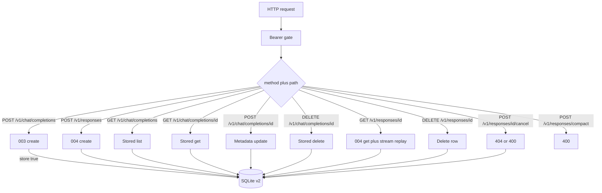
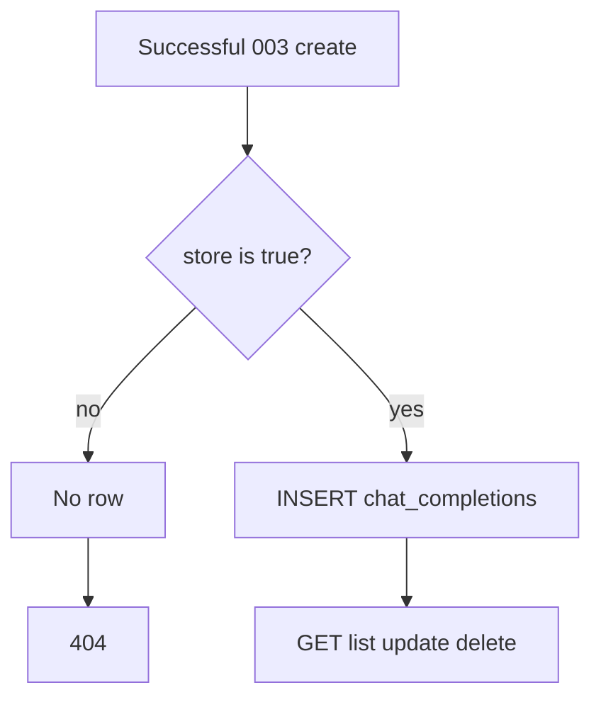
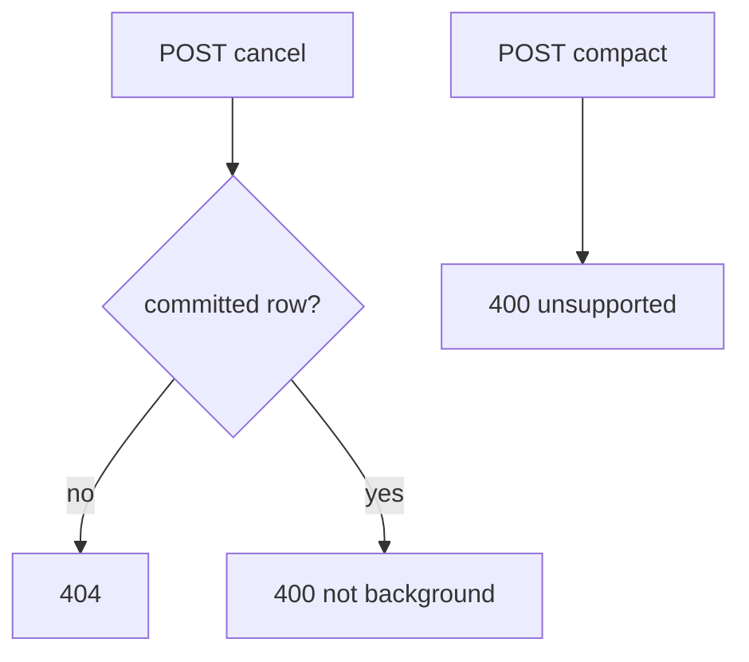

# OpenAI Chat and Responses Method Gaps - Plan

## Goal Capsule

- **Objective:** After the Chat Completions and Responses create plans, close the remaining Chat Completions and Responses HTTP methods named under `docs/specs/api/`, on the same `packages/cursor-rpc-openai-server` process, still through `cursor-rpc` ASK and the existing SQLite store.
- **Authority:** Unique files under `docs/specs/api/` own those methods. Three Responses spec files are byte-for-byte copies of other methods and are **not** authority until replaced: `docs/specs/api/responses/get.md` copies delete; `docs/specs/api/responses/cancel.md` and `docs/specs/api/responses/compact.md` copy create. `docs/plans/2026-08-19-003-feat-openai-compatible-server-plan.md` owns Chat create, models, auth, and packaging. `docs/plans/2026-08-19-004-feat-openai-responses-api-plan.md` owns Responses create, typed SSE, GET JSON, and SQLite v1. This plan owns stored-completion CRUD, Responses delete/cancel/compact, store schema v2, and spec-file repair. Unique spec files win on Chat list/get/update/delete and Responses delete. After U1, repaired `get.md`/`cancel.md`/`compact.md` document official OpenAI method shape; this plan (R11–R13, KD3, Stop if) still wins on this server’s retrieve/cancel/compact behavior, including honest 404/400, GET 004 JSON plus synthesized `stream` replay, and ignored `include`. 003/004 still win on create fail-closed walls and ASK.
- **In scope:** Repair the three copied spec files. Persist Chat Completions when `store` is true. `GET`/`GET list`/`POST update`/`DELETE` stored chat completions. `DELETE /v1/responses/{id}`. `POST /v1/responses/{id}/cancel` with honest 404/400 (no background). `POST /v1/responses/compact` as fail-closed 400. Align Responses GET query handling (`stream` replay from stored text; ignore `include`).
- **Out of scope:** Tools, vision, audio, structured output, `background: true`, Conversations, embeddings, Assistants, `input_items`, implementing `cursor-rpc`, a second HTTP process.
- **Stop if:** The only way to complete compact is to mint OpenAI `encrypted_content` or to fake a CompactedResponse from ASK. Stop if the only way to make cancel succeed is to add background create.
- **Execution profile:** Follow-up on 003 and 004. Prove official SDK list/retrieve/update/delete against a mocked client and a temp SQLite file.
- **Tail ownership:** Implementer owns routes, v2 migrate, spec-file repair, README, and SDK tests. Operator owns the shared SQLite prompt log.

---

## Product Contract

### Summary

This plan reviews `docs/specs/api/` against the two create plans and implements the methods those plans deferred. Chat Completions become listable after opt-in `store: true`. Responses gain delete; cancel and compact are honest fail-closed routes because this server never runs background and cannot compact. Create-time tools/vision/background stay 400.

Product Contract preservation: new bootstrap follow-up. Origins 003 and 004 Product Contracts are unchanged except 003’s ignore of `store`/`metadata` on create is reversed when storing, and 004’s “no delete” is reversed for Responses delete.

### Problem Frame

`docs/specs/api/` lists Chat Completions create/get/list/update/delete and Responses create/get/delete/cancel/compact. 003 ships only create plus models. 004 ships Responses create, GET JSON, and SQLite. Official SDK clients also call stored-completion CRUD and Responses delete/cancel/compact. Three Responses spec files are copies of the wrong method, so implementers reading the folder would implement delete twice or create three times.

### Requirements

**Specs and reuse**

- R1. Work lands in `packages/cursor-rpc-openai-server` after 003 and 004. Same listener, inbound Bearer, ASK pin, error envelope, and fail-closed create walls.
- R2. Replace `docs/specs/api/responses/get.md`, `cancel.md`, and `compact.md` with the official method bodies so filenames match contents. Do not implement cancel or compact from the current create copy. Do not implement GET from the current delete copy.
- R3. Chat Completions `POST /v1/chat/completions` stays 003’s text create. Responses `POST /v1/responses` stays 004’s text create. This plan does not add tools, vision, structured output, or background.

**Chat stored completions**

- R4. Persist a chat completion only when the create body has `store` exactly `true`. Omitted, `false`, and `null` do not insert. Later GET/LIST/UPDATE/DELETE of an unstored id are 404.
- R5. When storing, persist the public `chat.completion` JSON plus `metadata` (empty object if omitted). Honor `metadata` on create for stored rows. Ignore extra sampling keys as 003 already does.
- R6. `GET /v1/chat/completions/{completion_id}` returns the stored object or 404.
- R7. `GET /v1/chat/completions` lists stored rows with `after`, `limit` (default 20), `model`, `order` (`asc` default), and `metadata[key]=value` filters. Returns `{ object: "list", data, first_id, last_id, has_more }`. Empty `data` uses `first_id`/`last_id` null and `has_more` false.
- R8. `POST /v1/chat/completions/{completion_id}` updates `metadata` (object or null); extra keys are ignored and must not merge into the stored `body`; `metadata` null clears to `{}`. Omitted `metadata` is a no-op. Returns the full stored completion. Unknown id 404.
- R9. `DELETE /v1/chat/completions/{completion_id}` returns `{ id, deleted: true, object: "chat.completion.deleted" }` and removes the row. Unknown id 404.

**Responses lifecycle**

- R10. `DELETE /v1/responses/{response_id}` returns `{ id, object: "response", deleted: true }` and removes the row. Later GET is 404. Later `previous_response_id` of that id is 400. Unknown id 404.
- R11. `POST /v1/responses/{response_id}/cancel` does not abort SSE (clients disconnect). Unknown/unstored/uncommitted → 404. Stored `completed` or `failed` → 400 (only `background: true` can be cancelled; this server never accepts background).
- R12. `POST /v1/responses/compact` is 400 `invalid_request_error` before `run`. Do not return a CompactedResponse. Do not implement create-time `context_management`.
- R13. `GET /v1/responses/{id}` keeps 004 JSON retrieve. Query `include` is ignored. Query `stream=true` replays a synthesized 004 event ladder from stored assistant text (not a new ASK turn) with `Content-Type: text/event-stream`. Missing id 404.

**Store**

- R14. Chat and Responses share the 004 SQLite file and `DatabaseSync`. Schema version becomes 2 with a second table for chat completions. v1 files migrate by adding that table. Other versions still refuse to listen.

### Actors

- A1. OpenAI SDK or agent pointing `baseURL` at this server.
- A2. Operator of the process and the SQLite file.

### Key Flows

- F1. Store then list chat
  - **Trigger:** A1 creates with `store: true` then `chat.completions.list`.
  - **Steps:** Persist after the turn; GET list returns that id.
  - **Covered by:** R4, R5, R7
- F2. Update metadata then delete
  - **Trigger:** A1 updates metadata then deletes the completion.
  - **Steps:** POST returns new metadata; DELETE removes the row; GET 404s.
  - **Covered by:** R8, R9
- F3. Delete a chained response
  - **Trigger:** A1 deletes a stored parent id then creates with that `previous_response_id`.
  - **Steps:** DELETE 200; chain 400; GET 404.
  - **Covered by:** R10
- F4. Cancel and compact hit the wall
  - **Trigger:** A1 calls cancel on a completed id or compact on any body.
  - **Steps:** 400; `run` is not called.
  - **Covered by:** R11, R12

### Acceptance Examples

- AE1. Covers R4, R6. Given create with `store: true` and a mocked turn `"hi"`, when GET that `chatcmpl-` id after restart, then the stored `choices[0].message.content` is `"hi"`. Given create without `store`, when GET that id, then 404.
- AE2. Covers R7, R8. Given two stored completions with different metadata, when list filters `metadata[key]=value`, then only the matching row is in `data`. Update then GET reflects the new metadata.
- AE3. Covers R9. Given a stored completion, when DELETE then GET, then DELETE body has `object: "chat.completion.deleted"` and GET is 404.
- AE4. Covers R10. Given a stored `resp_` used as `previous_response_id`, when DELETE that id then create with it, then create is 400 `param: "previous_response_id"`.
- AE5. Covers R11, R12. Given a stored completed response, when cancel is called, then 400 and `run` is not called. Given compact with any JSON body, when called, then 400 and `run` is not called.
- AE6. Covers R2. After this work, `docs/specs/api/responses/get.md` documents GET retrieve, `cancel.md` documents POST cancel, and `compact.md` documents POST compact. Those three files are not copies of create or delete.

### Success Criteria

- Official SDK against `http://127.0.0.1:<port>/v1` can create a stored chat completion, list it, retrieve it, update metadata, and delete it, including after listener restart on the same DB file.
- Official SDK can `responses.delete`. Cancel of a completed id and compact are 400. Compact and cancel do not call `run`.
- GET retrieve with `stream=true` replays stored assistant text as a 004 event ladder, does not call `run`, and ignores query `include`.
- Origin 003 Chat create and 004 Responses create/SSE/GET JSON tests still pass.
- Spec copies no longer match the wrong method.

### Scope Boundaries

**In this work**

- Spec-file repair for the three copied Responses docs.
- Chat `store: true` persistence and list/get/update/delete.
- Responses delete; cancel and compact as documented fail-closed routes; GET `stream` replay from stored text.

**Deferred for later**

- Tools, vision, structured output, background create (so cancel can succeed).
- Honest compact / `encrypted_content`.
- `GET /v1/responses/{id}/input_items`, Responses list, Conversations.
- TTL, encryption, analytics.

**Outside this product's identity**

- Mapping inbound keys to Cursor users.
- Local shell/file/MCP execution.
- Replacing `@cursor/sdk`.

**Deferred to Follow-Up Work**

- Completing `cursor-rpc` (SDK plan).
- Filling the Pi provider stub.
- Open review items still pending on 003/004 (Bearer compare, serialize `run()`, GET retrieve 004 review menu). This plan does not absorb those unless they block a 005 unit.

### Key Decisions

- KD1. Gaps are the methods in `docs/specs/api/` besides create (already in 003/004), not a second pass on tools/vision. Governs R3.
- KD2. Chat persist is opt-in `store: true` only (unlike Responses omitted-or-true). Governs R4.
- KD3. Cancel and compact are honest 400/404, not fake success. Governs R11, R12.
- KD4. One SQLite file, schema v2, second table for chat. Governs R14.
- KD5. This server fail-closes with 400/404 when it cannot perform the operation; ignores unused retrieve `include`; and may replay stored text for GET `stream=true` without a new ASK turn. It does not invent `encrypted_content` or background runs. Governs R11–R13.

---

## Planning Contract

### Key Technical Decisions

- KTD1. Repair specs first from the official OpenAI method pages already listed under Sources & Research (retrieve, cancel, compact). Write those bodies into `docs/specs/api/responses/get.md`, `cancel.md`, and `compact.md`. Do not invent method text and do not copy create/delete. If a fetch of those pages fails, stop U1 rather than leaving the copies. Cite R2, AE6.
- KTD2. Reuse 003/004 listener, auth, errors, models, ASK pin, and `node:sqlite` connection. Do not import Completions SSE into Responses or Responses input into Chat CRUD. Both may use `response-store.ts`. Cite R1.
- KTD3. Schema `user_version` 2: keep 004 responses table; add `chat_completions` (`id TEXT PRIMARY KEY`, `created INTEGER`, `model TEXT`, `metadata TEXT`, `body TEXT`). Open: 0 → create v2 set 2; 1 → v1→v2 migrate in one transaction with `CREATE TABLE IF NOT EXISTS chat_completions` then `PRAGMA user_version=2` (if version is still 1 and the table already exists, set 2 and proceed); 2 → proceed; else refuse. Bound parameters. One autocommit INSERT per stored chat row. Never `INSERT OR REPLACE`. Cite R14.
- KTD4. Dispatch `GET /v1/chat/completions` to list and `POST /v1/chat/completions` to create. Dispatch `GET|POST|DELETE /v1/chat/completions/{id}` to stored CRUD. Auth still runs before routing. Cite R6–R9.
- KTD5. Persist chat only when JSON `store === true` after a successful turn (JSON `wait()` or SSE finished). Client abort: no row. INSERT uses the same `id` already minted on the public 003 `chat.completion` object; do not mint a second id. When `store === true`, validate `metadata` before `run` (object of string pairs, ≤16 keys, key ≤64 chars, value ≤512 chars); invalid → 400 `param: "metadata"`. When not storing, ignore `metadata` as 003. Cite R4, R5.
- KTD6. List: `limit` default 20; omitted is 20; `0`, negative, non-integer, or `>100` → 400 `param: "limit"`. `order` allowlisted to `asc`|`desc` (default `asc`); any other value → 400 `param: "order"`. Sort by `created` then `id`. `after` is an existing stored id cursor; unknown `after` → 400 `param: "after"`. Metadata filter is AND across provided keys via `json_each(metadata)` (or equivalent row-valued JSON iteration) with bound key and value parameters. Do not build `json_extract` paths from user keys. Empty page: `data: []`, `first_id`/`last_id` null, `has_more` false. Cite R7.
- KTD7. The `metadata` column is the source of truth. POST update writes only that column (`null` → `{}`). GET and list parse `body` JSON and overlay `metadata` from the column; they must not merge other request keys into `body`. Extra request keys (including `choices` and `id`) are ignored. Omitted `metadata` leaves the column unchanged. Same 16/64/512 limits as KTD5; invalid → 400 `param: "metadata"`. Cite R8.
- KTD8. Responses DELETE removes the row (no tombstone). Chain walk treats missing parent as 400 `param: "previous_response_id"` (004 KTD7). Cite R10.
- KTD9. Cancel: 404 if no committed row; 400 `invalid_request_error` with `param: "response_id"` if status is not a background in-progress (this server has none). Do not call `run.abort()` from this route. Cite R11.
- KTD10. Compact: 400 `invalid_request_error` `param: "compact"`, message that compaction/`encrypted_content` is unsupported. Cite R12.
- KTD11. GET retrieve query `stream=true`: `Content-Type: text/event-stream`; synthesize a 004 KTD10 ladder with monotonic `sequence_number`s and exactly one `response.output_text.delta` containing the full stored text (empty string if none). `starting_after` applies only to those synthetic numbers and is not resume of the original create stream. A stored `failed` row replays 004’s failed/error close, not `response.completed`. Query `include` and `include_obfuscation` are ignored. No new `run()`. Cite R13.
- KTD12. Official `openai` SDK tests: stored create/list/retrieve/update/delete; responses.delete; cancel 400; compact 400; restart then list; `responses.retrieve({ stream: true })` of a stored completed id. `maxRetries: 0` on negatives. Cite AE1–AE5.

### High-Level Technical Design

Method dispatch:

Chat store gate:

Cancel and compact:

### Sequencing

U1 has no origin-code dependency and may land in parallel with 003/004. U2–U5 begin only when `packages/cursor-rpc-openai-server/src/openai/response-store.ts` and `packages/cursor-rpc-openai-server/src/openai/completions.ts` exist as landed 003/004 code. If those paths are missing, stop. Do not implement 003/004 under this plan and do not use `apps/cursor-rpc-openai-server`. U2 depends on 004 U1. U3 depends on U2 and 003 U4. U4 depends on U1, U2, and 004 U2–U3. U5 depends on U3, U4, 003 U5, and 004 U4.

---

## Implementation Units

### U1. Repair copied Responses spec files

- **Goal:** Make `docs/specs/api/responses/get.md`, `cancel.md`, and `compact.md` document the official methods those filenames name.
- **Requirements:** R2, AE6, KTD1
- **Dependencies:** none
- **Files:** `docs/specs/api/responses/get.md`, `docs/specs/api/responses/cancel.md`, `docs/specs/api/responses/compact.md`
- **Approach:**
  1. Fetch official retrieve, cancel, and compact method pages from the URLs under Sources & Research.
  2. Replace get with official retrieve (`GET /responses/{response_id}`).
  3. Replace cancel with official cancel (`POST /responses/{response_id}/cancel`).
  4. Replace compact with official compact (`POST /responses/compact`).
  5. Leave create.md and delete.md unchanged. Do not add a this-server 400 banner to the official bodies (this plan still owns those walls).
- **Patterns to follow:** Existing unique files in `docs/specs/api/chat_completions/` (method heading, verb, path).
- **Test scenarios:**
  - Happy path: Covers AE6. get.md contains GET retrieve, not DELETE. cancel.md contains POST cancel, not create body. compact.md contains POST compact, not create body.
  - Edge: File hashes of get, cancel, and compact differ from delete.md and create.md.
- **Verification:** The three files are not byte-identical to create or delete.

### U2. SQLite schema v2 and chat table

- **Goal:** Migrate the 004 store to version 2 with a chat completions table without breaking Responses GET/chain.
- **Requirements:** R14, KTD3
- **Dependencies:** 004 U1. Hard start gate: `packages/cursor-rpc-openai-server/src/openai/response-store.ts` exists as landed 004 code.
- **Files:** `packages/cursor-rpc-openai-server/src/openai/response-store.ts`, `packages/cursor-rpc-openai-server/test/response-store.test.ts`
- **Approach:**
  1. Apply KTD3 open/migrate. Keep 004 responses INSERT/GET/walk.
  2. Add chat INSERT/GET/LIST/UPDATE/DELETE primitives used by U3.
  3. Change 004’s “user_version 2 refuses” test: version 2 is valid; version 3 still refuses. Rewrite every 004 store assertion that empty files are `user_version` 1 (they are v2 here).
- **Execution note:** Prove v1 file + restart + Responses GET still works after migrate, before Chat HTTP.
- **Patterns to follow:** 004 KTD3 bound parameters and no yield in a transaction. 004 KTD4 `0600`/`0700`, refuse group/other-readable, and treat `-wal`/`-shm` as the same secret.
- **Test scenarios:**
  - Happy path: Empty file opens as v2; Responses INSERT/GET still works.
  - Happy path: A v1 fixture file migrates to 2; existing `resp_` GET still 200.
  - Edge: Two overlapping chat inserts of distinct ids both commit.
  - Error: `user_version = 3` refuses to open.
  - Error: Hostile id characters round-trip as bound data.
  - Error: Hostile `metadata[key]` list filters do not change SQL shape; values stay bound.
  - Edge: Reopen a v1 file that already has `chat_completions` but `user_version` still 1; migrate sets 2 and Responses GET still works.
- **Verification:** Store tests pass without a live Cursor account. 004 Responses GET tests still pass.

### U3. Chat store persist and CRUD

- **Goal:** Honor `store: true` on create and serve list/get/update/delete.
- **Requirements:** R4–R9, AE1–AE3, KTD4, KTD5, KTD6, KTD7
- **Dependencies:** U2, 003 U4. Hard start gate: `packages/cursor-rpc-openai-server/src/openai/completions.ts` exists as landed 003 code.
- **Files:** `packages/cursor-rpc-openai-server/src/server.ts`, `packages/cursor-rpc-openai-server/src/openai/completions.ts`, `packages/cursor-rpc-openai-server/src/openai/stored-completions.ts`, `packages/cursor-rpc-openai-server/test/stored-completions.test.ts`
- **Approach:**
  1. After successful 003 create, INSERT when `store === true` (KTD5).
  2. Route GET list vs POST create by method (KTD4).
  3. GET/UPDATE/DELETE by id. Restart uses the same DB file.
- **Execution note:** Failing tests for store:true GET after restart, store omitted 404, and GET vs POST on `/v1/chat/completions` before widening.
- **Patterns to follow:** 003 create JSON (KTD12). 004 atomic INSERT after turn. Specs in `docs/specs/api/chat_completions/list.md`, `get.md`, `update.md`, `delete.md`.
- **Test scenarios:**
  - Happy path: Covers AE1. `store: true` then restart then GET content `"hi"` using the same `id` as the create JSON.
  - Happy path: Covers AE2. List filter and metadata update.
  - Happy path: Stream create with `store: true` inserts once after `[DONE]`; abort mid-stream inserts nothing.
  - Edge: Omitted `store` and `store: false` → GET 404. `tools: []` still allowed; non-empty tools still 400 and no insert.
  - Edge: List `limit` default 20; `after` pagination `has_more`. Empty list: `data: []`, `first_id`/`last_id` null, `has_more` false.
  - Error: Covers AE3. DELETE then GET 404. Unknown id GET/UPDATE/DELETE 404.
  - Error: Unknown `after` → 400. Wrong Bearer on list/get/update/delete → 401.
  - Error: GET `/v1/chat/completions` does not run create/`run`.
  - Error: Update with extra `choices` or `id` leaves stored content unchanged.
  - Error: Hostile `metadata[key]` on list → 400 or bound no-match; never interpolates SQL. `order=drop-table` → 400 `param: "order"`.
- **Verification:** Stored-completion tests pass with a fake client. 003 create tests still pass.

### U4. Responses delete, cancel, compact, retrieve stream

- **Goal:** Implement Responses delete; honest cancel/compact; GET `stream` replay.
- **Requirements:** R10–R13, AE4, AE5, KTD8–KTD11
- **Dependencies:** U1, U2, 004 U2–U3
- **Files:** `packages/cursor-rpc-openai-server/src/server.ts`, `packages/cursor-rpc-openai-server/src/openai/responses.ts`, `packages/cursor-rpc-openai-server/src/openai/responses-sse.ts`, `packages/cursor-rpc-openai-server/src/openai/response-store.ts`, `packages/cursor-rpc-openai-server/test/responses-lifecycle.test.ts`
- **Approach:**
  1. DELETE row per KTD8.
  2. Cancel and compact per KTD9/KTD10. Never call `run`.
  3. GET `stream=true` synthesizes 004’s ladder from stored text (KTD11).
- **Patterns to follow:** Official cancel/compact (after U1). 004 KTD7 missing parent 400. 004 KTD10 event order.
- **Test scenarios:**
  - Happy path: Covers AE4. DELETE then GET 404 then chain 400.
  - Happy path: GET `stream=true` of a stored completed response uses `Content-Type: text/event-stream`, emits `response.created` through `response.completed`, has no `data: [DONE]`, and does not call `run`.
  - Edge: Stored `failed` plus `stream=true` replays failed/error close, not `response.completed`.
  - Edge: `starting_after` skips synthetic sequence numbers only.
  - Error: Covers AE5. Cancel stored completed → 400. Compact any body → 400. `run` not called.
  - Error: Cancel unknown id → 404. DELETE unknown → 404.
  - Error: Wrong Bearer on delete/cancel/compact → 401.
  - Edge: DELETE does not remove sibling `resp_` rows. Forked children of a deleted parent still 400 on chain.
- **Verification:** Lifecycle tests pass. 004 create/SSE/GET JSON tests still pass.

### U5. README and official SDK contract tests

- **Goal:** Document stored Chat CRUD plus Responses delete/cancel/compact and prove the official SDK.
- **Requirements:** R1, AE1–AE5, KTD12
- **Dependencies:** U3, U4, 003 U5, 004 U4
- **Files:** `packages/cursor-rpc-openai-server/README.md`, `packages/cursor-rpc-openai-server/test/sdk.contract.test.ts`
- **Approach:**
  1. README: Chat `store: true` is required for list/get/update/delete; Responses `store` default remains 004; cancel needs background (unsupported); compact unsupported; shared SQLite file holds both id kinds; delete is the retention control. Chat list enumerates every stored completion body (messages included) to any caller who passes the 003 auth gate, including auth-off loopback; Responses remain inspect-by-known-id. GET retrieve `stream=true` replays stored text and is not a new ASK turn; `include` is ignored.
  2. SDK tests per KTD12. Restart then list chat and retrieve remaining responses.
- **Test scenarios:**
  - Happy path: SDK stored create, list, retrieve, update, delete; responses.delete; retrieve stored id with `stream: true`.
  - Error: SDK cancel and compact → `BadRequestError`. Retrieve deleted → `NotFoundError`.
  - Test expectation: README states Chat store is opt-in true; Chat list enumerates stored bodies to any authenticated (or auth-off loopback) caller; compact/cancel are unsupported.
- **Verification:** Package tests and typecheck pass. Origin 003/004 SDK cases still pass.

---

## Verification Contract

| Gate | Command | Applies to | Done signal |
| --- | --- | --- | --- |
| Spec files | compare hashes of the three repaired Responses docs to create.md and delete.md | U1, AE6 | Hashes differ; titles match the filenames |
| Server tests | `npm test -w cursor-rpc-openai-server` | U2–U5 plus 003/004 units | Stored chat, Responses lifecycle, origin create tests pass |
| Types | `npm run typecheck -w cursor-rpc-openai-server` after library build | U2–U5 | `tsc --noEmit` clean |

Do not require a live Cursor account for CI.

---

## Definition of Done

**Global**

- R1–R14 met or listed under Scope Boundaries.
- 003 create and 004 create/SSE/GET still behave as those plans specify.
- No fake CompactedResponse and no background create added to make cancel succeed.
- Abandoned spike routes are not left in the diff.

**Per unit**

- U1: Spec copies repaired.
- U2: v2 migrate; Responses GET/chain still work.
- U3: Chat store CRUD including restart.
- U4: Delete/cancel/compact/retrieve-stream.
- U5: README and SDK tests.

---

## System-Wide Impact

Chat `store: true` writes another plaintext prompt log into the same SQLite file as Responses. List makes ids enumerable to anyone who can authenticate (or any loopback client when auth is off). Delete is the retention control 004 deferred.

| Failure | Who sees it |
| --- | --- |
| Auth-off + list | Every stored `chatcmpl-` and (via known id) `resp_` |
| Delete of a chain parent | Later `previous_response_id` 400 for that branch |
| Compact/cancel 400 | Agents that assumed OpenAI background/compaction |
| v1 migrate bug | Responses GET/chain break after upgrade |
| GET `/v1/chat/completions` routed as create | Accidental ASK turns |

---

## Risks & Dependencies

- **Dependency:** 003 U1–U5 and 004 U1–U4 must exist as code under `packages/cursor-rpc-openai-server` before U2–U5. SDK U7 still required for a live ASK; CRUD tests must not wait on it.
- **Risk:** Implementers using unrepaired spec copies. Mitigate with U1 first and KTD1.
- **Risk:** Chat `store` default confusion vs Responses. Mitigate with KD2, README, AE1.
- **Risk:** Faking compact would poison `previous_response_id` with invalid items. Mitigate with KD3 / KTD10.
- **Risk:** List without auth-off loopback protection. Mitigate by reusing 003/004 auth-before-routing and documenting enumeration in README (U5).
- **Risk:** Schema v2 breaks 004’s refuse-v2 test. Mitigate by rewriting that test in U2. Rolling a 004 binary onto a v2 file still refuses to listen; operators keep a pre-migrate DB copy. This plan does not auto-downgrade.
- **Risk:** List filter SQL injection via `metadata[key]` or `order`. Mitigate with KTD6 allowlist and bound keys, plus U2/U3 hostile tests.

---

## Alternative Approaches Considered

- **404 unimplemented for list/delete.** Rejected: user asked to implement remaining methods.
- **Second SQLite file for chat.** Rejected: duplicates 004 path/mode/secret.
- **Implement compact via ASK summary.** Rejected: stop condition; cannot mint `encrypted_content`.
- **Add background create so cancel succeeds.** Rejected: 004 fail-closed wall; user confirmed this plan does not reopen it.

---

## Sources & Research

- Chat specs: `docs/specs/api/chat_completions/create.md`, `get.md`, `list.md`, `update.md`, `delete.md`
- Responses delete spec: `docs/specs/api/responses/delete.md`
- Official retrieve: https://developers.openai.com/api/reference/resources/responses/methods/retrieve
- Official cancel: https://developers.openai.com/api/reference/resources/responses/methods/cancel (background only; sync cancel is disconnect)
- Official compact: https://developers.openai.com/api/reference/resources/responses/methods/compact
- Origin create plans: `docs/plans/2026-08-19-003-feat-openai-compatible-server-plan.md`, `docs/plans/2026-08-19-004-feat-openai-responses-api-plan.md`
- Spec copy inventory (this worktree): `responses/get.md` = `delete.md`; `responses/cancel.md` = `compact.md` = `create.md`
