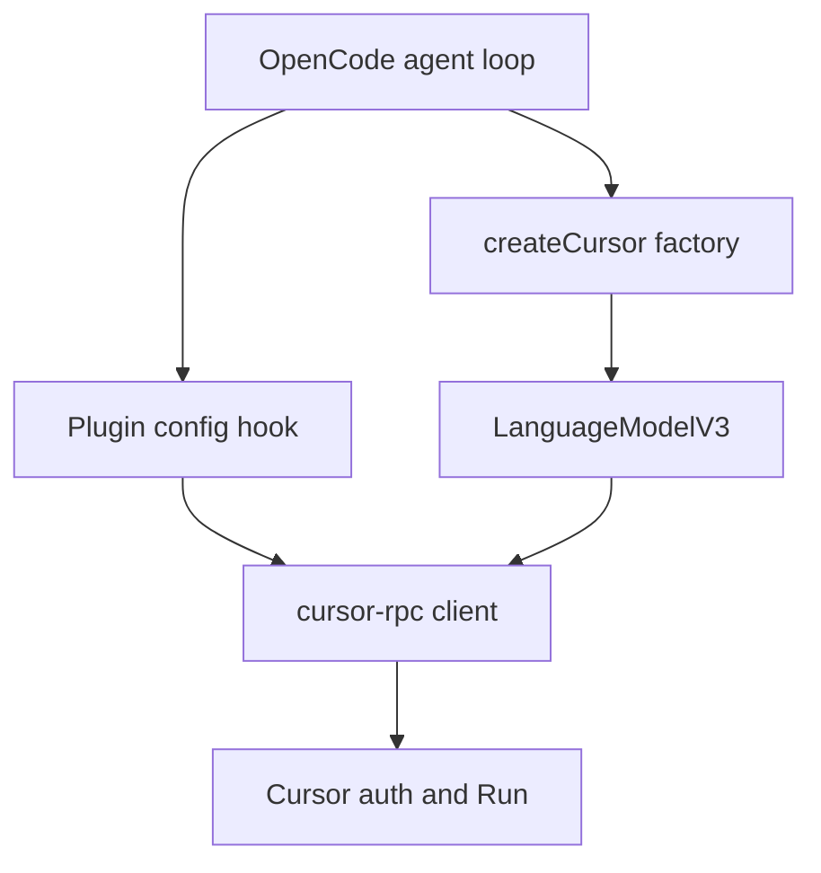
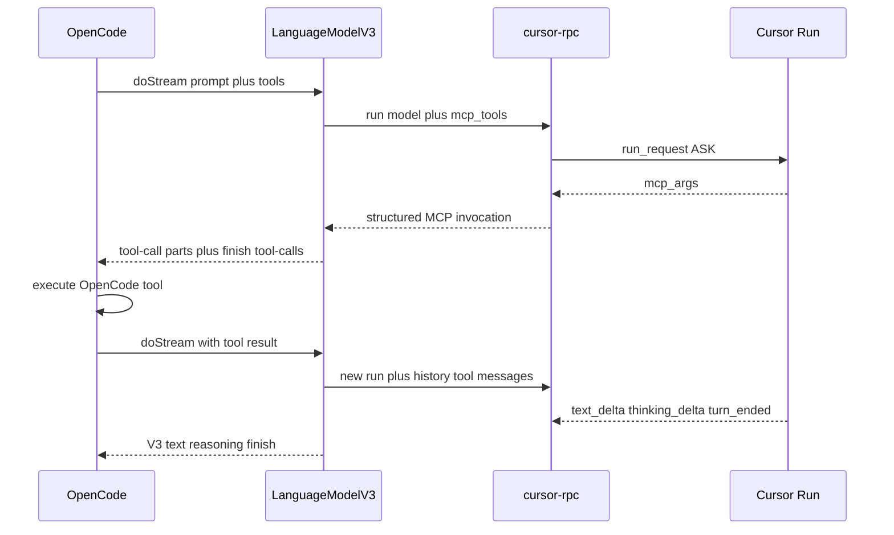

# OpenCode Cursor RPC Provider - Plan

## Goal Capsule

- **Objective:** Ship a working OpenCode provider package that lists the signed-in Cursor account's models and runs them inside OpenCode's agent loop, wrapping `cursor-rpc` rather than an OpenAI-compatible proxy.
- **Authority:** `docs/specs/rpc_spec.md` owns wire protocol. `docs/plans/2026-08-19-001-feat-nodejs-protocol-sdk-plan.md` owns library defaults except the run-option and MCP-exec extensions this plan adds. `docs/plans/2026-08-19-002-feat-npm-workspaces-scaffold-plan.md` owns workspace layout. OpenCode's loader (`provider.npm` / `providers.package`, `create*` factory, LanguageModelV3) owns the host contract. This plan owns the adapter package and the library gaps the adapter cannot fake.
- **In scope:** New publishable workspace `cursor-rpc-opencode`; LanguageModelV3 provider factory; v1 plugin `config` hook for live catalogue overlay; library `run` model selection; MCP tool catalogue plus inbound `mcp_args` proto subset so OpenCode tools round-trip through Cursor MCP without Cursor executing local shell or files.
- **Out of scope:** Pi provider, OpenAI-compatible server, packaging-only stub, browser login, HTTP/1.1 RunSSE, checkpoint/blob resume, nested Cursor agent that executes workspace tools, npm publish.
- **Stop if:** Live or reconstructed frames show ASK never emits `mcp_args` for advertised MCP tools. A one-shot AGENT characterization probe may still run, but AGENT-only emission is not a ship path. Stop if OpenCode cannot import a `create*` LanguageModelV3 factory from the built package. Do not invent a third tool bridge (text-parse or OpenAI proxy).
- **Execution profile:** Adapter plus two small library extensions. Contract-test the library against fake `openRun` streams first. Prove OpenCode load with a non-empty static model seed before live catalogue or MCP mapping.
- **Tail ownership:** Implementer owns package exports, dual v1/v2 config examples, and proto field layout for inbound `mcp_args` reconstructed from `rpc_spec.md` §12.2. Caller of OpenCode owns credentials and whether a given Cursor model is a good coding agent.

---

## Product Contract

### Summary

A working OpenCode provider package, sibling to the Pi package, makes Cursor RPC models selectable and runnable inside OpenCode through OpenCode's custom provider path. It wraps `cursor-rpc` and existing Cursor credentials. OpenCode keeps the agent loop. Model IDs come from the live Cursor catalogue. OpenCode tools pass through Cursor's MCP catalogue and execute on OpenCode's side.

Product Contract preservation: new bootstrap.

### Problem Frame

OpenCode's stock overlays speak OpenAI-compatible HTTP. Cursor's agent backend is ConnectRPC (`rpc_spec.md`). The repo already has a protocol client (`packages/cursor-rpc`) and a Pi identity stub (`packages/cursor-rpc-pi`). Without an OpenCode runtime adapter, Cursor models cannot appear in `/models` or drive OpenCode's loop. A packaging-only stub would link in the workspace and still fail to load. Routing through the private OpenAI server app would be a different product and was confirmed out of scope.

### Requirements

**Package and load**

- R1. A publishable ESM workspace named `cursor-rpc-opencode` exists under `packages/`, depends on `cursor-rpc` through an ordinary caret range, and Node 22+ can import it after a root install plus library build.
- R2. OpenCode v1 loads the package from `provider.<id>.npm` (npm name or absolute `file://`). The first export whose name starts with `create` is a synchronous factory that returns an AI SDK Provider with `languageModel(id)` implementing LanguageModelV3 (`specificationVersion: 'v3'`).
- R3. Example config ships at least one static seed model so v1 actually consults `npm`. Empty `models` must not be the documented install path.
- R4. README documents both OpenCode v1 (`provider.cursor.npm` / `options` / `tool_call`) and v2 beta (`providers.cursor.package` / `settings` / `capabilities.tools`) using the same factory. It also states that OpenCode owns session, tools, permissions, and workspace, and that Cursor is a language-model backend with fail-closed local exec.

**Auth and identity**

- R5. Credentials come from OpenCode provider options (`apiKey`) or existing `CURSOR_API_KEY` / `CURSOR_AUTH_TOKEN`. Missing credentials fail closed. The package never opens a browser and never calls `login()`.
- R6. Auth, policy, cancel, stall, and HTTP/1.1-unsupported errors surface as provider errors. The OpenCode turn must not hang.

**Models**

- R7. After credentials succeed, `/models` lists the signed-in account's usable catalogue from `client.models()`, not a hardcoded product list. A v1 plugin `config` hook overlays that catalogue and **replaces** the static seed so the picker contains only usable live rows. Keep the seed only when overlay fails.
- R8. Selecting a catalogue model sends that model on the opening `run_request` (`model_details` and/or `requested_model`). The picker is not cosmetic.

**Language-model backend**

- R9. OpenCode owns the agent loop: system prompt, session, tools, permissions, workspace. Each OpenCode generate is one new Cursor `Run` stream. Durable state is the OpenCode session, not a Cursor conversation id or checkpoint blob.
- R10. Cursor stays fail-closed for local exec: no handlers that run shell, file, or workspace tools; empty `workspace_paths`; `excludeWorkspaceContext: true`. Cursor must not execute OpenCode's machine.
- R11. The adapter maps OpenCode/AI SDK prompt messages into `prompt` plus `conversationHistory`. System text folds into the current prompt or `custom_system_prompt`. Prior OpenCode tool results round-trip as Cursor history tool messages, not as Cursor-native shell/file tool names.
- R12. Streaming implements LanguageModelV3 parts: `stream-start`, text start/delta/end, reasoning start/delta/end from `thinking_delta`, `finish` with usage from `turn_ended`. Honor `abortSignal`.

**Tools**

- R13. OpenCode JSON-schema tools on `doStream` are advertised to Cursor as `AgentRunRequest.mcp_tools` (`McpToolDefinition` with `input_schema_json`).
- R14. When Cursor issues an MCP invocation (`mcp_args`), the adapter emits LanguageModelV3 `tool-call` parts for OpenCode to execute locally, ends that generate with `finishReason` tool-calls, and does not run the tool on Cursor's behalf.
- R15. The next OpenCode generate includes those tool results. The adapter puts assistant `tool_call` plus `ConversationHistoryToolMessage` into `conversationHistory` for the new Run.
- R16. Catalogue rows advertise `tool_call: true` / `capabilities.tools: true` only after R13–R15 work. Images stay false unless a later mapper actually sends image parts.

### Key Decisions

- KD1. Working OpenCode provider, not a workspace identity stub. Governs R1, R2. `(session-settled: user-approved — chosen over a packaging-only stub like the current Pi package: models must be selectable and runnable.)`
- KD2. OpenCode keeps the agent loop. Cursor is the language-model backend. Governs R9, R10. `(session-settled: user-approved — chosen over a nested Cursor agent that executes tools on Cursor's side.)`
- KD3. Model IDs come from the live Cursor catalogue for the signed-in account. Governs R7, R8. `(session-settled: user-approved — chosen over a hardcoded static list as the only source of truth.)`
- KD4. OpenCode tools round-trip through Cursor's MCP catalogue. OpenCode executes them. Governs R13, R14, R15. `(session-settled: user-directed — chosen over chat/ask-only and over parsing tool intent from model text: keep OpenCode's loop and a protocol-shaped bridge.)`

### Actors

- A1. OpenCode user configuring `opencode.json` and picking a model in `/models`.
- A2. OpenCode agent loop calling `doStream` / `doGenerate` with session messages and tools.
- A3. `cursor-rpc` client talking to Cursor auth REST and `AgentService/Run`.

### Key Flows

- F1. Install and load
  - **Trigger:** A1 points OpenCode at the package via `file://` or npm name with a non-empty static `models` map.
  - **Actors:** A1
  - **Steps:** OpenCode imports `createCursor`; factory returns Provider; seed model appears in `/models`.
  - **Covered by:** R1, R2, R3
- F2. Auth
  - **Trigger:** Factory or plugin hook constructs `createClient`.
  - **Actors:** A1, A3
  - **Steps:** Read `apiKey` or env; bootstrap. Missing creds throw with no fetch and no browser.
  - **Covered by:** R5, R6
- F3. Live catalogue overlay
  - **Trigger:** Plugin `config` hook runs after credentials exist.
  - **Actors:** A1, A3
  - **Steps:** `client.models()`; replace the seed with usable `ModelDetails` on `provider.cursor.models`; keep the seed if overlay fails for any reason.
  - **Covered by:** R7
- F4. First turn
  - **Trigger:** A2 calls `languageModel(id).doStream`.
  - **Actors:** A2, A3
  - **Steps:** Map prompt; `run` with selected model; ASK + empty workspace; stream text/reasoning; `finish` with usage.
  - **Covered by:** R8, R9, R10, R11, R12
- F5. Tool round-trip
  - **Trigger:** A2 sends tools on `doStream`; Cursor emits `mcp_args`.
  - **Actors:** A2, A3
  - **Steps:** Advertise MCP defs; emit V3 tool-call parts; OpenCode executes locally; next generate carries tool results in history.
  - **Covered by:** R13, R14, R15, R16
- F6. Abort, auth failure, HTTP/1.1
  - **Trigger:** User stop, expired token, or `GetServerConfig` forces HTTP/1.1.
  - **Actors:** A1, A2, A3
  - **Steps:** Map `CancelledError` / `AuthenticationError` / `TransportUnsupportedError`. Do not hang. Picker may still list models when only Run is unsupported.
  - **Covered by:** R6, R7

### Acceptance Examples

- AE1. Covers R2, R3. Given v1 config with `npm` and one seed model, when OpenCode starts, then it imports `createCursor` and the seed appears in `/models`. Given the same config with empty `models`, when OpenCode starts, then the custom package is not loaded.
- AE2. Covers R5. Given no `apiKey` and no Cursor env, when the factory constructs a client, then it throws before network and does not open a browser.
- AE3. Covers R7, R8. Given a signed-in catalogue containing models A and B, when overlay succeeds, then `/models` lists A and B and not the seed id. When A1 selects A, then the opening `run_request` carries A's id on `requested_model` and/or `model_details`.
- AE4. Covers R9, R10. Given an OpenCode prompt that needs workspace files, when the turn runs, then OpenCode's bash/read tools may run after a tool-call part, and Cursor exec besides MCP is fail-closed with empty `workspace_paths`.
- AE5. Covers R13, R14, R15. Given OpenCode `write` in `doStream.tools`, when Cursor sends `mcp_args` for that tool, then the adapter emits a V3 `tool-call` naming OpenCode's `write`, finishes tool-calls, and the next `run` history includes the tool result. Cursor does not write the file.
- AE6. Covers R6, R12. Given A2 aborts mid-stream, when the adapter forwards `abortSignal`, then the Run stream tears down and the V3 stream does not emit a successful `finish`.

### Success Criteria

- OpenCode CLI can load the built package over `file://` with a seed model.
- Live catalogue overlay lists usable Cursor models when credentials work.
- Selected model id is present on the opening Run request.
- Text and reasoning stream as LanguageModelV3 parts with a terminal `finish`.
- OpenCode tool names round-trip through MCP without Cursor executing shell or files. If the Goal Capsule stop fires, this bullet does not apply; the shipped adapter is chat/ask with `tool_call: false` after the PR records that MCP was infeasible.
- Root typecheck and library tests still pass. New adapter tests pass without hitting the network.

### Scope Boundaries

**In this work**

- `packages/cursor-rpc-opencode` as a real emit package (exports to `dist`), not a Pi-style `noEmit` stub.
- Library extensions required by R8 and R13–R15.
- Dual v1/v2 README snippets and a plugin `config` hook.

**Deferred for later**

- Real Pi provider.
- OpenAI-compatible HTTP server.
- Checkpoint/blob resume and HTTP/1.1 RunSSE (already deferred in the SDK plan).
- Parameterized max-mode picker rows.
- Image/attachment mapping.
- LanguageModelV4 / AI SDK 7 (OpenCode `dev` still pins V3).

**Outside this product's identity**

- Official `@cursor/sdk` local agent runtime.
- Nested Cursor AGENT that runs shell/file/MCP on the user's machine.
- Auto browser login.
- Publishing to the npm registry in this work.

### Sources

- Confirmed scoping: working provider, OpenCode-owned loop, live catalogue, MCP tool bridge.
- `packages/cursor-rpc` public client, `openingRunRequest`, dispatch, events, catalogue merge.
- `packages/cursor-rpc-pi` as workspace sibling identity only.
- `docs/specs/rpc_spec.md` §10–§12 (opening `run_request`, MCP declaration, exec channel).
- OpenCode loader and docs listed under Planning Contract Sources.

---

## Planning Contract

### Key Technical Decisions

- KTD1. Name the workspace `cursor-rpc-opencode`. Copy library packaging (`exports` → `dist`, `build`, `engines.node` `>=22`, caret dep on `cursor-rpc`), not the Pi stub's missing publish surface. Cite R1. Honors workspaces-plan KTD2, KTD4, KTD10.
- KTD2. Export exactly one `create*` function, `createCursor`. It is synchronous and returns `{ languageModel(id) }`. Implement LanguageModelV3 against `@ai-sdk/provider@^3.0.8`. Do not ship V1 or V4. Cite R2.
- KTD3. One package serves both the provider factory and a v1 plugin `config` hook. The plugin export must not be named `create*`. Live catalogue overlays static seed models; `provider.models()` is not used for custom IDs. Cite R3, R7.
- KTD4. Extend `ClientRunOptions` / `openingRunRequest` so `run` sends `requested_model.model_id` (and `model_details` when the catalogue row is in hand). Resolve aliases through `catalogue.aliasMap`. Cite R8.
- KTD5. Reconstruct inbound `mcp_args` on the exec oneof at field 11 per `rpc_spec.md` §12.2, far enough to yield a public MCP `RunEvent`. Do not reconstruct `mcp_result` or the 70+ display `ToolCall` cases. Pass OpenCode tools as `McpToolDefinition` (`name` and `tool_name` = OpenCode tool id, `provider_identifier` `opencode`, `input_schema_json`). Cite R13, R14.
- KTD6. Translate Cursor's same-stream MCP exec into OpenCode's multi-call tool protocol. On `mcp_args`, emit V3 tool-call parts **only when** `tool_name` is in this turn's advertised `McpToolDefinition` list and `provider_identifier` is `opencode`; otherwise throw and abort with no V3 tool-call. For an advertised invocation: emit V3 parts, library-send `exec_client_control_message.throw` (unhangs the exec; it is not a tool result), then `RunHandle.abort` so Cursor cannot keep generating on that turn. That abort is adapter teardown, not a V3 stream error. Next `doStream` is a **new** Run. Follow-up `conversationHistory` comes only from the OpenCode prompt mapper (assistant `tool_call` + `ConversationHistoryToolMessage`). Discard the aborted handle's `conversationHistory()`. V3 `toolCallId` is adapter/OpenCode-owned, not `ExecServerMessage.id`. Keep library default reject for every `interaction_query`, including `mcp_auth_request_query`. Do not set `onInteraction` or `onExec`. Leave `supports_mcp_auth` unset. Cite R14, R15, R9.
- KTD7. Shipped `doStream` stays ASK + empty workspace. AGENT is an optional implementer-time characterization probe during U5, not a shipped generate mode. U1 may add an optional run `mode` that defaults to ASK and may be set to AGENT for that probe only. If ASK never emits `mcp_args`, hit the Goal Capsule stop even if the AGENT probe emits. Do not add a production AGENT path. Cite R10, R13. Stop condition in Goal Capsule.
- KTD8. Local install is absolute `file://` to the built package root or ESM entry file. Do not document `npm link` into `~/.local/share/opencode` (that directory is auth/sessions; packages resolve from cache or `file://`). Cite R2, R4.
- KTD9. Hold one `createClient` per factory instance. Forward OpenCode-injected `name`, `apiKey`, and wrapped `fetch`. Before passing headers into `createClient`, drop `Authorization`, `Cookie`, and any header whose name matches `/api-?key|token|secret|authorization/i`. Abort one generate only via `ClientRunOptions.signal` / `RunHandle.abort`. Never pass OpenCode `abortSignal` into `createClient`. `close()` is factory dispose only — not generate abort, tool-calls finish, or session stop. Recreate the client if options change; do not auto-recover expired auth without new credentials. Cite R5, R6.

### High-Level Technical Design



Load: static seed models make v1 call `npm`. Plugin overlay replaces seed rows with `client.models()` when auth works.

Generate and tool round-trip:



Run stays fail-closed for every exec that is not MCP. OpenCode remains the workspace of record.

### Output Structure

```text
packages/cursor-rpc-opencode/
  package.json
  tsconfig.json
  README.md
  src/index.ts              # createCursor + plugin export
  src/language-model.ts
  src/prompt.ts
  src/stream.ts
  src/catalogue.ts
  test/factory.test.ts
  test/prompt.test.ts
  test/stream.test.ts
  test/tools.test.ts
  test/catalogue.test.ts
packages/cursor-rpc/          # U1–U2 only: run options, proto exec oneofs, tests
test/workspaces-link.test.mjs # add the new tsconfig to the no-paths list
```

The tree is a scope declaration. Per-unit `Files` lists stay authoritative. The implementer may split `src/` if a file grows, but must keep a single `createCursor` export.

### Implementation Constraints

- Bind `rpc_spec.md` for wire fields. Units cite it; they do not restatement the proto.
- Bind workspaces-plan KTD2: caret range, no `workspace:*`.
- Source imports use `.js` extensions. `tsconfig.base.json` stays the compiler source of truth.
- Adapter tests fake `createClient` / `openRun`. Do not hit the network in unit tests.
- Root `npm test` remains workspace-link smoke unless a unit adds a documented fan-out. Adapter vitest runs as `npm test -w cursor-rpc-opencode`.
- Do not add extra `create*` exports. A helper named `createHeaders` would steal the loader.

### Sequencing

U1 library model id → U2 library MCP exec surface → U3 package scaffold that OpenCode can import → U4 prompt/stream mapping → U5 tool round-trip → U6 live catalogue plugin and dual-config README.

U3 can start after U1 types exist; it must not wait for U2 to prove `file://` load. U5 needs U2. U6 needs U3. Do not advertise `tool_call: true` until U5 is green.

### Assumptions

None beyond confirmed scope. ASK-vs-AGENT for MCP emission is KTD7 (shipped ASK; AGENT is characterization only).

### Sources & Research

Load-bearing external findings (OpenCode `dev` ~1.18.18, fetched 2026-08-19):

- v1 field is `provider.<id>.npm` + `options`; v2 beta is `providers.<id>.package` + `settings`.
- Loader: first `create*` export, `fn({ name, ...options })`, then `languageModel(id)`.
- Empty `models` silently ignores `npm` ([anomalyco/opencode#33888](https://github.com/anomalyco/opencode/issues/33888)).
- OpenCode pins `@ai-sdk/provider@3.0.8` (LanguageModelV3). V1 fails at first generate (`UnsupportedModelVersionError`).
- Custom IDs cannot use `provider.models()` ([#25630](https://github.com/anomalyco/opencode/issues/25630)). Use plugin `config` hook.
- `~/.local/share/opencode` is auth/sessions. Local provider packages use `file://`.
- `tool_call: false` makes OpenCode skip native tools; it is not a reliable prompt-injection coding agent. User chose MCP mapping instead.

Local: `packages/cursor-rpc/src/client.ts`, `src/run/run.ts` `openingRunRequest`, `src/run/dispatch.ts`, `src/run/events.ts`, `src/session/models.ts`, `src/run/transcript.ts`. Proto already has `mcp_tools` and `RequestedModel` on `AgentRunRequest`; exec oneofs currently omit `mcp_args`.

---

## Implementation Units

### U1. Pass selected model on Run

- **Goal:** `client.run` sends the OpenCode-selected model on the opening `run_request` so `/models` is not cosmetic.
- **Requirements:** R8
- **Dependencies:** none
- **Files:** `packages/cursor-rpc/src/client.ts`, `packages/cursor-rpc/src/run/run.ts`, `packages/cursor-rpc/test/client.test.ts`, `packages/cursor-rpc/test/run.test.ts`, `packages/cursor-rpc/src/index.ts` (types only if `ClientRunOptions` is re-exported)
- **Approach:**
  1. Add an optional `modelId` (and optional `modelDetails` when the caller has a catalogue row) to `ClientRunOptions`.
  2. Set `requested_model.model_id` on `openingRunRequest`. Set `model_details` when provided.
  3. Leave ASK, empty workspace, and fail-closed exec as defaults.
  4. Add an optional run `mode` that defaults to ASK and may be set to AGENT for KTD7's implementer-time probe only.
  5. Optional cheap add: `customSystemPrompt` on the same opening request so U4 does not flatten system text only into the user prompt.
- **Patterns to follow:** `openingRunRequest` in `packages/cursor-rpc/src/run/run.ts`; existing `run.test.ts` opening-message assertions; alias map in `packages/cursor-rpc/src/session/models.ts`.
- **Test scenarios:**
  - Happy path: `run({ prompt, modelId: "composer-2.5" })` writes `requested_model.model_id` `composer-2.5` on the first outbound `run_request`.
  - When `modelDetails` is passed, `model_details.model_id` matches.
  - Omitted `modelId` keeps today's opening message (no model fields), so existing callers do not change.
  - ASK, `excludeWorkspaceContext: true`, and empty `workspace_paths` still hold when a model is set.
- **Verification:** `npm test -w cursor-rpc` covers the new opening-request cases. Typecheck still passes.

### U2. MCP exec surface on the library

- **Goal:** The library can declare MCP tools on Run and surface `mcp_args` to a caller without executing them, and can reply without hanging the turn.
- **Requirements:** R13, R14
- **Dependencies:** none (parallel with U1)
- **Files:** `packages/cursor-rpc/proto/agent/v1/agent.proto`, generated `packages/cursor-rpc/src/generated/agent/v1/agent_pb.ts`, `packages/cursor-rpc/src/run/run.ts`, `packages/cursor-rpc/src/run/dispatch.ts`, `packages/cursor-rpc/src/run/events.ts`, `packages/cursor-rpc/src/client.ts`, `packages/cursor-rpc/test/dispatch.test.ts`, `packages/cursor-rpc/test/run.test.ts`
- **Approach:**
  1. Add inbound `mcp_args` to the exec oneof at field 11. Reconstruct argument fields from `rpc_spec.md` §12.2 and, if needed, a live frame dump, far enough to yield the public MCP `RunEvent`. Do not add `mcp_result`. Exact nested field names are an implementation-time unknown.
  2. Accept `mcpTools` on `ClientRunOptions` and set `AgentRunRequest.mcp_tools`.
  3. Yield a public `RunEvent` for MCP invocations (tool name, args JSON, portable id only) **after** `replyExecThrow` has been sent. Do not close the outbound queue until that write completes. The adapter must not set `onExec` or return `AgentClientMessage`.
  4. Default with no observer remains fail-closed `throw` so ASK text clients stay safe.
  5. Do not add shell/file exec cases.
- **Execution note:** Regenerate proto with the existing `buf generate` path. Characterize unknown `mcp_args` layout with a fixture before wiring the adapter.
- **Patterns to follow:** SDK plan's reconstructed-subset discipline (only fields this work needs). `defaultExecReply` / `replyExecThrow` in `packages/cursor-rpc/src/run/dispatch.ts`.
- **Test scenarios:**
  - Happy path: opening request with one `McpToolDefinition` (`tool_name` `write`, `provider_identifier` `opencode`, `input_schema_json` present) serializes `mcp_tools`.
  - Inbound `exec_server_message` with `mcp_args` yields a public MCP `RunEvent` with tool name and args, and the library itself sends `throw`.
  - No observer: MCP exec is still `throw`n; the turn does not hang.
  - Non-MCP exec (`request_context_args`, allowlist precheck) is unchanged.
  - Unknown exec case still fail-closes.
- **Verification:** `npm run generate -w cursor-rpc` then `npm test -w cursor-rpc`. Dispatch tests do not require a network.

### U3. OpenCode package scaffold and factory

- **Goal:** A loadable `cursor-rpc-opencode` package exports `createCursor` and a LanguageModelV3 that OpenCode can import over `file://`.
- **Requirements:** R1, R2, R5
- **Dependencies:** U1 (types for `modelId` on `run` may land as a stub `languageModel` that still compiles against current `run` if U1 is sequential; prefer U1 first)
- **Files:** `packages/cursor-rpc-opencode/package.json`, `packages/cursor-rpc-opencode/tsconfig.json`, `packages/cursor-rpc-opencode/src/index.ts`, `packages/cursor-rpc-opencode/src/language-model.ts`, `packages/cursor-rpc-opencode/test/factory.test.ts`, `test/workspaces-link.test.mjs`, `package-lock.json`
- **Approach:**
  1. Manifest: name `cursor-rpc-opencode`, ESM, `exports` to `dist`, `files` `dist` + `README.md`, `engines.node` `>=22`, dependency `cursor-rpc` `^1.0.0`, runtime `@ai-sdk/provider` `^3.0.8`.
  2. `tsconfig.json` extends `../../tsconfig.base.json` and **emits** to `dist` (library pattern, not Pi `noEmit`).
  3. `createCursor(settings)` is synchronous and returns an AI SDK Provider `{ languageModel(id) }`. `languageModel(id)` implements `specificationVersion: 'v3'`. Construct one `createClient` lazily on first `languageModel` call. Hold one client per factory instance. Forward `name`, `apiKey`, wrapped `fetch`, and sanitized headers per KTD9. Never pass OpenCode `abortSignal` into `createClient`. Expose `close()` as factory dispose only.
  4. Until U4, `doStream` / `doGenerate` may return an explicit "not implemented" provider error rather than a fake successful finish.
  5. Add the new tsconfig to the workspace-link no-`paths` list.
- **Execution note:** First proof is Node import of `createCursor` from the package after `npm run build -w cursor-rpc-opencode`, plus `specificationVersion === 'v3'`.
- **Patterns to follow:** `packages/cursor-rpc/package.json` exports/files/build. Workspaces-plan linking. Do not copy `packages/cursor-rpc-pi/src/index.ts` identity stub as the public export.
- **Test scenarios:**
  - Happy path: `createCursor` is a function; `Object.keys(mod)` first `create*` key is `createCursor`.
  - `createCursor({}).languageModel("x").specificationVersion` is `v3`.
  - Missing credentials: constructing a client through the factory throws `AuthenticationError` with no fetch. Thrown messages, stream errors, and adapter logs never contain `apiKey`, Bearer tokens, `CURSOR_API_KEY`, `CURSOR_AUTH_TOKEN`, `accessToken`, or `refreshToken`.
  - Extra `create*` export is absent (fixture assertion on export names).
  - Workspace tsconfig has no `compilerOptions.paths`.
- **Verification:** `npm run typecheck` at root (builds `cursor-rpc` first). `npm test` still passes workspace-link smoke. `npm test -w cursor-rpc-opencode` for factory tests.

### U4. Prompt, stream, abort, and errors

- **Goal:** One OpenCode generate maps to one ASK Run and streams LanguageModelV3 text/reasoning with a real `finish`.
- **Requirements:** R6, R9, R10, R11, R12
- **Dependencies:** U1, U3
- **Files:** `packages/cursor-rpc-opencode/src/prompt.ts`, `packages/cursor-rpc-opencode/src/stream.ts`, `packages/cursor-rpc-opencode/src/language-model.ts`, `packages/cursor-rpc-opencode/test/prompt.test.ts`, `packages/cursor-rpc-opencode/test/stream.test.ts`
- **Approach:**
  1. Last user text (plus folded system unless U1 added `customSystemPrompt`) is `prompt`. Earlier user/assistant text is `conversationHistory`. File/image parts warn and skip unless later work adds them.
  2. `doStream` is the source of truth. `doGenerate` consumes that stream.
  3. Emit `stream-start` (unsupported sampling/tools go in `warnings` until U5). Map `text_delta` to the text triad. Map `thinking_delta` / `thinking_completed` to the reasoning triad. `turn_ended` supplies usage and `finish`. Never omit `finish` on a successful drain.
  4. Forward caller `abortSignal` into `client.run`. User stop / `CancelledError` → error the ReadableStream; do not successful-`finish`. Adapter-owned `RunHandle.abort` after a tool-calls `finish` (U5 / KTD6) is teardown, not a V3 stream error.
  5. Map `AuthenticationError`, `CancelledError`, `PolicyError`, `TransportUnsupportedError`, stall to `APICallError` / stream `error` parts that carry only already-redacted `CursorRpcError.message` (no headers, bodies, or env dumps).
  6. Ignore Cursor display `tool_call` events in the LM stream (they are not OpenCode tools).
- **Patterns to follow:** Library `RunEvent` union; fake `openRun` / `AsyncQueue` in `packages/cursor-rpc/test/run.test.ts`. V3 part order from `@ai-sdk/provider` 3.0.8 types (`finishReason` is `{ unified, raw }`, not a string).
- **Test scenarios:**
  - Happy path: system + user → one prompt with system included; empty or single-user history.
  - Multi-turn: user/assistant/user → last user is `prompt`; first pair is history.
  - Stream: `stream-start` then text start/delta/end then `finish` with usage from `turn_ended`.
  - Reasoning: `thinking_delta` does not appear as `text-delta`.
  - Abort: fake inbound mid-text plus caller `abortSignal`; cancel that Run; no successful `finish`.
  - Isolation: two concurrent fake `run`s on one client; abort A; B still receives frames; `close()` is not called.
  - HTTP/1.1: `TransportUnsupportedError` becomes a provider error, not a hang.
  - Interaction query: fake `mcp_auth_request_query` is `rejected`; stream does not hang; no browser.
  - Missing `turn_ended`: still emit `finish` with `unified: 'other'` and a warning rather than hanging OpenCode.
- **Verification:** Adapter unit tests with a fake client. No network.

### U5. OpenCode tools through Cursor MCP

- **Goal:** OpenCode function tools round-trip through `mcp_tools` / `mcp_args` and execute on OpenCode's side.
- **Requirements:** R13, R14, R15, R16
- **Dependencies:** U1, U2, U4
- **Files:** `packages/cursor-rpc-opencode/src/language-model.ts`, `packages/cursor-rpc-opencode/src/prompt.ts`, `packages/cursor-rpc-opencode/src/stream.ts`, `packages/cursor-rpc-opencode/test/tools.test.ts`
- **Approach:**
  1. Map V3 `tools` (`inputSchema`) to `McpToolDefinition[]` per KTD5.
  2. On an advertised U2 MCP `RunEvent` (KTD6 allowlist), emit V3 `tool-input-*` / `tool-call` (`input` stringified JSON), `finish` with `unified: 'tool-calls'`, then abort that Run as adapter teardown. Do not send `mcp_result`. Do not wait for `turn_ended`. Do not emit a V3 error for that abort.
  3. Next `doStream`: map OpenCode `tool` messages into history per KTD6. OpenCode permissions are the human gate after that handoff; the adapter only emits and returns.
  4. Keep fail-closed for every non-MCP exec. Empty workspace. AGENT only via U1's optional mode for KTD7's implementer-time probe.
  5. Expose a factory-level tools-supported signal from `language-model.ts` once these tests pass. Do not write seed/overlay catalogue rows here.
- **Execution note:** If a live probe (optional, not required for unit green) shows no `mcp_args` in ASK or AGENT-fail-closed, stop per Goal Capsule. Do not switch to text-parse or an OpenAI proxy.
- **Patterns to follow:** U2 public MCP event shape; history types already in `packages/cursor-rpc/proto/agent/v1/agent.proto` (`ConversationHistoryToolCall`, `ConversationHistoryToolMessage`).
- **Test scenarios:**
  - Covers AE5. OpenCode tool `write` with a JSON schema appears as `mcp_tools` with `name` and `tool_name` `write`, `provider_identifier` `opencode`, and `input_schema_json` matching the V3 schema. Two OpenCode tools advertise 1:1.
  - Fake inbound `mcp_args` for `write` produces a V3 `tool-call` with that name and stringified args, `finish` tool-calls, outbound `throw`, and Run abort. No later `text_delta` or second exec is mapped into that V3 stream.
  - Cursor non-MCP exec is still thrown; no shell result is applied. Adapter does not set `onExec`.
  - Follow-up `doStream` with a `tool` result starts a **new** Run whose history has both assistant `tool_call` and `ConversationHistoryToolMessage` for the same OpenCode `tool_call_id` / `write`. No successful `mcp_result`. Aborted handle transcript is not reused. No “tool not implemented” text in history.
  - `doStream` with empty `tools` does not send `mcp_tools` (or sends empty).
  - Display-only Cursor `tool_call` events still do not become V3 `tool-call` parts.
  - Unadvertised `mcp_args` (e.g. `bash` while only `write` was advertised) produces no V3 `tool-call`; library still throws and aborts.
  - AGENT probe via U1 mode: `shell_args` then `mcp_args` → no shell result applied, only V3 `write` tool-call, empty workspace, `excludeWorkspaceContext` still true. Mid-turn `request_context_args` still returns empty `workspace_paths`. Shipped `doStream` stays ASK.
  - Fake `mcp_auth_request_query` during a tool-mapped ASK turn is `rejected`; no V3 `tool-call` from the query; no hang; no `login()`.
- **Verification:** `npm test -w cursor-rpc-opencode`. Nested-agent regression: workspace_paths empty; no `onExec` that runs shell.

### U6. Live catalogue plugin and dual-config docs

- **Goal:** `/models` shows the signed-in usable catalogue, and install docs match OpenCode v1 and v2 field names.
- **Requirements:** R3, R4, R7, R16
- **Dependencies:** U3
- **Files:** `packages/cursor-rpc-opencode/src/catalogue.ts`, `packages/cursor-rpc-opencode/src/index.ts`, `packages/cursor-rpc-opencode/README.md`, `packages/cursor-rpc-opencode/test/catalogue.test.ts`
- **Approach:**
  1. Plugin `config` hook: if credentials exist, `client.models()` and **replace** `cfg.provider.cursor.models` with usable rows. Provider id is `cursor`. Include `id` / display name, `tool_call` / `capabilities.tools` from U5's factory signal (false until U5 is green), `reasoning` true when `thinking_delta` is mapped, `attachment` false.
  2. Any `client.models()` failure (auth, empty catalogue, transport, timeout): keep the static seed; do not call `login()`; do not throw out of the hook.
  3. README: v1 `plugin` + `provider.cursor.npm` `file://` + non-empty seed; v2 `plugins` + `providers.cursor.package` + `settings` + `capabilities.tools`. State OpenCode-owns-the-loop per R4. State that empty `models` silently skips the package.
  4. Usable `ModelDetails` only. Do not add parameterized variants as extra picker rows.
- **Patterns to follow:** `mergeModelCatalogue` / `aliasMap`. OpenCode plugin `config(cfg)` mutation-before-return (v1). Do not use `provider.models()` as the injection path.
- **Test scenarios:**
  - Happy path: fake catalogue of two models overlays both ids into the config provider `models` map.
  - Alias / display id maps to canonical `modelId` used as OpenCode `id`.
  - Overlay without credentials leaves the seed model in place.
  - `tool_call` on overlay rows is false until U5's factory signal is true.
- **Verification:** Unit tests for overlay. README contains both v1 and v2 snippets and a `file://` example. Manual CLI smoke is optional and not a unit gate.

---

## Verification Contract

| Gate | Command / outcome | Applies to |
| --- | --- | --- |
| Library tests | `npm test -w cursor-rpc` | U1, U2 |
| Proto generate | `npm run generate -w cursor-rpc` then typecheck | U2 |
| Adapter tests | `npm test -w cursor-rpc-opencode` | U3–U6 |
| Root typecheck | `npm run typecheck` (builds `cursor-rpc` first) | All |
| Workspace link | `npm test` (root smoke) | U3 tsconfig list |
| OpenCode load | After U3 build, v1 config with `file://` and one seed model lists that model | U3, U6 |
| Nested-agent | Opening request has empty `workspace_paths` and fail-closed non-MCP exec | U4, U5 |

Do not require a live Cursor account for unit green. Live MCP emission is the Goal Capsule stop probe, not a CI gate in this repo today.

---

## Definition of Done

- All units U1–U6 meet their verification outcomes.
- Product requirements R1–R16 are each cited by at least one unit.
- `createCursor` is the only `create*` export. Models are LanguageModelV3.
- README documents v1 and v2 config, `file://`, seed models, and credential env.
- No Pi provider, OpenAI server, or `login()` auto-start landed.
- Abandoned probe code (extra proto fields that were unused, AGENT-mode experiments that did not emit `mcp_args`) is removed from the diff.
- If the stop condition fired, the shipped adapter is chat/ask with `tool_call: false` **only after** recording that MCP was infeasible in the PR; do not silently ship a fake tool bridge.

---

## System-Wide Impact

- **Library callers:** `ClientRunOptions` gains optional model and MCP fields. Omitted options preserve today's ASK text client.
- **OpenCode users:** New provider id and dual config keys. Wrong config (empty `models`) looks like "package did nothing."
- **Workspace of record:** OpenCode owns workspace, session, tools, and permissions. Cursor is LM + MCP catalogue only (`excludeWorkspaceContext`, empty `workspace_paths`).
- **Trust:** Cursor must not gain shell/file on the OpenCode machine. MCP is the only exec surfaced as a V3 `tool-call`. OpenCode permissions fire after that handoff.
- **Human-only:** Browser login stays out of scope. Cursor `mcp_auth_request_query` and other `interaction_query`s are rejected; they are not a new login or permission UI.
- **Auth:** Secrets stay in OpenCode options / env. Do not log tokens.
- **Concurrency:** Per KTD9, aborting one generate must not `close()` the shared client or abort sibling Runs.

---

## Risk Analysis

| Risk | Mitigation |
| --- | --- |
| ASK never invokes advertised MCP tools | Goal Capsule stop; AGENT characterization does not become a ship path |
| AGENT-fail-closed still nests a Cursor agent | AGENT is implementer-time only; shipped generates stay ASK |
| Throw-then-history poisons the next turn | KTD6: throw unhangs exec, abort the Run, OpenCode-only history; never `mcp_result` or aborted transcript |
| `mcp_args` layout is underspecified in `rpc_spec.md` | Reconstruct from field 11 + fixture; keep mapping in one module |
| Empty v1 `models` silently drops `npm` | Seed model required in README and AE1 |
| LanguageModelV1 from the user's attached guide | Explicit V3 pin; factory test on `specificationVersion` |
| Advertising `tool_call: true` before U5 | Sequencing forbids it |
| `CreateClientOptions.signal` or `close()` kills sibling Runs | KTD9: per-turn abort only; `close()` is dispose |
| Desktop ESM `file://` directory bug | Document CLI `file://` to a file entry; package `exports` points at a file |

---

## Open Questions

- Q1. (deferred) Exact nested fields of inbound `mcp_args`. Resolve during U2 from spec field numbers and a captured frame. Not launch-blocking for planning.
- Q2. (deferred) OpenCode plugin export identifier (`plugin` vs default `Plugin.define`). Resolve against `@opencode-ai/plugin` types during U6. Factory `createCursor` is independent.

No blocking product questions remain.
